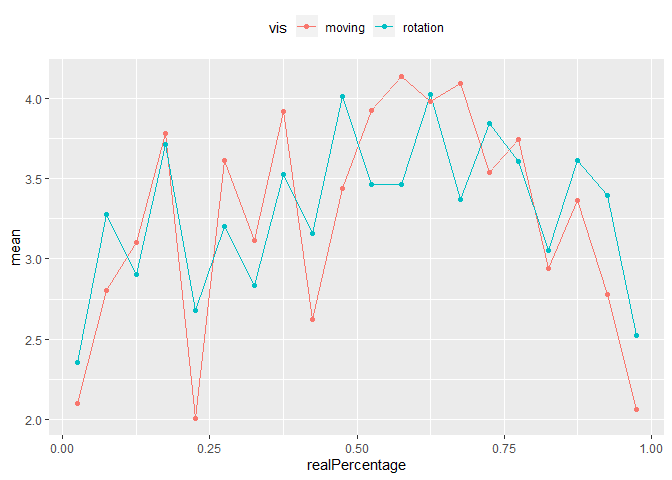
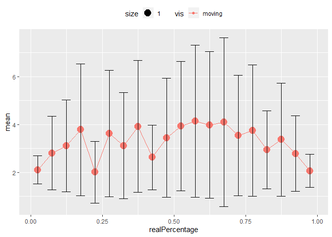
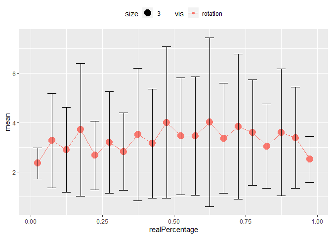
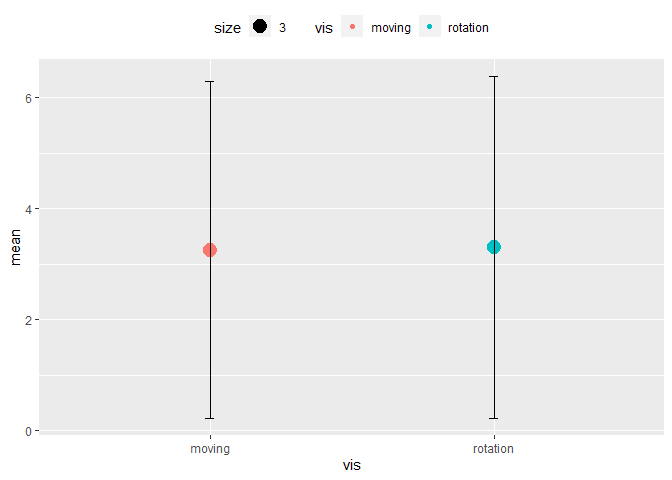
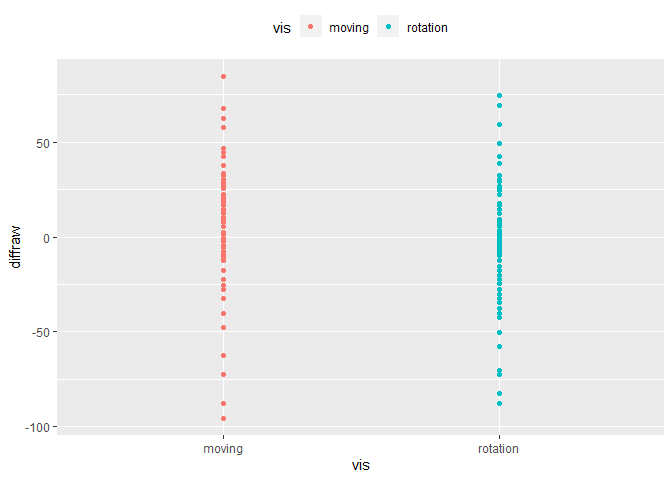

Motion\_CM\_Analysis
================
Yiren
12/8/2019

\#Header1 Analysis

``` r
library(ggplot2)
library(rstudioapi)
library(plyr)

library(dplyr)
```

    ## 
    ## Attaching package: 'dplyr'

    ## The following objects are masked from 'package:plyr':
    ## 
    ##     arrange, count, desc, failwith, id, mutate, rename, summarise,
    ##     summarize

    ## The following objects are masked from 'package:stats':
    ## 
    ##     filter, lag

    ## The following objects are masked from 'package:base':
    ## 
    ##     intersect, setdiff, setequal, union

\#set directory

cm analysis load flattened data

``` r
#set directory and load data
df <- read.table(file = "motion_cm_pilot1.tsv", sep = '\t',header = TRUE)
head(df)
```

    ##   rid currentIndex   data_0    data_1   data_2    data_3   data_4 expType
    ## 1   1            9 15.81297 72.928509 37.20698 19.316327 56.18039    main
    ## 2   2            4 49.01450  8.577537 63.82144 49.699209 11.92943    main
    ## 3   3           15 39.16174 32.817775 54.01619 68.803542 18.96452    main
    ## 4   4            6 81.43088 68.374356 98.66578 16.864286 18.80295    main
    ## 5   5            5 62.23851 43.242052 12.23600  2.753101 59.35285    main
    ## 6   6           18 53.10580 46.270159 63.69505 40.486389 30.83352    main
    ##   experimentName realLarger realPercentage repeatIndex selectedIndices_0
    ## 1         cmtest          C          0.425           1                 0
    ## 2         cmtest          A          0.175           1                 1
    ## 3         cmtest          C          0.725           1                 0
    ## 4         cmtest          B          0.275           1                 4
    ## 5         cmtest          C          0.225           1                 3
    ## 6         cmtest          B          0.875           1                 3
    ##   selectedIndices_1 selectedPercentage            sessionId      trial
    ## 1                 2                 50 -LvBo_ZuTd3kZHTZjYx0    moving9
    ## 2                 0                 30 -LvBo_ZuTd3kZHTZjYx0  rotation4
    ## 3                 2                 50 -LvBo_ZuTd3kZHTZjYx0 rotation15
    ## 4                 1                 20 -LvBo_ZuTd3kZHTZjYx0  rotation6
    ## 5                 2                 20 -LvBo_ZuTd3kZHTZjYx0    moving5
    ## 6                 1                100 -LvBo_ZuTd3kZHTZjYx0   moving18
    ##   trialEndTime trialStartTime uniqueTrialId      vis
    ## 1 1.575395e+12   1.575395e+12             9   moving
    ## 2 1.575395e+12   1.575395e+12             4 rotation
    ## 3 1.575395e+12   1.575395e+12            15 rotation
    ## 4 1.575395e+12   1.575395e+12             6 rotation
    ## 5 1.575395e+12   1.575395e+12             5   moving
    ## 6 1.575395e+12   1.575395e+12            18   moving

# check flattened data

``` r
head(df$realPercentage,5)
```

    ## [1] 0.425 0.175 0.725 0.275 0.225

``` r
df <- df %>% mutate(diff= abs(realPercentage*100-selectedPercentage))
df <- df %>% mutate(diffraw= selectedPercentage-realPercentage*100)

head(df$diff,5)
```

    ## [1]  7.5 12.5 22.5  7.5  2.5

``` r
df <- df %>% mutate(err= log(diff+0.125,2))
df
```

    ##     rid currentIndex      data_0     data_1     data_2      data_3
    ## 1     1            9 15.81296592 72.9285090 37.2069786 19.31632697
    ## 2     2            4 49.01449596  8.5775368 63.8214366 49.69920861
    ## 3     3           15 39.16173760 32.8177747 54.0161898 68.80354234
    ## 4     4            6 81.43088475 68.3743563 98.6657794 16.86428618
    ## 5     5            5 62.23851447 43.2420523 12.2360040  2.75310089
    ## 6     6           18 53.10580460 46.2701585 63.6950458 40.48638870
    ## 7     7           11 31.12719999  8.5849727 16.3417800 83.21338976
    ## 8     8            9 72.92850905 19.3163270 15.8129659 56.18038527
    ## 9     9           20 96.49180160 38.1625866  5.7551088  5.61123105
    ## 10   10            8 42.77272371 69.1347193 95.5788051 95.41733188
    ## 11   11            6 81.43088475 16.8642862 98.6657794 68.37435625
    ## 12   12           17 60.86296397 39.0190942 22.6906577 13.23861452
    ## 13   13           15 18.96451877 32.8177747 54.0161898 39.16173760
    ## 14   14            7 13.76967408 88.1584620 16.5643460  4.47514408
    ## 15   15            3 77.90200592 64.8942107  8.1117763 13.99911772
    ## 16   16            8 95.41733188 25.9255197 42.7727237 95.57880510
    ## 17   17            5 59.35285010  2.7531009 43.2420523 62.23851447
    ## 18   18           16 14.25765152 35.0780632  1.8952606  1.46882696
    ## 19   19           16 35.07806323  1.8952606 14.2576515 78.77974857
    ## 20   20           12 85.76168716 77.9650795 49.9972453  0.03933155
    ## 21   21           12  0.03933155 49.9972453 77.9650795 85.76168716
    ## 22   22            7 63.16758820 13.7696741  4.4751441 16.56434604
    ## 23   23           10  8.64324578 45.7821950 18.1963069 37.76044089
    ## 24   24            2 43.98920983 55.9441511  3.5992781 30.50651411
    ## 25   25           18 46.27015851 63.6950458 30.8335200 53.10580460
    ## 26   26           19  0.43011376 79.3081061 53.8587196 70.17790419
    ## 27   27           13 85.30742906 35.2842738 56.4548380 50.55243322
    ## 28   28           19 53.85871965  0.4301138  0.3978552 79.30810612
    ## 29   29            1 10.23279212 87.7082965 46.7147195  2.19270741
    ## 30   30            3 77.90200592 13.9991177 64.8942107 16.30289180
    ## 31   31           13 35.28427377 56.4548380 57.2677426 85.30742906
    ## 32   32            1 46.71471955 10.2327921  2.1927074 73.09111829
    ## 33   33           14 99.77208818 10.5872879 15.6848710  1.56130551
    ## 34   34           20  5.61123105 96.4918016 72.4285130  5.75510877
    ## 35   35           10 18.19630690  8.6432458 45.7821950  2.49180084
    ## 36   36            4  8.57753679 11.9294337 49.6992086 49.01449596
    ## 37   37           14 99.77208818  1.5613055 10.5872879 62.01248229
    ## 38   38           17 60.86296397 18.7197926 13.2386145 22.69065768
    ## 39   39            2 43.98920983  3.5992781 47.9903748 30.50651411
    ## 40   40           11 44.76834736  8.5849727 16.3417800 83.21338976
    ## 41   41            9 15.81296592 72.9285090 37.2069786 19.31632697
    ## 42   42            4 49.01449596  8.5775368 63.8214366 49.69920861
    ## 43   43           15 39.16173760 32.8177747 54.0161898 68.80354234
    ## 44   44            6 81.43088475 68.3743563 98.6657794 16.86428618
    ## 45   45            5 62.23851447 43.2420523 12.2360040  2.75310089
    ## 46   46            9 15.81296592 72.9285090 37.2069786 19.31632697
    ## 47   47           18 53.10580460 46.2701585 63.6950458 40.48638870
    ## 48   48            4 49.01449596  8.5775368 63.8214366 49.69920861
    ## 49   49           11 31.12719999  8.5849727 16.3417800 83.21338976
    ## 50   50            9 72.92850905 19.3163270 15.8129659 56.18038527
    ## 51   51           15 39.16173760 32.8177747 54.0161898 68.80354234
    ## 52   52           20 96.49180160 38.1625866  5.7551088  5.61123105
    ## 53   53            6 81.43088475 68.3743563 98.6657794 16.86428618
    ## 54   54            8 42.77272371 69.1347193 95.5788051 95.41733188
    ## 55   55            5 62.23851447 43.2420523 12.2360040  2.75310089
    ## 56   56            9 15.81296592 72.9285090 37.2069786 19.31632697
    ## 57   57           18 53.10580460 46.2701585 63.6950458 40.48638870
    ## 58   58            6 81.43088475 16.8642862 98.6657794 68.37435625
    ## 59   59           11 31.12719999  8.5849727 16.3417800 83.21338976
    ## 60   60           17 60.86296397 39.0190942 22.6906577 13.23861452
    ## 61   61            4 49.01449596  8.5775368 63.8214366 49.69920861
    ## 62   62           15 18.96451877 32.8177747 54.0161898 39.16173760
    ## 63   63            7 13.76967408 88.1584620 16.5643460  4.47514408
    ## 64   64            3 77.90200592 64.8942107  8.1117763 13.99911772
    ## 65   65           15 39.16173760 32.8177747 54.0161898 68.80354234
    ## 66   66            8 95.41733188 25.9255197 42.7727237 95.57880510
    ## 67   67            5 59.35285010  2.7531009 43.2420523 62.23851447
    ## 68   68            9 72.92850905 19.3163270 15.8129659 56.18038527
    ## 69   69           20 96.49180160 38.1625866  5.7551088  5.61123105
    ## 70   70           16 14.25765152 35.0780632  1.8952606  1.46882696
    ## 71   71           16 35.07806323  1.8952606 14.2576515 78.77974857
    ## 72   72           12 85.76168716 77.9650795 49.9972453  0.03933155
    ## 73   73            8 42.77272371 69.1347193 95.5788051 95.41733188
    ## 74   74            6 81.43088475 68.3743563 98.6657794 16.86428618
    ## 75   75            6 81.43088475 16.8642862 98.6657794 68.37435625
    ## 76   76           17 60.86296397 39.0190942 22.6906577 13.23861452
    ## 77   77           15 18.96451877 32.8177747 54.0161898 39.16173760
    ## 78   78            7 13.76967408 88.1584620 16.5643460  4.47514408
    ## 79   79            5 62.23851447 43.2420523 12.2360040  2.75310089
    ## 80   80            3 77.90200592 64.8942107  8.1117763 13.99911772
    ## 81   81            8 95.41733188 25.9255197 42.7727237 95.57880510
    ## 82   82            5 59.35285010  2.7531009 43.2420523 62.23851447
    ## 83   83           16 14.25765152 35.0780632  1.8952606  1.46882696
    ## 84   84           12  0.03933155 49.9972453 77.9650795 85.76168716
    ## 85   85            7 63.16758820 13.7696741  4.4751441 16.56434604
    ## 86   86           16 35.07806323  1.8952606 14.2576515 78.77974857
    ## 87   87           10  8.64324578 45.7821950 18.1963069 37.76044089
    ## 88   88           12 85.76168716 77.9650795 49.9972453  0.03933155
    ## 89   89            2 43.98920983 55.9441511  3.5992781 30.50651411
    ## 90   90           18 46.27015851 63.6950458 30.8335200 53.10580460
    ## 91   91           12  0.03933155 49.9972453 77.9650795 85.76168716
    ## 92   92           18 53.10580460 46.2701585 63.6950458 40.48638870
    ## 93   93            7 63.16758820 13.7696741  4.4751441 16.56434604
    ## 94   94           19  0.43011376 79.3081061 53.8587196 70.17790419
    ## 95   95           10  8.64324578 45.7821950 18.1963069 37.76044089
    ## 96   96            2 43.98920983 55.9441511  3.5992781 30.50651411
    ## 97   97           18 46.27015851 63.6950458 30.8335200 53.10580460
    ## 98   98           11 31.12719999  8.5849727 16.3417800 83.21338976
    ## 99   99           13 85.30742906 35.2842738 56.4548380 50.55243322
    ## 100 100           19 53.85871965  0.4301138  0.3978552 79.30810612
    ## 101 101           19  0.43011376 79.3081061 53.8587196 70.17790419
    ## 102 102            1 10.23279212 87.7082965 46.7147195  2.19270741
    ## 103 103           13 85.30742906 35.2842738 56.4548380 50.55243322
    ## 104 104            3 77.90200592 13.9991177 64.8942107 16.30289180
    ## 105 105            9 72.92850905 19.3163270 15.8129659 56.18038527
    ## 106 106           13 35.28427377 56.4548380 57.2677426 85.30742906
    ## 107 107           19 53.85871965  0.4301138  0.3978552 79.30810612
    ## 108 108            1 10.23279212 87.7082965 46.7147195  2.19270741
    ## 109 109            3 77.90200592 13.9991177 64.8942107 16.30289180
    ## 110 110           20 96.49180160 38.1625866  5.7551088  5.61123105
    ## 111 111            1 46.71471955 10.2327921  2.1927074 73.09111829
    ## 112 112           13 35.28427377 56.4548380 57.2677426 85.30742906
    ## 113 113           14 99.77208818 10.5872879 15.6848710  1.56130551
    ## 114 114            8 42.77272371 69.1347193 95.5788051 95.41733188
    ## 115 115            1 46.71471955 10.2327921  2.1927074 73.09111829
    ## 116 116           20  5.61123105 96.4918016 72.4285130  5.75510877
    ## 117 117           10 18.19630690  8.6432458 45.7821950  2.49180084
    ## 118 118           14 99.77208818 10.5872879 15.6848710  1.56130551
    ## 119 119            4  8.57753679 11.9294337 49.6992086 49.01449596
    ## 120 120           20  5.61123105 96.4918016 72.4285130  5.75510877
    ## 121 121           10 18.19630690  8.6432458 45.7821950  2.49180084
    ## 122 122            4  8.57753679 11.9294337 49.6992086 49.01449596
    ## 123 123           14 99.77208818  1.5613055 10.5872879 62.01248229
    ## 124 124           14 99.77208818  1.5613055 10.5872879 62.01248229
    ## 125 125           17 60.86296397 18.7197926 13.2386145 22.69065768
    ## 126 126           17 60.86296397 18.7197926 13.2386145 22.69065768
    ## 127 127            2 43.98920983  3.5992781 47.9903748 30.50651411
    ## 128 128            6 81.43088475 16.8642862 98.6657794 68.37435625
    ## 129 129           11 44.76834736  8.5849727 16.3417800 83.21338976
    ## 130 130           17 60.86296397 39.0190942 22.6906577 13.23861452
    ## 131 131            2 43.98920983  3.5992781 47.9903748 30.50651411
    ## 132 132           15 18.96451877 32.8177747 54.0161898 39.16173760
    ## 133 133           11 44.76834736  8.5849727 16.3417800 83.21338976
    ## 134 134            7 13.76967408 88.1584620 16.5643460  4.47514408
    ## 135 135            3 77.90200592 64.8942107  8.1117763 13.99911772
    ## 136 136            8 95.41733188 25.9255197 42.7727237 95.57880510
    ## 137 137            5 59.35285010  2.7531009 43.2420523 62.23851447
    ## 138 138           16 14.25765152 35.0780632  1.8952606  1.46882696
    ## 139 139           16 35.07806323  1.8952606 14.2576515 78.77974857
    ## 140 140           12 85.76168716 77.9650795 49.9972453  0.03933155
    ## 141 141           12  0.03933155 49.9972453 77.9650795 85.76168716
    ## 142 142            7 63.16758820 13.7696741  4.4751441 16.56434604
    ## 143 143           10  8.64324578 45.7821950 18.1963069 37.76044089
    ## 144 144            2 43.98920983 55.9441511  3.5992781 30.50651411
    ## 145 145           18 46.27015851 63.6950458 30.8335200 53.10580460
    ## 146 146           19  0.43011376 79.3081061 53.8587196 70.17790419
    ## 147 147           13 85.30742906 35.2842738 56.4548380 50.55243322
    ## 148 148           19 53.85871965  0.4301138  0.3978552 79.30810612
    ## 149 149            1 10.23279212 87.7082965 46.7147195  2.19270741
    ## 150 150            3 77.90200592 13.9991177 64.8942107 16.30289180
    ## 151 151           13 35.28427377 56.4548380 57.2677426 85.30742906
    ## 152 152            1 46.71471955 10.2327921  2.1927074 73.09111829
    ## 153 153           14 99.77208818 10.5872879 15.6848710  1.56130551
    ## 154 154           20  5.61123105 96.4918016 72.4285130  5.75510877
    ## 155 155           10 18.19630690  8.6432458 45.7821950  2.49180084
    ## 156 156            9 15.81296592 72.9285090 37.2069786 19.31632697
    ## 157 157            4  8.57753679 11.9294337 49.6992086 49.01449596
    ## 158 158            4 49.01449596  8.5775368 63.8214366 49.69920861
    ## 159 159           15 39.16173760 32.8177747 54.0161898 68.80354234
    ## 160 160           14 99.77208818  1.5613055 10.5872879 62.01248229
    ## 161 161            6 81.43088475 68.3743563 98.6657794 16.86428618
    ## 162 162            5 62.23851447 43.2420523 12.2360040  2.75310089
    ## 163 163           18 53.10580460 46.2701585 63.6950458 40.48638870
    ## 164 164           11 31.12719999  8.5849727 16.3417800 83.21338976
    ## 165 165           17 60.86296397 18.7197926 13.2386145 22.69065768
    ## 166 166            9 72.92850905 19.3163270 15.8129659 56.18038527
    ## 167 167            2 43.98920983  3.5992781 47.9903748 30.50651411
    ## 168 168           20 96.49180160 38.1625866  5.7551088  5.61123105
    ## 169 169            8 42.77272371 69.1347193 95.5788051 95.41733188
    ## 170 170            6 81.43088475 16.8642862 98.6657794 68.37435625
    ## 171 171           17 60.86296397 39.0190942 22.6906577 13.23861452
    ## 172 172           15 18.96451877 32.8177747 54.0161898 39.16173760
    ## 173 173            7 13.76967408 88.1584620 16.5643460  4.47514408
    ## 174 174           11 44.76834736  8.5849727 16.3417800 83.21338976
    ## 175 175            3 77.90200592 64.8942107  8.1117763 13.99911772
    ## 176 176            8 95.41733188 25.9255197 42.7727237 95.57880510
    ## 177 177            5 59.35285010  2.7531009 43.2420523 62.23851447
    ## 178 178           16 14.25765152 35.0780632  1.8952606  1.46882696
    ## 179 179           16 35.07806323  1.8952606 14.2576515 78.77974857
    ## 180 180           12 85.76168716 77.9650795 49.9972453  0.03933155
    ## 181 181           12  0.03933155 49.9972453 77.9650795 85.76168716
    ## 182 182            7 63.16758820 13.7696741  4.4751441 16.56434604
    ## 183 183           10  8.64324578 45.7821950 18.1963069 37.76044089
    ## 184 184            2 43.98920983 55.9441511  3.5992781 30.50651411
    ## 185 185           18 46.27015851 63.6950458 30.8335200 53.10580460
    ## 186 186           19  0.43011376 79.3081061 53.8587196 70.17790419
    ## 187 187           13 85.30742906 35.2842738 56.4548380 50.55243322
    ## 188 188            9 15.81296592 72.9285090 37.2069786 19.31632697
    ## 189 189           19 53.85871965  0.4301138  0.3978552 79.30810612
    ## 190 190            4 49.01449596  8.5775368 63.8214366 49.69920861
    ## 191 191           15 39.16173760 32.8177747 54.0161898 68.80354234
    ## 192 192            1 10.23279212 87.7082965 46.7147195  2.19270741
    ## 193 193            6 81.43088475 68.3743563 98.6657794 16.86428618
    ## 194 194            3 77.90200592 13.9991177 64.8942107 16.30289180
    ## 195 195           13 35.28427377 56.4548380 57.2677426 85.30742906
    ## 196 196            5 62.23851447 43.2420523 12.2360040  2.75310089
    ## 197 197            1 46.71471955 10.2327921  2.1927074 73.09111829
    ## 198 198           14 99.77208818 10.5872879 15.6848710  1.56130551
    ## 199 199           20  5.61123105 96.4918016 72.4285130  5.75510877
    ## 200 200           18 53.10580460 46.2701585 63.6950458 40.48638870
    ## 201 201           10 18.19630690  8.6432458 45.7821950  2.49180084
    ## 202 202           11 31.12719999  8.5849727 16.3417800 83.21338976
    ## 203 203            9 72.92850905 19.3163270 15.8129659 56.18038527
    ## 204 204            4  8.57753679 11.9294337 49.6992086 49.01449596
    ## 205 205           20 96.49180160 38.1625866  5.7551088  5.61123105
    ## 206 206           14 99.77208818  1.5613055 10.5872879 62.01248229
    ## 207 207            8 42.77272371 69.1347193 95.5788051 95.41733188
    ## 208 208           17 60.86296397 18.7197926 13.2386145 22.69065768
    ## 209 209            2 43.98920983  3.5992781 47.9903748 30.50651411
    ## 210 210           11 44.76834736  8.5849727 16.3417800 83.21338976
    ## 211 211            6 81.43088475 16.8642862 98.6657794 68.37435625
    ## 212 212           17 60.86296397 39.0190942 22.6906577 13.23861452
    ## 213 213           15 18.96451877 32.8177747 54.0161898 39.16173760
    ## 214 214            7 13.76967408 88.1584620 16.5643460  4.47514408
    ## 215 215            3 77.90200592 64.8942107  8.1117763 13.99911772
    ## 216 216            9 15.81296592 72.9285090 37.2069786 19.31632697
    ## 217 217            8 95.41733188 25.9255197 42.7727237 95.57880510
    ## 218 218            5 59.35285010  2.7531009 43.2420523 62.23851447
    ## 219 219           16 14.25765152 35.0780632  1.8952606  1.46882696
    ## 220 220            4 49.01449596  8.5775368 63.8214366 49.69920861
    ## 221 221           15 39.16173760 32.8177747 54.0161898 68.80354234
    ## 222 222           16 35.07806323  1.8952606 14.2576515 78.77974857
    ## 223 223           12 85.76168716 77.9650795 49.9972453  0.03933155
    ## 224 224            6 81.43088475 68.3743563 98.6657794 16.86428618
    ## 225 225           12  0.03933155 49.9972453 77.9650795 85.76168716
    ## 226 226            7 63.16758820 13.7696741  4.4751441 16.56434604
    ## 227 227            5 62.23851447 43.2420523 12.2360040  2.75310089
    ## 228 228           10  8.64324578 45.7821950 18.1963069 37.76044089
    ## 229 229           18 53.10580460 46.2701585 63.6950458 40.48638870
    ## 230 230            2 43.98920983 55.9441511  3.5992781 30.50651411
    ## 231 231           11 31.12719999  8.5849727 16.3417800 83.21338976
    ## 232 232            9 72.92850905 19.3163270 15.8129659 56.18038527
    ## 233 233           18 46.27015851 63.6950458 30.8335200 53.10580460
    ## 234 234           20 96.49180160 38.1625866  5.7551088  5.61123105
    ## 235 235           19  0.43011376 79.3081061 53.8587196 70.17790419
    ## 236 236            8 42.77272371 69.1347193 95.5788051 95.41733188
    ## 237 237           13 85.30742906 35.2842738 56.4548380 50.55243322
    ## 238 238           19 53.85871965  0.4301138  0.3978552 79.30810612
    ## 239 239            1 10.23279212 87.7082965 46.7147195  2.19270741
    ## 240 240            3 77.90200592 13.9991177 64.8942107 16.30289180
    ## 241 241            6 81.43088475 16.8642862 98.6657794 68.37435625
    ## 242 242           17 60.86296397 39.0190942 22.6906577 13.23861452
    ## 243 243           15 18.96451877 32.8177747 54.0161898 39.16173760
    ## 244 244           13 35.28427377 56.4548380 57.2677426 85.30742906
    ## 245 245            1 46.71471955 10.2327921  2.1927074 73.09111829
    ## 246 246           14 99.77208818 10.5872879 15.6848710  1.56130551
    ## 247 247           20  5.61123105 96.4918016 72.4285130  5.75510877
    ## 248 248           10 18.19630690  8.6432458 45.7821950  2.49180084
    ## 249 249            4  8.57753679 11.9294337 49.6992086 49.01449596
    ## 250 250           14 99.77208818  1.5613055 10.5872879 62.01248229
    ## 251 251           17 60.86296397 18.7197926 13.2386145 22.69065768
    ## 252 252            2 43.98920983  3.5992781 47.9903748 30.50651411
    ## 253 253           11 44.76834736  8.5849727 16.3417800 83.21338976
    ## 254 254            7 13.76967408 88.1584620 16.5643460  4.47514408
    ## 255 255            3 77.90200592 64.8942107  8.1117763 13.99911772
    ## 256 256            8 95.41733188 25.9255197 42.7727237 95.57880510
    ## 257 257            5 59.35285010  2.7531009 43.2420523 62.23851447
    ## 258 258           16 14.25765152 35.0780632  1.8952606  1.46882696
    ## 259 259           16 35.07806323  1.8952606 14.2576515 78.77974857
    ## 260 260           12 85.76168716 77.9650795 49.9972453  0.03933155
    ## 261 261           12  0.03933155 49.9972453 77.9650795 85.76168716
    ## 262 262            7 63.16758820 13.7696741  4.4751441 16.56434604
    ## 263 263           10  8.64324578 45.7821950 18.1963069 37.76044089
    ## 264 264            2 43.98920983 55.9441511  3.5992781 30.50651411
    ## 265 265           18 46.27015851 63.6950458 30.8335200 53.10580460
    ## 266 266           19  0.43011376 79.3081061 53.8587196 70.17790419
    ## 267 267           13 85.30742906 35.2842738 56.4548380 50.55243322
    ## 268 268           19 53.85871965  0.4301138  0.3978552 79.30810612
    ## 269 269            1 10.23279212 87.7082965 46.7147195  2.19270741
    ## 270 270            3 77.90200592 13.9991177 64.8942107 16.30289180
    ## 271 271           13 35.28427377 56.4548380 57.2677426 85.30742906
    ## 272 272            1 46.71471955 10.2327921  2.1927074 73.09111829
    ## 273 273           14 99.77208818 10.5872879 15.6848710  1.56130551
    ## 274 274           20  5.61123105 96.4918016 72.4285130  5.75510877
    ## 275 275           10 18.19630690  8.6432458 45.7821950  2.49180084
    ## 276 276            4  8.57753679 11.9294337 49.6992086 49.01449596
    ## 277 277           14 99.77208818  1.5613055 10.5872879 62.01248229
    ## 278 278           17 60.86296397 18.7197926 13.2386145 22.69065768
    ## 279 279            2 43.98920983  3.5992781 47.9903748 30.50651411
    ## 280 280           11 44.76834736  8.5849727 16.3417800 83.21338976
    ## 281 281            9 15.81296592 72.9285090 37.2069786 19.31632697
    ## 282 282            4 49.01449596  8.5775368 63.8214366 49.69920861
    ## 283 283           15 39.16173760 32.8177747 54.0161898 68.80354234
    ## 284 284            6 81.43088475 68.3743563 98.6657794 16.86428618
    ## 285 285            5 62.23851447 43.2420523 12.2360040  2.75310089
    ## 286 286           18 53.10580460 46.2701585 63.6950458 40.48638870
    ## 287 287           11 31.12719999  8.5849727 16.3417800 83.21338976
    ## 288 288            9 72.92850905 19.3163270 15.8129659 56.18038527
    ## 289 289           20 96.49180160 38.1625866  5.7551088  5.61123105
    ## 290 290            8 42.77272371 69.1347193 95.5788051 95.41733188
    ## 291 291            6 81.43088475 16.8642862 98.6657794 68.37435625
    ## 292 292           17 60.86296397 39.0190942 22.6906577 13.23861452
    ## 293 293           15 18.96451877 32.8177747 54.0161898 39.16173760
    ## 294 294            7 13.76967408 88.1584620 16.5643460  4.47514408
    ## 295 295            3 77.90200592 64.8942107  8.1117763 13.99911772
    ## 296 296            8 95.41733188 25.9255197 42.7727237 95.57880510
    ## 297 297            5 59.35285010  2.7531009 43.2420523 62.23851447
    ## 298 298           16 14.25765152 35.0780632  1.8952606  1.46882696
    ## 299 299           16 35.07806323  1.8952606 14.2576515 78.77974857
    ## 300 300           12 85.76168716 77.9650795 49.9972453  0.03933155
    ## 301 301           12  0.03933155 49.9972453 77.9650795 85.76168716
    ## 302 302            7 63.16758820 13.7696741  4.4751441 16.56434604
    ## 303 303           10  8.64324578 45.7821950 18.1963069 37.76044089
    ## 304 304            2 43.98920983 55.9441511  3.5992781 30.50651411
    ## 305 305           18 46.27015851 63.6950458 30.8335200 53.10580460
    ## 306 306           19  0.43011376 79.3081061 53.8587196 70.17790419
    ## 307 307           13 85.30742906 35.2842738 56.4548380 50.55243322
    ## 308 308           19 53.85871965  0.4301138  0.3978552 79.30810612
    ## 309 309            1 10.23279212 87.7082965 46.7147195  2.19270741
    ## 310 310            3 77.90200592 13.9991177 64.8942107 16.30289180
    ## 311 311           13 35.28427377 56.4548380 57.2677426 85.30742906
    ## 312 312            1 46.71471955 10.2327921  2.1927074 73.09111829
    ## 313 313           14 99.77208818 10.5872879 15.6848710  1.56130551
    ## 314 314           20  5.61123105 96.4918016 72.4285130  5.75510877
    ## 315 315           10 18.19630690  8.6432458 45.7821950  2.49180084
    ## 316 316            4  8.57753679 11.9294337 49.6992086 49.01449596
    ## 317 317           14 99.77208818  1.5613055 10.5872879 62.01248229
    ## 318 318           17 60.86296397 18.7197926 13.2386145 22.69065768
    ## 319 319            2 43.98920983  3.5992781 47.9903748 30.50651411
    ## 320 320           11 44.76834736  8.5849727 16.3417800 83.21338976
    ## 321 321            9 15.81296592 72.9285090 37.2069786 19.31632697
    ## 322 322            4 49.01449596  8.5775368 63.8214366 49.69920861
    ## 323 323           15 39.16173760 32.8177747 54.0161898 68.80354234
    ## 324 324            6 81.43088475 68.3743563 98.6657794 16.86428618
    ## 325 325            5 62.23851447 43.2420523 12.2360040  2.75310089
    ## 326 326           18 53.10580460 46.2701585 63.6950458 40.48638870
    ## 327 327           11 31.12719999  8.5849727 16.3417800 83.21338976
    ## 328 328            9 72.92850905 19.3163270 15.8129659 56.18038527
    ## 329 329           20 96.49180160 38.1625866  5.7551088  5.61123105
    ## 330 330            8 42.77272371 69.1347193 95.5788051 95.41733188
    ## 331 331            6 81.43088475 16.8642862 98.6657794 68.37435625
    ## 332 332           17 60.86296397 39.0190942 22.6906577 13.23861452
    ## 333 333           15 18.96451877 32.8177747 54.0161898 39.16173760
    ## 334 334            7 13.76967408 88.1584620 16.5643460  4.47514408
    ## 335 335            3 77.90200592 64.8942107  8.1117763 13.99911772
    ## 336 336            8 95.41733188 25.9255197 42.7727237 95.57880510
    ## 337 337            5 59.35285010  2.7531009 43.2420523 62.23851447
    ## 338 338           16 14.25765152 35.0780632  1.8952606  1.46882696
    ## 339 339           16 35.07806323  1.8952606 14.2576515 78.77974857
    ## 340 340           12 85.76168716 77.9650795 49.9972453  0.03933155
    ## 341 341           12  0.03933155 49.9972453 77.9650795 85.76168716
    ## 342 342            7 63.16758820 13.7696741  4.4751441 16.56434604
    ## 343 343           10  8.64324578 45.7821950 18.1963069 37.76044089
    ## 344 344            2 43.98920983 55.9441511  3.5992781 30.50651411
    ## 345 345           18 46.27015851 63.6950458 30.8335200 53.10580460
    ## 346 346           19  0.43011376 79.3081061 53.8587196 70.17790419
    ## 347 347           13 85.30742906 35.2842738 56.4548380 50.55243322
    ## 348 348           19 53.85871965  0.4301138  0.3978552 79.30810612
    ## 349 349            1 10.23279212 87.7082965 46.7147195  2.19270741
    ## 350 350            3 77.90200592 13.9991177 64.8942107 16.30289180
    ## 351 351           13 35.28427377 56.4548380 57.2677426 85.30742906
    ## 352 352            1 46.71471955 10.2327921  2.1927074 73.09111829
    ## 353 353           14 99.77208818 10.5872879 15.6848710  1.56130551
    ## 354 354           20  5.61123105 96.4918016 72.4285130  5.75510877
    ## 355 355           10 18.19630690  8.6432458 45.7821950  2.49180084
    ## 356 356            4  8.57753679 11.9294337 49.6992086 49.01449596
    ## 357 357           14 99.77208818  1.5613055 10.5872879 62.01248229
    ## 358 358           17 60.86296397 18.7197926 13.2386145 22.69065768
    ## 359 359            2 43.98920983  3.5992781 47.9903748 30.50651411
    ## 360 360           11 44.76834736  8.5849727 16.3417800 83.21338976
    ##         data_4 expType experimentName realLarger realPercentage
    ## 1   56.1803853    main         cmtest          C          0.425
    ## 2   11.9294337    main         cmtest          A          0.175
    ## 3   18.9645188    main         cmtest          C          0.725
    ## 4   18.8029480    main         cmtest          B          0.275
    ## 5   59.3528501    main         cmtest          C          0.225
    ## 6   30.8335200    main         cmtest          B          0.875
    ## 7   44.7683474    main         cmtest          A          0.525
    ## 8   37.2069786    main         cmtest          E          0.425
    ## 9   72.4285130    main         cmtest          C          0.975
    ## 10  25.9255197    main         cmtest          B          0.375
    ## 11  18.8029480    main         cmtest          D          0.275
    ## 12  18.7197926    main         cmtest          C          0.825
    ## 13  68.8035423    main         cmtest          C          0.725
    ## 14  63.1675882    main         cmtest          A          0.325
    ## 15  16.3028918    main         cmtest          B          0.125
    ## 16  69.1347193    main         cmtest          E          0.375
    ## 17  12.2360040    main         cmtest          E          0.225
    ## 18  78.7797486    main         cmtest          C          0.775
    ## 19   1.4688270    main         cmtest          B          0.775
    ## 20  28.7484160    main         cmtest          C          0.575
    ## 21  28.7484160    main         cmtest          B          0.575
    ## 22  88.1584620    main         cmtest          B          0.325
    ## 23   2.4918008    main         cmtest          C          0.475
    ## 24  47.9903748    main         cmtest          E          0.075
    ## 25  40.4863887    main         cmtest          A          0.875
    ## 26   0.3978552    main         cmtest          A          0.925
    ## 27  57.2677426    main         cmtest          C          0.625
    ## 28  70.1779042    main         cmtest          B          0.925
    ## 29  73.0911183    main         cmtest          B          0.025
    ## 30   8.1117763    main         cmtest          C          0.125
    ## 31  50.5524332    main         cmtest          B          0.625
    ## 32  87.7082965    main         cmtest          E          0.025
    ## 33  62.0124823    main         cmtest          C          0.675
    ## 34  38.1625866    main         cmtest          D          0.975
    ## 35  37.7604409    main         cmtest          A          0.475
    ## 36  63.8214366    main         cmtest          D          0.175
    ## 37  15.6848710    main         cmtest          E          0.675
    ## 38  39.0190942    main         cmtest          D          0.825
    ## 39  55.9441511    main         cmtest          C          0.075
    ## 40  31.1272000    main         cmtest          E          0.525
    ## 41  56.1803853    main  motion-pilot1          C          0.425
    ## 42  11.9294337    main  motion-pilot1          A          0.175
    ## 43  18.9645188    main  motion-pilot1          C          0.725
    ## 44  18.8029480    main  motion-pilot1          B          0.275
    ## 45  59.3528501    main  motion-pilot1          C          0.225
    ## 46  56.1803853    main  motion-pilot1          C          0.425
    ## 47  30.8335200    main  motion-pilot1          B          0.875
    ## 48  11.9294337    main  motion-pilot1          A          0.175
    ## 49  44.7683474    main  motion-pilot1          A          0.525
    ## 50  37.2069786    main  motion-pilot1          E          0.425
    ## 51  18.9645188    main  motion-pilot1          C          0.725
    ## 52  72.4285130    main  motion-pilot1          C          0.975
    ## 53  18.8029480    main  motion-pilot1          B          0.275
    ## 54  25.9255197    main  motion-pilot1          B          0.375
    ## 55  59.3528501    main  motion-pilot1          C          0.225
    ## 56  56.1803853    main  motion-pilot1          C          0.425
    ## 57  30.8335200    main  motion-pilot1          B          0.875
    ## 58  18.8029480    main  motion-pilot1          D          0.275
    ## 59  44.7683474    main  motion-pilot1          A          0.525
    ## 60  18.7197926    main  motion-pilot1          C          0.825
    ## 61  11.9294337    main  motion-pilot1          A          0.175
    ## 62  68.8035423    main  motion-pilot1          C          0.725
    ## 63  63.1675882    main  motion-pilot1          A          0.325
    ## 64  16.3028918    main  motion-pilot1          B          0.125
    ## 65  18.9645188    main  motion-pilot1          C          0.725
    ## 66  69.1347193    main  motion-pilot1          E          0.375
    ## 67  12.2360040    main  motion-pilot1          E          0.225
    ## 68  37.2069786    main  motion-pilot1          E          0.425
    ## 69  72.4285130    main  motion-pilot1          C          0.975
    ## 70  78.7797486    main  motion-pilot1          C          0.775
    ## 71   1.4688270    main  motion-pilot1          B          0.775
    ## 72  28.7484160    main  motion-pilot1          C          0.575
    ## 73  25.9255197    main  motion-pilot1          B          0.375
    ## 74  18.8029480    main  motion-pilot1          B          0.275
    ## 75  18.8029480    main  motion-pilot1          D          0.275
    ## 76  18.7197926    main  motion-pilot1          C          0.825
    ## 77  68.8035423    main  motion-pilot1          C          0.725
    ## 78  63.1675882    main  motion-pilot1          A          0.325
    ## 79  59.3528501    main  motion-pilot1          C          0.225
    ## 80  16.3028918    main  motion-pilot1          B          0.125
    ## 81  69.1347193    main  motion-pilot1          E          0.375
    ## 82  12.2360040    main  motion-pilot1          E          0.225
    ## 83  78.7797486    main  motion-pilot1          C          0.775
    ## 84  28.7484160    main  motion-pilot1          B          0.575
    ## 85  88.1584620    main  motion-pilot1          B          0.325
    ## 86   1.4688270    main  motion-pilot1          B          0.775
    ## 87   2.4918008    main  motion-pilot1          C          0.475
    ## 88  28.7484160    main  motion-pilot1          C          0.575
    ## 89  47.9903748    main  motion-pilot1          E          0.075
    ## 90  40.4863887    main  motion-pilot1          A          0.875
    ## 91  28.7484160    main  motion-pilot1          B          0.575
    ## 92  30.8335200    main  motion-pilot1          B          0.875
    ## 93  88.1584620    main  motion-pilot1          B          0.325
    ## 94   0.3978552    main  motion-pilot1          A          0.925
    ## 95   2.4918008    main  motion-pilot1          C          0.475
    ## 96  47.9903748    main  motion-pilot1          E          0.075
    ## 97  40.4863887    main  motion-pilot1          A          0.875
    ## 98  44.7683474    main  motion-pilot1          A          0.525
    ## 99  57.2677426    main  motion-pilot1          C          0.625
    ## 100 70.1779042    main  motion-pilot1          B          0.925
    ## 101  0.3978552    main  motion-pilot1          A          0.925
    ## 102 73.0911183    main  motion-pilot1          B          0.025
    ## 103 57.2677426    main  motion-pilot1          C          0.625
    ## 104  8.1117763    main  motion-pilot1          C          0.125
    ## 105 37.2069786    main  motion-pilot1          E          0.425
    ## 106 50.5524332    main  motion-pilot1          B          0.625
    ## 107 70.1779042    main  motion-pilot1          B          0.925
    ## 108 73.0911183    main  motion-pilot1          B          0.025
    ## 109  8.1117763    main  motion-pilot1          C          0.125
    ## 110 72.4285130    main  motion-pilot1          C          0.975
    ## 111 87.7082965    main  motion-pilot1          E          0.025
    ## 112 50.5524332    main  motion-pilot1          B          0.625
    ## 113 62.0124823    main  motion-pilot1          C          0.675
    ## 114 25.9255197    main  motion-pilot1          B          0.375
    ## 115 87.7082965    main  motion-pilot1          E          0.025
    ## 116 38.1625866    main  motion-pilot1          D          0.975
    ## 117 37.7604409    main  motion-pilot1          A          0.475
    ## 118 62.0124823    main  motion-pilot1          C          0.675
    ## 119 63.8214366    main  motion-pilot1          D          0.175
    ## 120 38.1625866    main  motion-pilot1          D          0.975
    ## 121 37.7604409    main  motion-pilot1          A          0.475
    ## 122 63.8214366    main  motion-pilot1          D          0.175
    ## 123 15.6848710    main  motion-pilot1          E          0.675
    ## 124 15.6848710    main  motion-pilot1          E          0.675
    ## 125 39.0190942    main  motion-pilot1          D          0.825
    ## 126 39.0190942    main  motion-pilot1          D          0.825
    ## 127 55.9441511    main  motion-pilot1          C          0.075
    ## 128 18.8029480    main  motion-pilot1          D          0.275
    ## 129 31.1272000    main  motion-pilot1          E          0.525
    ## 130 18.7197926    main  motion-pilot1          C          0.825
    ## 131 55.9441511    main  motion-pilot1          C          0.075
    ## 132 68.8035423    main  motion-pilot1          C          0.725
    ## 133 31.1272000    main  motion-pilot1          E          0.525
    ## 134 63.1675882    main  motion-pilot1          A          0.325
    ## 135 16.3028918    main  motion-pilot1          B          0.125
    ## 136 69.1347193    main  motion-pilot1          E          0.375
    ## 137 12.2360040    main  motion-pilot1          E          0.225
    ## 138 78.7797486    main  motion-pilot1          C          0.775
    ## 139  1.4688270    main  motion-pilot1          B          0.775
    ## 140 28.7484160    main  motion-pilot1          C          0.575
    ## 141 28.7484160    main  motion-pilot1          B          0.575
    ## 142 88.1584620    main  motion-pilot1          B          0.325
    ## 143  2.4918008    main  motion-pilot1          C          0.475
    ## 144 47.9903748    main  motion-pilot1          E          0.075
    ## 145 40.4863887    main  motion-pilot1          A          0.875
    ## 146  0.3978552    main  motion-pilot1          A          0.925
    ## 147 57.2677426    main  motion-pilot1          C          0.625
    ## 148 70.1779042    main  motion-pilot1          B          0.925
    ## 149 73.0911183    main  motion-pilot1          B          0.025
    ## 150  8.1117763    main  motion-pilot1          C          0.125
    ## 151 50.5524332    main  motion-pilot1          B          0.625
    ## 152 87.7082965    main  motion-pilot1          E          0.025
    ## 153 62.0124823    main  motion-pilot1          C          0.675
    ## 154 38.1625866    main  motion-pilot1          D          0.975
    ## 155 37.7604409    main  motion-pilot1          A          0.475
    ## 156 56.1803853    main  motion-pilot1          C          0.425
    ## 157 63.8214366    main  motion-pilot1          D          0.175
    ## 158 11.9294337    main  motion-pilot1          A          0.175
    ## 159 18.9645188    main  motion-pilot1          C          0.725
    ## 160 15.6848710    main  motion-pilot1          E          0.675
    ## 161 18.8029480    main  motion-pilot1          B          0.275
    ## 162 59.3528501    main  motion-pilot1          C          0.225
    ## 163 30.8335200    main  motion-pilot1          B          0.875
    ## 164 44.7683474    main  motion-pilot1          A          0.525
    ## 165 39.0190942    main  motion-pilot1          D          0.825
    ## 166 37.2069786    main  motion-pilot1          E          0.425
    ## 167 55.9441511    main  motion-pilot1          C          0.075
    ## 168 72.4285130    main  motion-pilot1          C          0.975
    ## 169 25.9255197    main  motion-pilot1          B          0.375
    ## 170 18.8029480    main  motion-pilot1          D          0.275
    ## 171 18.7197926    main  motion-pilot1          C          0.825
    ## 172 68.8035423    main  motion-pilot1          C          0.725
    ## 173 63.1675882    main  motion-pilot1          A          0.325
    ## 174 31.1272000    main  motion-pilot1          E          0.525
    ## 175 16.3028918    main  motion-pilot1          B          0.125
    ## 176 69.1347193    main  motion-pilot1          E          0.375
    ## 177 12.2360040    main  motion-pilot1          E          0.225
    ## 178 78.7797486    main  motion-pilot1          C          0.775
    ## 179  1.4688270    main  motion-pilot1          B          0.775
    ## 180 28.7484160    main  motion-pilot1          C          0.575
    ## 181 28.7484160    main  motion-pilot1          B          0.575
    ## 182 88.1584620    main  motion-pilot1          B          0.325
    ## 183  2.4918008    main  motion-pilot1          C          0.475
    ## 184 47.9903748    main  motion-pilot1          E          0.075
    ## 185 40.4863887    main  motion-pilot1          A          0.875
    ## 186  0.3978552    main  motion-pilot1          A          0.925
    ## 187 57.2677426    main  motion-pilot1          C          0.625
    ## 188 56.1803853    main  motion-pilot1          C          0.425
    ## 189 70.1779042    main  motion-pilot1          B          0.925
    ## 190 11.9294337    main  motion-pilot1          A          0.175
    ## 191 18.9645188    main  motion-pilot1          C          0.725
    ## 192 73.0911183    main  motion-pilot1          B          0.025
    ## 193 18.8029480    main  motion-pilot1          B          0.275
    ## 194  8.1117763    main  motion-pilot1          C          0.125
    ## 195 50.5524332    main  motion-pilot1          B          0.625
    ## 196 59.3528501    main  motion-pilot1          C          0.225
    ## 197 87.7082965    main  motion-pilot1          E          0.025
    ## 198 62.0124823    main  motion-pilot1          C          0.675
    ## 199 38.1625866    main  motion-pilot1          D          0.975
    ## 200 30.8335200    main  motion-pilot1          B          0.875
    ## 201 37.7604409    main  motion-pilot1          A          0.475
    ## 202 44.7683474    main  motion-pilot1          A          0.525
    ## 203 37.2069786    main  motion-pilot1          E          0.425
    ## 204 63.8214366    main  motion-pilot1          D          0.175
    ## 205 72.4285130    main  motion-pilot1          C          0.975
    ## 206 15.6848710    main  motion-pilot1          E          0.675
    ## 207 25.9255197    main  motion-pilot1          B          0.375
    ## 208 39.0190942    main  motion-pilot1          D          0.825
    ## 209 55.9441511    main  motion-pilot1          C          0.075
    ## 210 31.1272000    main  motion-pilot1          E          0.525
    ## 211 18.8029480    main  motion-pilot1          D          0.275
    ## 212 18.7197926    main  motion-pilot1          C          0.825
    ## 213 68.8035423    main  motion-pilot1          C          0.725
    ## 214 63.1675882    main  motion-pilot1          A          0.325
    ## 215 16.3028918    main  motion-pilot1          B          0.125
    ## 216 56.1803853    main  motion-pilot1          C          0.425
    ## 217 69.1347193    main  motion-pilot1          E          0.375
    ## 218 12.2360040    main  motion-pilot1          E          0.225
    ## 219 78.7797486    main  motion-pilot1          C          0.775
    ## 220 11.9294337    main  motion-pilot1          A          0.175
    ## 221 18.9645188    main  motion-pilot1          C          0.725
    ## 222  1.4688270    main  motion-pilot1          B          0.775
    ## 223 28.7484160    main  motion-pilot1          C          0.575
    ## 224 18.8029480    main  motion-pilot1          B          0.275
    ## 225 28.7484160    main  motion-pilot1          B          0.575
    ## 226 88.1584620    main  motion-pilot1          B          0.325
    ## 227 59.3528501    main  motion-pilot1          C          0.225
    ## 228  2.4918008    main  motion-pilot1          C          0.475
    ## 229 30.8335200    main  motion-pilot1          B          0.875
    ## 230 47.9903748    main  motion-pilot1          E          0.075
    ## 231 44.7683474    main  motion-pilot1          A          0.525
    ## 232 37.2069786    main  motion-pilot1          E          0.425
    ## 233 40.4863887    main  motion-pilot1          A          0.875
    ## 234 72.4285130    main  motion-pilot1          C          0.975
    ## 235  0.3978552    main  motion-pilot1          A          0.925
    ## 236 25.9255197    main  motion-pilot1          B          0.375
    ## 237 57.2677426    main  motion-pilot1          C          0.625
    ## 238 70.1779042    main  motion-pilot1          B          0.925
    ## 239 73.0911183    main  motion-pilot1          B          0.025
    ## 240  8.1117763    main  motion-pilot1          C          0.125
    ## 241 18.8029480    main  motion-pilot1          D          0.275
    ## 242 18.7197926    main  motion-pilot1          C          0.825
    ## 243 68.8035423    main  motion-pilot1          C          0.725
    ## 244 50.5524332    main  motion-pilot1          B          0.625
    ## 245 87.7082965    main  motion-pilot1          E          0.025
    ## 246 62.0124823    main  motion-pilot1          C          0.675
    ## 247 38.1625866    main  motion-pilot1          D          0.975
    ## 248 37.7604409    main  motion-pilot1          A          0.475
    ## 249 63.8214366    main  motion-pilot1          D          0.175
    ## 250 15.6848710    main  motion-pilot1          E          0.675
    ## 251 39.0190942    main  motion-pilot1          D          0.825
    ## 252 55.9441511    main  motion-pilot1          C          0.075
    ## 253 31.1272000    main  motion-pilot1          E          0.525
    ## 254 63.1675882    main  motion-pilot1          A          0.325
    ## 255 16.3028918    main  motion-pilot1          B          0.125
    ## 256 69.1347193    main  motion-pilot1          E          0.375
    ## 257 12.2360040    main  motion-pilot1          E          0.225
    ## 258 78.7797486    main  motion-pilot1          C          0.775
    ## 259  1.4688270    main  motion-pilot1          B          0.775
    ## 260 28.7484160    main  motion-pilot1          C          0.575
    ## 261 28.7484160    main  motion-pilot1          B          0.575
    ## 262 88.1584620    main  motion-pilot1          B          0.325
    ## 263  2.4918008    main  motion-pilot1          C          0.475
    ## 264 47.9903748    main  motion-pilot1          E          0.075
    ## 265 40.4863887    main  motion-pilot1          A          0.875
    ## 266  0.3978552    main  motion-pilot1          A          0.925
    ## 267 57.2677426    main  motion-pilot1          C          0.625
    ## 268 70.1779042    main  motion-pilot1          B          0.925
    ## 269 73.0911183    main  motion-pilot1          B          0.025
    ## 270  8.1117763    main  motion-pilot1          C          0.125
    ## 271 50.5524332    main  motion-pilot1          B          0.625
    ## 272 87.7082965    main  motion-pilot1          E          0.025
    ## 273 62.0124823    main  motion-pilot1          C          0.675
    ## 274 38.1625866    main  motion-pilot1          D          0.975
    ## 275 37.7604409    main  motion-pilot1          A          0.475
    ## 276 63.8214366    main  motion-pilot1          D          0.175
    ## 277 15.6848710    main  motion-pilot1          E          0.675
    ## 278 39.0190942    main  motion-pilot1          D          0.825
    ## 279 55.9441511    main  motion-pilot1          C          0.075
    ## 280 31.1272000    main  motion-pilot1          E          0.525
    ## 281 56.1803853    main  motion-pilot1          C          0.425
    ## 282 11.9294337    main  motion-pilot1          A          0.175
    ## 283 18.9645188    main  motion-pilot1          C          0.725
    ## 284 18.8029480    main  motion-pilot1          B          0.275
    ## 285 59.3528501    main  motion-pilot1          C          0.225
    ## 286 30.8335200    main  motion-pilot1          B          0.875
    ## 287 44.7683474    main  motion-pilot1          A          0.525
    ## 288 37.2069786    main  motion-pilot1          E          0.425
    ## 289 72.4285130    main  motion-pilot1          C          0.975
    ## 290 25.9255197    main  motion-pilot1          B          0.375
    ## 291 18.8029480    main  motion-pilot1          D          0.275
    ## 292 18.7197926    main  motion-pilot1          C          0.825
    ## 293 68.8035423    main  motion-pilot1          C          0.725
    ## 294 63.1675882    main  motion-pilot1          A          0.325
    ## 295 16.3028918    main  motion-pilot1          B          0.125
    ## 296 69.1347193    main  motion-pilot1          E          0.375
    ## 297 12.2360040    main  motion-pilot1          E          0.225
    ## 298 78.7797486    main  motion-pilot1          C          0.775
    ## 299  1.4688270    main  motion-pilot1          B          0.775
    ## 300 28.7484160    main  motion-pilot1          C          0.575
    ## 301 28.7484160    main  motion-pilot1          B          0.575
    ## 302 88.1584620    main  motion-pilot1          B          0.325
    ## 303  2.4918008    main  motion-pilot1          C          0.475
    ## 304 47.9903748    main  motion-pilot1          E          0.075
    ## 305 40.4863887    main  motion-pilot1          A          0.875
    ## 306  0.3978552    main  motion-pilot1          A          0.925
    ## 307 57.2677426    main  motion-pilot1          C          0.625
    ## 308 70.1779042    main  motion-pilot1          B          0.925
    ## 309 73.0911183    main  motion-pilot1          B          0.025
    ## 310  8.1117763    main  motion-pilot1          C          0.125
    ## 311 50.5524332    main  motion-pilot1          B          0.625
    ## 312 87.7082965    main  motion-pilot1          E          0.025
    ## 313 62.0124823    main  motion-pilot1          C          0.675
    ## 314 38.1625866    main  motion-pilot1          D          0.975
    ## 315 37.7604409    main  motion-pilot1          A          0.475
    ## 316 63.8214366    main  motion-pilot1          D          0.175
    ## 317 15.6848710    main  motion-pilot1          E          0.675
    ## 318 39.0190942    main  motion-pilot1          D          0.825
    ## 319 55.9441511    main  motion-pilot1          C          0.075
    ## 320 31.1272000    main  motion-pilot1          E          0.525
    ## 321 56.1803853    main  motion-pilot1          C          0.425
    ## 322 11.9294337    main  motion-pilot1          A          0.175
    ## 323 18.9645188    main  motion-pilot1          C          0.725
    ## 324 18.8029480    main  motion-pilot1          B          0.275
    ## 325 59.3528501    main  motion-pilot1          C          0.225
    ## 326 30.8335200    main  motion-pilot1          B          0.875
    ## 327 44.7683474    main  motion-pilot1          A          0.525
    ## 328 37.2069786    main  motion-pilot1          E          0.425
    ## 329 72.4285130    main  motion-pilot1          C          0.975
    ## 330 25.9255197    main  motion-pilot1          B          0.375
    ## 331 18.8029480    main  motion-pilot1          D          0.275
    ## 332 18.7197926    main  motion-pilot1          C          0.825
    ## 333 68.8035423    main  motion-pilot1          C          0.725
    ## 334 63.1675882    main  motion-pilot1          A          0.325
    ## 335 16.3028918    main  motion-pilot1          B          0.125
    ## 336 69.1347193    main  motion-pilot1          E          0.375
    ## 337 12.2360040    main  motion-pilot1          E          0.225
    ## 338 78.7797486    main  motion-pilot1          C          0.775
    ## 339  1.4688270    main  motion-pilot1          B          0.775
    ## 340 28.7484160    main  motion-pilot1          C          0.575
    ## 341 28.7484160    main  motion-pilot1          B          0.575
    ## 342 88.1584620    main  motion-pilot1          B          0.325
    ## 343  2.4918008    main  motion-pilot1          C          0.475
    ## 344 47.9903748    main  motion-pilot1          E          0.075
    ## 345 40.4863887    main  motion-pilot1          A          0.875
    ## 346  0.3978552    main  motion-pilot1          A          0.925
    ## 347 57.2677426    main  motion-pilot1          C          0.625
    ## 348 70.1779042    main  motion-pilot1          B          0.925
    ## 349 73.0911183    main  motion-pilot1          B          0.025
    ## 350  8.1117763    main  motion-pilot1          C          0.125
    ## 351 50.5524332    main  motion-pilot1          B          0.625
    ## 352 87.7082965    main  motion-pilot1          E          0.025
    ## 353 62.0124823    main  motion-pilot1          C          0.675
    ## 354 38.1625866    main  motion-pilot1          D          0.975
    ## 355 37.7604409    main  motion-pilot1          A          0.475
    ## 356 63.8214366    main  motion-pilot1          D          0.175
    ## 357 15.6848710    main  motion-pilot1          E          0.675
    ## 358 39.0190942    main  motion-pilot1          D          0.825
    ## 359 55.9441511    main  motion-pilot1          C          0.075
    ## 360 31.1272000    main  motion-pilot1          E          0.525
    ##     repeatIndex selectedIndices_0 selectedIndices_1 selectedPercentage
    ## 1             1                 0                 2                 50
    ## 2             1                 1                 0                 30
    ## 3             1                 0                 2                 50
    ## 4             1                 4                 1                 20
    ## 5             1                 3                 2                 20
    ## 6             1                 3                 1                100
    ## 7             1                 2                 0                 50
    ## 8             1                 2                 4                 45
    ## 9             1                 3                 2                 90
    ## 10            1                 4                 1                 40
    ## 11            1                 4                 3                 45
    ## 12            1                 4                 2                 60
    ## 13            1                 3                 2                 90
    ## 14            1                 3                 0                 50
    ## 15            1                 2                 1                 26
    ## 16            1                 1                 4                 40
    ## 17            1                 1                 4                 30
    ## 18            1                 3                 2                 90
    ## 19            1                 4                 1                 85
    ## 20            1                 4                 2                 90
    ## 21            1                 4                 1                 70
    ## 22            1                 2                 1                 60
    ## 23            1                 0                 2                 60
    ## 24            1                 2                 4                 20
    ## 25            1                 4                 0                 95
    ## 26            1                 4                 0                 90
    ## 27            1                 1                 2                 85
    ## 28            1                 2                 1                 90
    ## 29            1                 3                 1                 15
    ## 30            1                 4                 2                 30
    ## 31            1                 0                 1                 95
    ## 32            1                 2                 4                 20
    ## 33            1                 1                 2                 88
    ## 34            1                 0                 3                100
    ## 35            1                 1                 0                 90
    ## 36            1                 0                 3                 60
    ## 37            1                 2                 4                 85
    ## 38            1                 1                 3                 88
    ## 39            1                 1                 2                 20
    ## 40            1                 2                 4                 85
    ## 41            1                 0                 2                 42
    ## 42            1                 1                 0                 67
    ## 43            1                 0                 2                 60
    ## 44            1                 4                 1                 40
    ## 45            1                 3                 2                 25
    ## 46            1                 0                 2                 50
    ## 47            1                 3                 1                 40
    ## 48            1                 1                 0                 10
    ## 49            1                 2                 0                 20
    ## 50            1                 2                 4                 50
    ## 51            1                 0                 2                 15
    ## 52            1                 3                 2                  2
    ## 53            1                 4                 1                  7
    ## 54            1                 4                 1                 50
    ## 55            1                 3                 2                 10
    ## 56            1                 0                 2                 60
    ## 57            1                 3                 1                100
    ## 58            1                 4                 3                 74
    ## 59            1                 2                 0                 12
    ## 60            1                 4                 2                 25
    ## 61            1                 1                 0                 25
    ## 62            1                 3                 2                 50
    ## 63            1                 3                 0                 25
    ## 64            1                 2                 1                 75
    ## 65            1                 0                 2                 50
    ## 66            1                 1                 4                 65
    ## 67            1                 1                 4                  5
    ## 68            1                 2                 4                  5
    ## 69            1                 3                 2                100
    ## 70            1                 3                 2                  5
    ## 71            1                 4                 1                  5
    ## 72            1                 4                 2                 25
    ## 73            1                 4                 1                  3
    ## 74            1                 4                 1                 30
    ## 75            1                 4                 3                  2
    ## 76            1                 4                 2                 60
    ## 77            1                 3                 2                100
    ## 78            1                 3                 0                  2
    ## 79            1                 3                 2                 25
    ## 80            1                 2                 1                  3
    ## 81            1                 1                 4                  5
    ## 82            1                 1                 4                  2
    ## 83            1                 3                 2                100
    ## 84            1                 4                 1                 50
    ## 85            1                 2                 1                 25
    ## 86            1                 4                 1                 90
    ## 87            1                 0                 2                 25
    ## 88            1                 4                 2                 90
    ## 89            1                 2                 4                 67
    ## 90            1                 4                 0                 45
    ## 91            1                 4                 1                 15
    ## 92            1                 3                 1                 90
    ## 93            1                 2                 1                 25
    ## 94            1                 4                 0                  5
    ## 95            1                 0                 2                 50
    ## 96            1                 2                 4                  5
    ## 97            1                 4                 0                100
    ## 98            1                 2                 0                 60
    ## 99            1                 1                 2                 25
    ## 100           1                 2                 1                  5
    ## 101           1                 4                 0                100
    ## 102           1                 3                 1                 87
    ## 103           1                 1                 2                 50
    ## 104           1                 4                 2                 87
    ## 105           1                 2                 4                 60
    ## 106           1                 0                 1                 45
    ## 107           1                 2                 1                100
    ## 108           1                 3                 1                  1
    ## 109           1                 4                 2                  3
    ## 110           1                 3                 2                 95
    ## 111           1                 2                 4                 72
    ## 112           1                 0                 1                 75
    ## 113           1                 1                 2                 20
    ## 114           1                 4                 1                 30
    ## 115           1                 2                 4                  2
    ## 116           1                 0                 3                 15
    ## 117           1                 1                 0                 25
    ## 118           1                 1                 2                 90
    ## 119           1                 0                 3                 75
    ## 120           1                 0                 3                100
    ## 121           1                 1                 0                 80
    ## 122           1                 0                 3                  6
    ## 123           1                 2                 4                 45
    ## 124           1                 2                 4                100
    ## 125           1                 1                 3                 20
    ## 126           1                 1                 3                100
    ## 127           1                 1                 2                  2
    ## 128           1                 4                 3                 20
    ## 129           1                 2                 4                 90
    ## 130           1                 4                 2                 75
    ## 131           1                 1                 2                 75
    ## 132           1                 3                 2                 80
    ## 133           1                 2                 4                 25
    ## 134           1                 3                 0                 33
    ## 135           1                 2                 1                 25
    ## 136           1                 1                 4                 67
    ## 137           1                 1                 4                 20
    ## 138           1                 3                 2                 75
    ## 139           1                 4                 1                 80
    ## 140           1                 4                 2                 50
    ## 141           1                 4                 1                 75
    ## 142           1                 2                 1                 30
    ## 143           1                 0                 2                 60
    ## 144           1                 2                 4                 10
    ## 145           1                 4                 0                 90
    ## 146           1                 4                 0                 90
    ## 147           1                 1                 2                 50
    ## 148           1                 2                 1                 95
    ## 149           1                 3                 1                  1
    ## 150           1                 4                 2                 15
    ## 151           1                 0                 1                 55
    ## 152           1                 2                 4                  5
    ## 153           1                 1                 2                 75
    ## 154           1                 0                 3                 93
    ## 155           1                 1                 0                 55
    ## 156           1                 0                 2                 50
    ## 157           1                 0                 3                 25
    ## 158           1                 1                 0                 25
    ## 159           1                 0                 2                 80
    ## 160           1                 2                 4                 94
    ## 161           1                 4                 1                 30
    ## 162           1                 3                 2                 20
    ## 163           1                 3                 1                 90
    ## 164           1                 2                 0                 70
    ## 165           1                 1                 3                 80
    ## 166           1                 2                 4                 30
    ## 167           1                 1                 2                  3
    ## 168           1                 3                 2                 95
    ## 169           1                 4                 1                 30
    ## 170           1                 4                 3                 30
    ## 171           1                 4                 2                 80
    ## 172           1                 3                 2                 70
    ## 173           1                 3                 0                 40
    ## 174           1                 2                 4                 50
    ## 175           1                 2                 1                 10
    ## 176           1                 1                 4                 60
    ## 177           1                 1                 4                 20
    ## 178           1                 3                 2                 80
    ## 179           1                 4                 1                 90
    ## 180           1                 4                 2                 60
    ## 181           1                 4                 1                 60
    ## 182           1                 2                 1                 40
    ## 183           1                 0                 2                 60
    ## 184           1                 2                 4                 40
    ## 185           1                 4                 0                 80
    ## 186           1                 4                 0                 95
    ## 187           1                 1                 2                 70
    ## 188           1                 0                 2                 45
    ## 189           1                 2                 1                 50
    ## 190           1                 1                 0                 47
    ## 191           1                 0                 2                 80
    ## 192           1                 3                 1                  5
    ## 193           1                 4                 1                 66
    ## 194           1                 4                 2                 10
    ## 195           1                 0                 1                 60
    ## 196           1                 3                 2                 14
    ## 197           1                 2                 4                 10
    ## 198           1                 1                 2                 80
    ## 199           1                 0                 3                 90
    ## 200           1                 3                 1                 98
    ## 201           1                 1                 0                 70
    ## 202           1                 2                 0                 67
    ## 203           1                 2                 4                 34
    ## 204           1                 0                 3                 40
    ## 205           1                 3                 2                 99
    ## 206           1                 2                 4                 69
    ## 207           1                 4                 1                 45
    ## 208           1                 1                 3                 80
    ## 209           1                 1                 2                 20
    ## 210           1                 2                 4                 60
    ## 211           1                 4                 3                 47
    ## 212           1                 4                 2                 65
    ## 213           1                 3                 2                 89
    ## 214           1                 3                 0                 23
    ## 215           1                 2                 1                 30
    ## 216           1                 0                 2                 64
    ## 217           1                 1                 4                 82
    ## 218           1                 1                 4                 10
    ## 219           1                 3                 2                 95
    ## 220           1                 1                 0                 34
    ## 221           1                 0                 2                 66
    ## 222           1                 4                 1                 94
    ## 223           1                 4                 2                 88
    ## 224           1                 4                 1                 24
    ## 225           1                 4                 1                 88
    ## 226           1                 2                 1                 50
    ## 227           1                 3                 2                 15
    ## 228           1                 0                 2                 65
    ## 229           1                 3                 1                 98
    ## 230           1                 2                 4                 34
    ## 231           1                 2                 0                 35
    ## 232           1                 2                 4                 30
    ## 233           1                 4                 0                 96
    ## 234           1                 3                 2                100
    ## 235           1                 4                 0                 84
    ## 236           1                 4                 1                 20
    ## 237           1                 1                 2                 40
    ## 238           1                 2                 1                 68
    ## 239           1                 3                 1                 12
    ## 240           1                 4                 2                 16
    ## 241           1                 4                 3                 22
    ## 242           1                 4                 2                 85
    ## 243           1                 3                 2                 95
    ## 244           1                 0                 1                 88
    ## 245           1                 2                 4                 10
    ## 246           1                 1                 2                 80
    ## 247           1                 0                 3                 70
    ## 248           1                 1                 0                 64
    ## 249           1                 0                 3                 30
    ## 250           1                 2                 4                 55
    ## 251           1                 1                 3                 80
    ## 252           1                 1                 2                 20
    ## 253           1                 2                 4                 74
    ## 254           1                 3                 0                 30
    ## 255           1                 2                 1                 10
    ## 256           1                 1                 4                 55
    ## 257           1                 1                 4                  7
    ## 258           1                 3                 2                  7
    ## 259           1                 4                 1                 97
    ## 260           1                 4                 2                 84
    ## 261           1                 4                 1                 60
    ## 262           1                 2                 1                 47
    ## 263           1                 0                 2                 77
    ## 264           1                 2                 4                  4
    ## 265           1                 4                 0                 37
    ## 266           1                 4                 0                100
    ## 267           1                 1                 2                 88
    ## 268           1                 2                 1                100
    ## 269           1                 3                 1                  1
    ## 270           1                 4                 2                 19
    ## 271           1                 0                 1                 96
    ## 272           1                 2                 4                  2
    ## 273           1                 1                 2                 88
    ## 274           1                 0                 3                 97
    ## 275           1                 1                 0                 72
    ## 276           1                 0                 3                  9
    ## 277           1                 2                 4                 77
    ## 278           1                 1                 3                100
    ## 279           1                 1                 2                  6
    ## 280           1                 2                 4                 12
    ## 281           1                 0                 2                 40
    ## 282           1                 1                 0                 50
    ## 283           1                 0                 2                 67
    ## 284           1                 4                 1                 60
    ## 285           1                 3                 2                 20
    ## 286           1                 3                 1                 70
    ## 287           1                 2                 0                 60
    ## 288           1                 2                 4                 45
    ## 289           1                 3                 2                100
    ## 290           1                 4                 1                 60
    ## 291           1                 4                 3                 45
    ## 292           1                 4                 2                 80
    ## 293           1                 3                 2                 70
    ## 294           1                 3                 0                 25
    ## 295           1                 2                 1                 10
    ## 296           1                 1                 4                 35
    ## 297           1                 1                 4                 30
    ## 298           1                 3                 2                 90
    ## 299           1                 4                 1                 86
    ## 300           1                 4                 2                 70
    ## 301           1                 4                 1                 70
    ## 302           1                 2                 1                 45
    ## 303           1                 0                 2                 50
    ## 304           1                 2                 4                 25
    ## 305           1                 4                 0                 65
    ## 306           1                 4                 0                 98
    ## 307           1                 1                 2                 70
    ## 308           1                 2                 1                 98
    ## 309           1                 3                 1                  5
    ## 310           1                 4                 2                  8
    ## 311           1                 0                 1                 80
    ## 312           1                 2                 4                 15
    ## 313           1                 1                 2                 80
    ## 314           1                 0                 3                 90
    ## 315           1                 1                 0                 60
    ## 316           1                 0                 3                 30
    ## 317           1                 2                 4                 70
    ## 318           1                 1                 3                 80
    ## 319           1                 1                 2                 10
    ## 320           1                 2                 4                 50
    ## 321           1                 0                 2                 60
    ## 322           1                 1                 0                 20
    ## 323           1                 0                 2                 40
    ## 324           1                 4                 1                 20
    ## 325           1                 3                 2                 25
    ## 326           1                 3                 1                100
    ## 327           1                 2                 0                 50
    ## 328           1                 2                 4                 50
    ## 329           1                 3                 2                100
    ## 330           1                 4                 1                 20
    ## 331           1                 4                 3                 35
    ## 332           1                 4                 2                 80
    ## 333           1                 3                 2                 90
    ## 334           1                 3                 0                 45
    ## 335           1                 2                 1                 20
    ## 336           1                 1                 4                 50
    ## 337           1                 1                 4                 23
    ## 338           1                 3                 2                 75
    ## 339           1                 4                 1                 99
    ## 340           1                 4                 2                 80
    ## 341           1                 4                 1                 70
    ## 342           1                 2                 1                 30
    ## 343           1                 0                 2                 60
    ## 344           1                 2                 4                  5
    ## 345           1                 4                 0                 95
    ## 346           1                 4                 0                100
    ## 347           1                 1                 2                 80
    ## 348           1                 2                 1                100
    ## 349           1                 3                 1                  1
    ## 350           1                 4                 2                 20
    ## 351           1                 0                 1                 90
    ## 352           1                 2                 4                  5
    ## 353           1                 1                 2                 85
    ## 354           1                 0                 3                100
    ## 355           1                 1                 0                 50
    ## 356           1                 0                 3                 20
    ## 357           1                 2                 4                 75
    ## 358           1                 1                 3                100
    ## 359           1                 1                 2                  5
    ## 360           1                 2                 4                 80
    ##                sessionId      trial trialEndTime trialStartTime
    ## 1   -LvBo_ZuTd3kZHTZjYx0    moving9 1.575395e+12   1.575395e+12
    ## 2   -LvBo_ZuTd3kZHTZjYx0  rotation4 1.575395e+12   1.575395e+12
    ## 3   -LvBo_ZuTd3kZHTZjYx0 rotation15 1.575395e+12   1.575395e+12
    ## 4   -LvBo_ZuTd3kZHTZjYx0  rotation6 1.575395e+12   1.575395e+12
    ## 5   -LvBo_ZuTd3kZHTZjYx0    moving5 1.575395e+12   1.575395e+12
    ## 6   -LvBo_ZuTd3kZHTZjYx0   moving18 1.575395e+12   1.575395e+12
    ## 7   -LvBo_ZuTd3kZHTZjYx0 rotation11 1.575395e+12   1.575395e+12
    ## 8   -LvBo_ZuTd3kZHTZjYx0  rotation9 1.575395e+12   1.575395e+12
    ## 9   -LvBo_ZuTd3kZHTZjYx0   moving20 1.575395e+12   1.575395e+12
    ## 10  -LvBo_ZuTd3kZHTZjYx0  rotation8 1.575395e+12   1.575395e+12
    ## 11  -LvBo_ZuTd3kZHTZjYx0    moving6 1.575395e+12   1.575395e+12
    ## 12  -LvBo_ZuTd3kZHTZjYx0 rotation17 1.575395e+12   1.575395e+12
    ## 13  -LvBo_ZuTd3kZHTZjYx0   moving15 1.575395e+12   1.575395e+12
    ## 14  -LvBo_ZuTd3kZHTZjYx0  rotation7 1.575395e+12   1.575395e+12
    ## 15  -LvBo_ZuTd3kZHTZjYx0    moving3 1.575395e+12   1.575395e+12
    ## 16  -LvBo_ZuTd3kZHTZjYx0    moving8 1.575395e+12   1.575395e+12
    ## 17  -LvBo_ZuTd3kZHTZjYx0  rotation5 1.575395e+12   1.575395e+12
    ## 18  -LvBo_ZuTd3kZHTZjYx0 rotation16 1.575395e+12   1.575395e+12
    ## 19  -LvBo_ZuTd3kZHTZjYx0   moving16 1.575395e+12   1.575395e+12
    ## 20  -LvBo_ZuTd3kZHTZjYx0   moving12 1.575395e+12   1.575395e+12
    ## 21  -LvBo_ZuTd3kZHTZjYx0 rotation12 1.575395e+12   1.575395e+12
    ## 22  -LvBo_ZuTd3kZHTZjYx0    moving7 1.575395e+12   1.575395e+12
    ## 23  -LvBo_ZuTd3kZHTZjYx0   moving10 1.575395e+12   1.575395e+12
    ## 24  -LvBo_ZuTd3kZHTZjYx0  rotation2 1.575395e+12   1.575395e+12
    ## 25  -LvBo_ZuTd3kZHTZjYx0 rotation18 1.575395e+12   1.575395e+12
    ## 26  -LvBo_ZuTd3kZHTZjYx0   moving19 1.575395e+12   1.575395e+12
    ## 27  -LvBo_ZuTd3kZHTZjYx0 rotation13 1.575395e+12   1.575395e+12
    ## 28  -LvBo_ZuTd3kZHTZjYx0 rotation19 1.575395e+12   1.575395e+12
    ## 29  -LvBo_ZuTd3kZHTZjYx0    moving1 1.575395e+12   1.575395e+12
    ## 30  -LvBo_ZuTd3kZHTZjYx0  rotation3 1.575395e+12   1.575395e+12
    ## 31  -LvBo_ZuTd3kZHTZjYx0   moving13 1.575395e+12   1.575395e+12
    ## 32  -LvBo_ZuTd3kZHTZjYx0  rotation1 1.575395e+12   1.575395e+12
    ## 33  -LvBo_ZuTd3kZHTZjYx0   moving14 1.575395e+12   1.575395e+12
    ## 34  -LvBo_ZuTd3kZHTZjYx0 rotation20 1.575395e+12   1.575395e+12
    ## 35  -LvBo_ZuTd3kZHTZjYx0 rotation10 1.575395e+12   1.575395e+12
    ## 36  -LvBo_ZuTd3kZHTZjYx0    moving4 1.575395e+12   1.575395e+12
    ## 37  -LvBo_ZuTd3kZHTZjYx0 rotation14 1.575395e+12   1.575395e+12
    ## 38  -LvBo_ZuTd3kZHTZjYx0   moving17 1.575395e+12   1.575395e+12
    ## 39  -LvBo_ZuTd3kZHTZjYx0    moving2 1.575395e+12   1.575395e+12
    ## 40  -LvBo_ZuTd3kZHTZjYx0   moving11 1.575395e+12   1.575395e+12
    ## 41  -LvC6pvzupGUM7zLqyNc    moving9 1.575400e+12   1.575399e+12
    ## 42  -LvC6pvzupGUM7zLqyNc  rotation4 1.575400e+12   1.575400e+12
    ## 43  -LvC6pvzupGUM7zLqyNc rotation15 1.575400e+12   1.575400e+12
    ## 44  -LvC6pvzupGUM7zLqyNc  rotation6 1.575400e+12   1.575400e+12
    ## 45  -LvC6pvzupGUM7zLqyNc    moving5 1.575400e+12   1.575400e+12
    ## 46  -LvC6vkMlBWxRbJuSo9O    moving9 1.575400e+12   1.575400e+12
    ## 47  -LvC6pvzupGUM7zLqyNc   moving18 1.575400e+12   1.575400e+12
    ## 48  -LvC6vkMlBWxRbJuSo9O  rotation4 1.575400e+12   1.575400e+12
    ## 49  -LvC6pvzupGUM7zLqyNc rotation11 1.575400e+12   1.575400e+12
    ## 50  -LvC6pvzupGUM7zLqyNc  rotation9 1.575400e+12   1.575400e+12
    ## 51  -LvC6vkMlBWxRbJuSo9O rotation15 1.575400e+12   1.575400e+12
    ## 52  -LvC6pvzupGUM7zLqyNc   moving20 1.575400e+12   1.575400e+12
    ## 53  -LvC6vkMlBWxRbJuSo9O  rotation6 1.575400e+12   1.575400e+12
    ## 54  -LvC6pvzupGUM7zLqyNc  rotation8 1.575400e+12   1.575400e+12
    ## 55  -LvC6vkMlBWxRbJuSo9O    moving5 1.575400e+12   1.575400e+12
    ## 56  -LvC6l9Ql92l497mm6lb    moving9 1.575400e+12   1.575400e+12
    ## 57  -LvC6vkMlBWxRbJuSo9O   moving18 1.575400e+12   1.575400e+12
    ## 58  -LvC6pvzupGUM7zLqyNc    moving6 1.575400e+12   1.575400e+12
    ## 59  -LvC6vkMlBWxRbJuSo9O rotation11 1.575400e+12   1.575400e+12
    ## 60  -LvC6pvzupGUM7zLqyNc rotation17 1.575400e+12   1.575400e+12
    ## 61  -LvC6l9Ql92l497mm6lb  rotation4 1.575400e+12   1.575400e+12
    ## 62  -LvC6pvzupGUM7zLqyNc   moving15 1.575400e+12   1.575400e+12
    ## 63  -LvC6pvzupGUM7zLqyNc  rotation7 1.575400e+12   1.575400e+12
    ## 64  -LvC6pvzupGUM7zLqyNc    moving3 1.575400e+12   1.575400e+12
    ## 65  -LvC6l9Ql92l497mm6lb rotation15 1.575400e+12   1.575400e+12
    ## 66  -LvC6pvzupGUM7zLqyNc    moving8 1.575400e+12   1.575400e+12
    ## 67  -LvC6pvzupGUM7zLqyNc  rotation5 1.575400e+12   1.575400e+12
    ## 68  -LvC6vkMlBWxRbJuSo9O  rotation9 1.575400e+12   1.575400e+12
    ## 69  -LvC6vkMlBWxRbJuSo9O   moving20 1.575400e+12   1.575400e+12
    ## 70  -LvC6pvzupGUM7zLqyNc rotation16 1.575400e+12   1.575400e+12
    ## 71  -LvC6pvzupGUM7zLqyNc   moving16 1.575400e+12   1.575400e+12
    ## 72  -LvC6pvzupGUM7zLqyNc   moving12 1.575400e+12   1.575400e+12
    ## 73  -LvC6vkMlBWxRbJuSo9O  rotation8 1.575400e+12   1.575400e+12
    ## 74  -LvC6l9Ql92l497mm6lb  rotation6 1.575400e+12   1.575400e+12
    ## 75  -LvC6vkMlBWxRbJuSo9O    moving6 1.575400e+12   1.575400e+12
    ## 76  -LvC6vkMlBWxRbJuSo9O rotation17 1.575400e+12   1.575400e+12
    ## 77  -LvC6vkMlBWxRbJuSo9O   moving15 1.575400e+12   1.575400e+12
    ## 78  -LvC6vkMlBWxRbJuSo9O  rotation7 1.575400e+12   1.575400e+12
    ## 79  -LvC6l9Ql92l497mm6lb    moving5 1.575400e+12   1.575400e+12
    ## 80  -LvC6vkMlBWxRbJuSo9O    moving3 1.575400e+12   1.575400e+12
    ## 81  -LvC6vkMlBWxRbJuSo9O    moving8 1.575400e+12   1.575400e+12
    ## 82  -LvC6vkMlBWxRbJuSo9O  rotation5 1.575400e+12   1.575400e+12
    ## 83  -LvC6vkMlBWxRbJuSo9O rotation16 1.575400e+12   1.575400e+12
    ## 84  -LvC6pvzupGUM7zLqyNc rotation12 1.575400e+12   1.575400e+12
    ## 85  -LvC6pvzupGUM7zLqyNc    moving7 1.575400e+12   1.575400e+12
    ## 86  -LvC6vkMlBWxRbJuSo9O   moving16 1.575400e+12   1.575400e+12
    ## 87  -LvC6pvzupGUM7zLqyNc   moving10 1.575400e+12   1.575400e+12
    ## 88  -LvC6vkMlBWxRbJuSo9O   moving12 1.575400e+12   1.575400e+12
    ## 89  -LvC6pvzupGUM7zLqyNc  rotation2 1.575400e+12   1.575400e+12
    ## 90  -LvC6pvzupGUM7zLqyNc rotation18 1.575400e+12   1.575400e+12
    ## 91  -LvC6vkMlBWxRbJuSo9O rotation12 1.575400e+12   1.575400e+12
    ## 92  -LvC6l9Ql92l497mm6lb   moving18 1.575400e+12   1.575400e+12
    ## 93  -LvC6vkMlBWxRbJuSo9O    moving7 1.575400e+12   1.575400e+12
    ## 94  -LvC6pvzupGUM7zLqyNc   moving19 1.575400e+12   1.575400e+12
    ## 95  -LvC6vkMlBWxRbJuSo9O   moving10 1.575400e+12   1.575400e+12
    ## 96  -LvC6vkMlBWxRbJuSo9O  rotation2 1.575400e+12   1.575400e+12
    ## 97  -LvC6vkMlBWxRbJuSo9O rotation18 1.575400e+12   1.575400e+12
    ## 98  -LvC6l9Ql92l497mm6lb rotation11 1.575400e+12   1.575400e+12
    ## 99  -LvC6pvzupGUM7zLqyNc rotation13 1.575400e+12   1.575400e+12
    ## 100 -LvC6pvzupGUM7zLqyNc rotation19 1.575400e+12   1.575400e+12
    ## 101 -LvC6vkMlBWxRbJuSo9O   moving19 1.575400e+12   1.575400e+12
    ## 102 -LvC6pvzupGUM7zLqyNc    moving1 1.575400e+12   1.575400e+12
    ## 103 -LvC6vkMlBWxRbJuSo9O rotation13 1.575400e+12   1.575400e+12
    ## 104 -LvC6pvzupGUM7zLqyNc  rotation3 1.575400e+12   1.575400e+12
    ## 105 -LvC6l9Ql92l497mm6lb  rotation9 1.575400e+12   1.575400e+12
    ## 106 -LvC6pvzupGUM7zLqyNc   moving13 1.575400e+12   1.575400e+12
    ## 107 -LvC6vkMlBWxRbJuSo9O rotation19 1.575400e+12   1.575400e+12
    ## 108 -LvC6vkMlBWxRbJuSo9O    moving1 1.575400e+12   1.575400e+12
    ## 109 -LvC6vkMlBWxRbJuSo9O  rotation3 1.575400e+12   1.575400e+12
    ## 110 -LvC6l9Ql92l497mm6lb   moving20 1.575400e+12   1.575400e+12
    ## 111 -LvC6pvzupGUM7zLqyNc  rotation1 1.575400e+12   1.575400e+12
    ## 112 -LvC6vkMlBWxRbJuSo9O   moving13 1.575400e+12   1.575400e+12
    ## 113 -LvC6pvzupGUM7zLqyNc   moving14 1.575400e+12   1.575400e+12
    ## 114 -LvC6l9Ql92l497mm6lb  rotation8 1.575400e+12   1.575400e+12
    ## 115 -LvC6vkMlBWxRbJuSo9O  rotation1 1.575400e+12   1.575400e+12
    ## 116 -LvC6pvzupGUM7zLqyNc rotation20 1.575400e+12   1.575400e+12
    ## 117 -LvC6pvzupGUM7zLqyNc rotation10 1.575400e+12   1.575400e+12
    ## 118 -LvC6vkMlBWxRbJuSo9O   moving14 1.575400e+12   1.575400e+12
    ## 119 -LvC6pvzupGUM7zLqyNc    moving4 1.575400e+12   1.575400e+12
    ## 120 -LvC6vkMlBWxRbJuSo9O rotation20 1.575400e+12   1.575400e+12
    ## 121 -LvC6vkMlBWxRbJuSo9O rotation10 1.575400e+12   1.575400e+12
    ## 122 -LvC6vkMlBWxRbJuSo9O    moving4 1.575400e+12   1.575400e+12
    ## 123 -LvC6pvzupGUM7zLqyNc rotation14 1.575400e+12   1.575400e+12
    ## 124 -LvC6vkMlBWxRbJuSo9O rotation14 1.575400e+12   1.575400e+12
    ## 125 -LvC6pvzupGUM7zLqyNc   moving17 1.575400e+12   1.575400e+12
    ## 126 -LvC6vkMlBWxRbJuSo9O   moving17 1.575400e+12   1.575400e+12
    ## 127 -LvC6vkMlBWxRbJuSo9O    moving2 1.575400e+12   1.575400e+12
    ## 128 -LvC6l9Ql92l497mm6lb    moving6 1.575400e+12   1.575400e+12
    ## 129 -LvC6vkMlBWxRbJuSo9O   moving11 1.575400e+12   1.575400e+12
    ## 130 -LvC6l9Ql92l497mm6lb rotation17 1.575400e+12   1.575400e+12
    ## 131 -LvC6pvzupGUM7zLqyNc    moving2 1.575400e+12   1.575400e+12
    ## 132 -LvC6l9Ql92l497mm6lb   moving15 1.575400e+12   1.575400e+12
    ## 133 -LvC6pvzupGUM7zLqyNc   moving11 1.575400e+12   1.575400e+12
    ## 134 -LvC6l9Ql92l497mm6lb  rotation7 1.575400e+12   1.575400e+12
    ## 135 -LvC6l9Ql92l497mm6lb    moving3 1.575400e+12   1.575400e+12
    ## 136 -LvC6l9Ql92l497mm6lb    moving8 1.575400e+12   1.575400e+12
    ## 137 -LvC6l9Ql92l497mm6lb  rotation5 1.575400e+12   1.575400e+12
    ## 138 -LvC6l9Ql92l497mm6lb rotation16 1.575400e+12   1.575400e+12
    ## 139 -LvC6l9Ql92l497mm6lb   moving16 1.575400e+12   1.575400e+12
    ## 140 -LvC6l9Ql92l497mm6lb   moving12 1.575400e+12   1.575400e+12
    ## 141 -LvC6l9Ql92l497mm6lb rotation12 1.575400e+12   1.575400e+12
    ## 142 -LvC6l9Ql92l497mm6lb    moving7 1.575400e+12   1.575400e+12
    ## 143 -LvC6l9Ql92l497mm6lb   moving10 1.575400e+12   1.575400e+12
    ## 144 -LvC6l9Ql92l497mm6lb  rotation2 1.575400e+12   1.575400e+12
    ## 145 -LvC6l9Ql92l497mm6lb rotation18 1.575400e+12   1.575400e+12
    ## 146 -LvC6l9Ql92l497mm6lb   moving19 1.575400e+12   1.575400e+12
    ## 147 -LvC6l9Ql92l497mm6lb rotation13 1.575400e+12   1.575400e+12
    ## 148 -LvC6l9Ql92l497mm6lb rotation19 1.575401e+12   1.575400e+12
    ## 149 -LvC6l9Ql92l497mm6lb    moving1 1.575401e+12   1.575401e+12
    ## 150 -LvC6l9Ql92l497mm6lb  rotation3 1.575401e+12   1.575401e+12
    ## 151 -LvC6l9Ql92l497mm6lb   moving13 1.575401e+12   1.575401e+12
    ## 152 -LvC6l9Ql92l497mm6lb  rotation1 1.575401e+12   1.575401e+12
    ## 153 -LvC6l9Ql92l497mm6lb   moving14 1.575401e+12   1.575401e+12
    ## 154 -LvC6l9Ql92l497mm6lb rotation20 1.575401e+12   1.575401e+12
    ## 155 -LvC6l9Ql92l497mm6lb rotation10 1.575401e+12   1.575401e+12
    ## 156 -LvCCKA7zIkkVo7jboCQ    moving9 1.575401e+12   1.575401e+12
    ## 157 -LvC6l9Ql92l497mm6lb    moving4 1.575401e+12   1.575401e+12
    ## 158 -LvCCKA7zIkkVo7jboCQ  rotation4 1.575401e+12   1.575401e+12
    ## 159 -LvCCKA7zIkkVo7jboCQ rotation15 1.575401e+12   1.575401e+12
    ## 160 -LvC6l9Ql92l497mm6lb rotation14 1.575401e+12   1.575401e+12
    ## 161 -LvCCKA7zIkkVo7jboCQ  rotation6 1.575401e+12   1.575401e+12
    ## 162 -LvCCKA7zIkkVo7jboCQ    moving5 1.575401e+12   1.575401e+12
    ## 163 -LvCCKA7zIkkVo7jboCQ   moving18 1.575401e+12   1.575401e+12
    ## 164 -LvCCKA7zIkkVo7jboCQ rotation11 1.575401e+12   1.575401e+12
    ## 165 -LvC6l9Ql92l497mm6lb   moving17 1.575401e+12   1.575401e+12
    ## 166 -LvCCKA7zIkkVo7jboCQ  rotation9 1.575401e+12   1.575401e+12
    ## 167 -LvC6l9Ql92l497mm6lb    moving2 1.575401e+12   1.575401e+12
    ## 168 -LvCCKA7zIkkVo7jboCQ   moving20 1.575401e+12   1.575401e+12
    ## 169 -LvCCKA7zIkkVo7jboCQ  rotation8 1.575401e+12   1.575401e+12
    ## 170 -LvCCKA7zIkkVo7jboCQ    moving6 1.575401e+12   1.575401e+12
    ## 171 -LvCCKA7zIkkVo7jboCQ rotation17 1.575401e+12   1.575401e+12
    ## 172 -LvCCKA7zIkkVo7jboCQ   moving15 1.575401e+12   1.575401e+12
    ## 173 -LvCCKA7zIkkVo7jboCQ  rotation7 1.575401e+12   1.575401e+12
    ## 174 -LvC6l9Ql92l497mm6lb   moving11 1.575401e+12   1.575401e+12
    ## 175 -LvCCKA7zIkkVo7jboCQ    moving3 1.575401e+12   1.575401e+12
    ## 176 -LvCCKA7zIkkVo7jboCQ    moving8 1.575401e+12   1.575401e+12
    ## 177 -LvCCKA7zIkkVo7jboCQ  rotation5 1.575401e+12   1.575401e+12
    ## 178 -LvCCKA7zIkkVo7jboCQ rotation16 1.575401e+12   1.575401e+12
    ## 179 -LvCCKA7zIkkVo7jboCQ   moving16 1.575401e+12   1.575401e+12
    ## 180 -LvCCKA7zIkkVo7jboCQ   moving12 1.575401e+12   1.575401e+12
    ## 181 -LvCCKA7zIkkVo7jboCQ rotation12 1.575401e+12   1.575401e+12
    ## 182 -LvCCKA7zIkkVo7jboCQ    moving7 1.575401e+12   1.575401e+12
    ## 183 -LvCCKA7zIkkVo7jboCQ   moving10 1.575401e+12   1.575401e+12
    ## 184 -LvCCKA7zIkkVo7jboCQ  rotation2 1.575401e+12   1.575401e+12
    ## 185 -LvCCKA7zIkkVo7jboCQ rotation18 1.575401e+12   1.575401e+12
    ## 186 -LvCCKA7zIkkVo7jboCQ   moving19 1.575401e+12   1.575401e+12
    ## 187 -LvCCKA7zIkkVo7jboCQ rotation13 1.575401e+12   1.575401e+12
    ## 188 -LvCDPJVBAGqvDk39ztt    moving9 1.575401e+12   1.575401e+12
    ## 189 -LvCCKA7zIkkVo7jboCQ rotation19 1.575401e+12   1.575401e+12
    ## 190 -LvCDPJVBAGqvDk39ztt  rotation4 1.575401e+12   1.575401e+12
    ## 191 -LvCDPJVBAGqvDk39ztt rotation15 1.575401e+12   1.575401e+12
    ## 192 -LvCCKA7zIkkVo7jboCQ    moving1 1.575401e+12   1.575401e+12
    ## 193 -LvCDPJVBAGqvDk39ztt  rotation6 1.575401e+12   1.575401e+12
    ## 194 -LvCCKA7zIkkVo7jboCQ  rotation3 1.575401e+12   1.575401e+12
    ## 195 -LvCCKA7zIkkVo7jboCQ   moving13 1.575401e+12   1.575401e+12
    ## 196 -LvCDPJVBAGqvDk39ztt    moving5 1.575401e+12   1.575401e+12
    ## 197 -LvCCKA7zIkkVo7jboCQ  rotation1 1.575401e+12   1.575401e+12
    ## 198 -LvCCKA7zIkkVo7jboCQ   moving14 1.575401e+12   1.575401e+12
    ## 199 -LvCCKA7zIkkVo7jboCQ rotation20 1.575401e+12   1.575401e+12
    ## 200 -LvCDPJVBAGqvDk39ztt   moving18 1.575401e+12   1.575401e+12
    ## 201 -LvCCKA7zIkkVo7jboCQ rotation10 1.575401e+12   1.575401e+12
    ## 202 -LvCDPJVBAGqvDk39ztt rotation11 1.575401e+12   1.575401e+12
    ## 203 -LvCDPJVBAGqvDk39ztt  rotation9 1.575401e+12   1.575401e+12
    ## 204 -LvCCKA7zIkkVo7jboCQ    moving4 1.575401e+12   1.575401e+12
    ## 205 -LvCDPJVBAGqvDk39ztt   moving20 1.575401e+12   1.575401e+12
    ## 206 -LvCCKA7zIkkVo7jboCQ rotation14 1.575401e+12   1.575401e+12
    ## 207 -LvCDPJVBAGqvDk39ztt  rotation8 1.575401e+12   1.575401e+12
    ## 208 -LvCCKA7zIkkVo7jboCQ   moving17 1.575401e+12   1.575401e+12
    ## 209 -LvCCKA7zIkkVo7jboCQ    moving2 1.575401e+12   1.575401e+12
    ## 210 -LvCCKA7zIkkVo7jboCQ   moving11 1.575401e+12   1.575401e+12
    ## 211 -LvCDPJVBAGqvDk39ztt    moving6 1.575401e+12   1.575401e+12
    ## 212 -LvCDPJVBAGqvDk39ztt rotation17 1.575401e+12   1.575401e+12
    ## 213 -LvCDPJVBAGqvDk39ztt   moving15 1.575401e+12   1.575401e+12
    ## 214 -LvCDPJVBAGqvDk39ztt  rotation7 1.575401e+12   1.575401e+12
    ## 215 -LvCDPJVBAGqvDk39ztt    moving3 1.575401e+12   1.575401e+12
    ## 216 -LvCDMm6UN4JdE-yMUnh    moving9 1.575401e+12   1.575401e+12
    ## 217 -LvCDPJVBAGqvDk39ztt    moving8 1.575401e+12   1.575401e+12
    ## 218 -LvCDPJVBAGqvDk39ztt  rotation5 1.575401e+12   1.575401e+12
    ## 219 -LvCDPJVBAGqvDk39ztt rotation16 1.575401e+12   1.575401e+12
    ## 220 -LvCDMm6UN4JdE-yMUnh  rotation4 1.575401e+12   1.575401e+12
    ## 221 -LvCDMm6UN4JdE-yMUnh rotation15 1.575401e+12   1.575401e+12
    ## 222 -LvCDPJVBAGqvDk39ztt   moving16 1.575401e+12   1.575401e+12
    ## 223 -LvCDPJVBAGqvDk39ztt   moving12 1.575401e+12   1.575401e+12
    ## 224 -LvCDMm6UN4JdE-yMUnh  rotation6 1.575401e+12   1.575401e+12
    ## 225 -LvCDPJVBAGqvDk39ztt rotation12 1.575401e+12   1.575401e+12
    ## 226 -LvCDPJVBAGqvDk39ztt    moving7 1.575401e+12   1.575401e+12
    ## 227 -LvCDMm6UN4JdE-yMUnh    moving5 1.575401e+12   1.575401e+12
    ## 228 -LvCDPJVBAGqvDk39ztt   moving10 1.575401e+12   1.575401e+12
    ## 229 -LvCDMm6UN4JdE-yMUnh   moving18 1.575401e+12   1.575401e+12
    ## 230 -LvCDPJVBAGqvDk39ztt  rotation2 1.575401e+12   1.575401e+12
    ## 231 -LvCDMm6UN4JdE-yMUnh rotation11 1.575401e+12   1.575401e+12
    ## 232 -LvCDMm6UN4JdE-yMUnh  rotation9 1.575401e+12   1.575401e+12
    ## 233 -LvCDPJVBAGqvDk39ztt rotation18 1.575401e+12   1.575401e+12
    ## 234 -LvCDMm6UN4JdE-yMUnh   moving20 1.575401e+12   1.575401e+12
    ## 235 -LvCDPJVBAGqvDk39ztt   moving19 1.575401e+12   1.575401e+12
    ## 236 -LvCDMm6UN4JdE-yMUnh  rotation8 1.575401e+12   1.575401e+12
    ## 237 -LvCDPJVBAGqvDk39ztt rotation13 1.575401e+12   1.575401e+12
    ## 238 -LvCDPJVBAGqvDk39ztt rotation19 1.575401e+12   1.575401e+12
    ## 239 -LvCDPJVBAGqvDk39ztt    moving1 1.575401e+12   1.575401e+12
    ## 240 -LvCDPJVBAGqvDk39ztt  rotation3 1.575401e+12   1.575401e+12
    ## 241 -LvCDMm6UN4JdE-yMUnh    moving6 1.575401e+12   1.575401e+12
    ## 242 -LvCDMm6UN4JdE-yMUnh rotation17 1.575401e+12   1.575401e+12
    ## 243 -LvCDMm6UN4JdE-yMUnh   moving15 1.575401e+12   1.575401e+12
    ## 244 -LvCDPJVBAGqvDk39ztt   moving13 1.575401e+12   1.575401e+12
    ## 245 -LvCDPJVBAGqvDk39ztt  rotation1 1.575401e+12   1.575401e+12
    ## 246 -LvCDPJVBAGqvDk39ztt   moving14 1.575401e+12   1.575401e+12
    ## 247 -LvCDPJVBAGqvDk39ztt rotation20 1.575401e+12   1.575401e+12
    ## 248 -LvCDPJVBAGqvDk39ztt rotation10 1.575401e+12   1.575401e+12
    ## 249 -LvCDPJVBAGqvDk39ztt    moving4 1.575401e+12   1.575401e+12
    ## 250 -LvCDPJVBAGqvDk39ztt rotation14 1.575401e+12   1.575401e+12
    ## 251 -LvCDPJVBAGqvDk39ztt   moving17 1.575401e+12   1.575401e+12
    ## 252 -LvCDPJVBAGqvDk39ztt    moving2 1.575401e+12   1.575401e+12
    ## 253 -LvCDPJVBAGqvDk39ztt   moving11 1.575402e+12   1.575401e+12
    ## 254 -LvCDMm6UN4JdE-yMUnh  rotation7 1.575402e+12   1.575401e+12
    ## 255 -LvCDMm6UN4JdE-yMUnh    moving3 1.575402e+12   1.575402e+12
    ## 256 -LvCDMm6UN4JdE-yMUnh    moving8 1.575402e+12   1.575402e+12
    ## 257 -LvCDMm6UN4JdE-yMUnh  rotation5 1.575402e+12   1.575402e+12
    ## 258 -LvCDMm6UN4JdE-yMUnh rotation16 1.575402e+12   1.575402e+12
    ## 259 -LvCDMm6UN4JdE-yMUnh   moving16 1.575402e+12   1.575402e+12
    ## 260 -LvCDMm6UN4JdE-yMUnh   moving12 1.575402e+12   1.575402e+12
    ## 261 -LvCDMm6UN4JdE-yMUnh rotation12 1.575402e+12   1.575402e+12
    ## 262 -LvCDMm6UN4JdE-yMUnh    moving7 1.575402e+12   1.575402e+12
    ## 263 -LvCDMm6UN4JdE-yMUnh   moving10 1.575402e+12   1.575402e+12
    ## 264 -LvCDMm6UN4JdE-yMUnh  rotation2 1.575402e+12   1.575402e+12
    ## 265 -LvCDMm6UN4JdE-yMUnh rotation18 1.575402e+12   1.575402e+12
    ## 266 -LvCDMm6UN4JdE-yMUnh   moving19 1.575402e+12   1.575402e+12
    ## 267 -LvCDMm6UN4JdE-yMUnh rotation13 1.575402e+12   1.575402e+12
    ## 268 -LvCDMm6UN4JdE-yMUnh rotation19 1.575402e+12   1.575402e+12
    ## 269 -LvCDMm6UN4JdE-yMUnh    moving1 1.575402e+12   1.575402e+12
    ## 270 -LvCDMm6UN4JdE-yMUnh  rotation3 1.575402e+12   1.575402e+12
    ## 271 -LvCDMm6UN4JdE-yMUnh   moving13 1.575402e+12   1.575402e+12
    ## 272 -LvCDMm6UN4JdE-yMUnh  rotation1 1.575402e+12   1.575402e+12
    ## 273 -LvCDMm6UN4JdE-yMUnh   moving14 1.575402e+12   1.575402e+12
    ## 274 -LvCDMm6UN4JdE-yMUnh rotation20 1.575402e+12   1.575402e+12
    ## 275 -LvCDMm6UN4JdE-yMUnh rotation10 1.575402e+12   1.575402e+12
    ## 276 -LvCDMm6UN4JdE-yMUnh    moving4 1.575402e+12   1.575402e+12
    ## 277 -LvCDMm6UN4JdE-yMUnh rotation14 1.575402e+12   1.575402e+12
    ## 278 -LvCDMm6UN4JdE-yMUnh   moving17 1.575402e+12   1.575402e+12
    ## 279 -LvCDMm6UN4JdE-yMUnh    moving2 1.575402e+12   1.575402e+12
    ## 280 -LvCDMm6UN4JdE-yMUnh   moving11 1.575402e+12   1.575402e+12
    ## 281 -LvCE0Kf-3hHafXP4jH-    moving9 1.575402e+12   1.575402e+12
    ## 282 -LvCE0Kf-3hHafXP4jH-  rotation4 1.575402e+12   1.575402e+12
    ## 283 -LvCE0Kf-3hHafXP4jH- rotation15 1.575402e+12   1.575402e+12
    ## 284 -LvCE0Kf-3hHafXP4jH-  rotation6 1.575402e+12   1.575402e+12
    ## 285 -LvCE0Kf-3hHafXP4jH-    moving5 1.575402e+12   1.575402e+12
    ## 286 -LvCE0Kf-3hHafXP4jH-   moving18 1.575402e+12   1.575402e+12
    ## 287 -LvCE0Kf-3hHafXP4jH- rotation11 1.575402e+12   1.575402e+12
    ## 288 -LvCE0Kf-3hHafXP4jH-  rotation9 1.575402e+12   1.575402e+12
    ## 289 -LvCE0Kf-3hHafXP4jH-   moving20 1.575402e+12   1.575402e+12
    ## 290 -LvCE0Kf-3hHafXP4jH-  rotation8 1.575402e+12   1.575402e+12
    ## 291 -LvCE0Kf-3hHafXP4jH-    moving6 1.575402e+12   1.575402e+12
    ## 292 -LvCE0Kf-3hHafXP4jH- rotation17 1.575402e+12   1.575402e+12
    ## 293 -LvCE0Kf-3hHafXP4jH-   moving15 1.575402e+12   1.575402e+12
    ## 294 -LvCE0Kf-3hHafXP4jH-  rotation7 1.575402e+12   1.575402e+12
    ## 295 -LvCE0Kf-3hHafXP4jH-    moving3 1.575402e+12   1.575402e+12
    ## 296 -LvCE0Kf-3hHafXP4jH-    moving8 1.575402e+12   1.575402e+12
    ## 297 -LvCE0Kf-3hHafXP4jH-  rotation5 1.575402e+12   1.575402e+12
    ## 298 -LvCE0Kf-3hHafXP4jH- rotation16 1.575402e+12   1.575402e+12
    ## 299 -LvCE0Kf-3hHafXP4jH-   moving16 1.575402e+12   1.575402e+12
    ## 300 -LvCE0Kf-3hHafXP4jH-   moving12 1.575402e+12   1.575402e+12
    ## 301 -LvCE0Kf-3hHafXP4jH- rotation12 1.575402e+12   1.575402e+12
    ## 302 -LvCE0Kf-3hHafXP4jH-    moving7 1.575402e+12   1.575402e+12
    ## 303 -LvCE0Kf-3hHafXP4jH-   moving10 1.575402e+12   1.575402e+12
    ## 304 -LvCE0Kf-3hHafXP4jH-  rotation2 1.575402e+12   1.575402e+12
    ## 305 -LvCE0Kf-3hHafXP4jH- rotation18 1.575402e+12   1.575402e+12
    ## 306 -LvCE0Kf-3hHafXP4jH-   moving19 1.575402e+12   1.575402e+12
    ## 307 -LvCE0Kf-3hHafXP4jH- rotation13 1.575402e+12   1.575402e+12
    ## 308 -LvCE0Kf-3hHafXP4jH- rotation19 1.575402e+12   1.575402e+12
    ## 309 -LvCE0Kf-3hHafXP4jH-    moving1 1.575402e+12   1.575402e+12
    ## 310 -LvCE0Kf-3hHafXP4jH-  rotation3 1.575402e+12   1.575402e+12
    ## 311 -LvCE0Kf-3hHafXP4jH-   moving13 1.575402e+12   1.575402e+12
    ## 312 -LvCE0Kf-3hHafXP4jH-  rotation1 1.575402e+12   1.575402e+12
    ## 313 -LvCE0Kf-3hHafXP4jH-   moving14 1.575402e+12   1.575402e+12
    ## 314 -LvCE0Kf-3hHafXP4jH- rotation20 1.575402e+12   1.575402e+12
    ## 315 -LvCE0Kf-3hHafXP4jH- rotation10 1.575402e+12   1.575402e+12
    ## 316 -LvCE0Kf-3hHafXP4jH-    moving4 1.575402e+12   1.575402e+12
    ## 317 -LvCE0Kf-3hHafXP4jH- rotation14 1.575402e+12   1.575402e+12
    ## 318 -LvCE0Kf-3hHafXP4jH-   moving17 1.575402e+12   1.575402e+12
    ## 319 -LvCE0Kf-3hHafXP4jH-    moving2 1.575402e+12   1.575402e+12
    ## 320 -LvCE0Kf-3hHafXP4jH-   moving11 1.575402e+12   1.575402e+12
    ## 321 -LvCLSMJUmCdTKFvtOlf    moving9 1.575403e+12   1.575403e+12
    ## 322 -LvCLSMJUmCdTKFvtOlf  rotation4 1.575403e+12   1.575403e+12
    ## 323 -LvCLSMJUmCdTKFvtOlf rotation15 1.575404e+12   1.575403e+12
    ## 324 -LvCLSMJUmCdTKFvtOlf  rotation6 1.575404e+12   1.575404e+12
    ## 325 -LvCLSMJUmCdTKFvtOlf    moving5 1.575404e+12   1.575404e+12
    ## 326 -LvCLSMJUmCdTKFvtOlf   moving18 1.575404e+12   1.575404e+12
    ## 327 -LvCLSMJUmCdTKFvtOlf rotation11 1.575404e+12   1.575404e+12
    ## 328 -LvCLSMJUmCdTKFvtOlf  rotation9 1.575404e+12   1.575404e+12
    ## 329 -LvCLSMJUmCdTKFvtOlf   moving20 1.575404e+12   1.575404e+12
    ## 330 -LvCLSMJUmCdTKFvtOlf  rotation8 1.575404e+12   1.575404e+12
    ## 331 -LvCLSMJUmCdTKFvtOlf    moving6 1.575404e+12   1.575404e+12
    ## 332 -LvCLSMJUmCdTKFvtOlf rotation17 1.575404e+12   1.575404e+12
    ## 333 -LvCLSMJUmCdTKFvtOlf   moving15 1.575404e+12   1.575404e+12
    ## 334 -LvCLSMJUmCdTKFvtOlf  rotation7 1.575404e+12   1.575404e+12
    ## 335 -LvCLSMJUmCdTKFvtOlf    moving3 1.575404e+12   1.575404e+12
    ## 336 -LvCLSMJUmCdTKFvtOlf    moving8 1.575404e+12   1.575404e+12
    ## 337 -LvCLSMJUmCdTKFvtOlf  rotation5 1.575404e+12   1.575404e+12
    ## 338 -LvCLSMJUmCdTKFvtOlf rotation16 1.575404e+12   1.575404e+12
    ## 339 -LvCLSMJUmCdTKFvtOlf   moving16 1.575404e+12   1.575404e+12
    ## 340 -LvCLSMJUmCdTKFvtOlf   moving12 1.575404e+12   1.575404e+12
    ## 341 -LvCLSMJUmCdTKFvtOlf rotation12 1.575404e+12   1.575404e+12
    ## 342 -LvCLSMJUmCdTKFvtOlf    moving7 1.575404e+12   1.575404e+12
    ## 343 -LvCLSMJUmCdTKFvtOlf   moving10 1.575404e+12   1.575404e+12
    ## 344 -LvCLSMJUmCdTKFvtOlf  rotation2 1.575404e+12   1.575404e+12
    ## 345 -LvCLSMJUmCdTKFvtOlf rotation18 1.575404e+12   1.575404e+12
    ## 346 -LvCLSMJUmCdTKFvtOlf   moving19 1.575404e+12   1.575404e+12
    ## 347 -LvCLSMJUmCdTKFvtOlf rotation13 1.575404e+12   1.575404e+12
    ## 348 -LvCLSMJUmCdTKFvtOlf rotation19 1.575404e+12   1.575404e+12
    ## 349 -LvCLSMJUmCdTKFvtOlf    moving1 1.575404e+12   1.575404e+12
    ## 350 -LvCLSMJUmCdTKFvtOlf  rotation3 1.575404e+12   1.575404e+12
    ## 351 -LvCLSMJUmCdTKFvtOlf   moving13 1.575404e+12   1.575404e+12
    ## 352 -LvCLSMJUmCdTKFvtOlf  rotation1 1.575404e+12   1.575404e+12
    ## 353 -LvCLSMJUmCdTKFvtOlf   moving14 1.575404e+12   1.575404e+12
    ## 354 -LvCLSMJUmCdTKFvtOlf rotation20 1.575404e+12   1.575404e+12
    ## 355 -LvCLSMJUmCdTKFvtOlf rotation10 1.575404e+12   1.575404e+12
    ## 356 -LvCLSMJUmCdTKFvtOlf    moving4 1.575404e+12   1.575404e+12
    ## 357 -LvCLSMJUmCdTKFvtOlf rotation14 1.575404e+12   1.575404e+12
    ## 358 -LvCLSMJUmCdTKFvtOlf   moving17 1.575404e+12   1.575404e+12
    ## 359 -LvCLSMJUmCdTKFvtOlf    moving2 1.575404e+12   1.575404e+12
    ## 360 -LvCLSMJUmCdTKFvtOlf   moving11 1.575404e+12   1.575404e+12
    ##     uniqueTrialId      vis diff diffraw        err
    ## 1               9   moving  7.5     7.5  2.9307373
    ## 2               4 rotation 12.5    12.5  3.6582115
    ## 3              15 rotation 22.5   -22.5  4.4998459
    ## 4               6 rotation  7.5    -7.5  2.9307373
    ## 5               5   moving  2.5    -2.5  1.3923174
    ## 6              18   moving 12.5    12.5  3.6582115
    ## 7              11 rotation  2.5    -2.5  1.3923174
    ## 8               9 rotation  2.5     2.5  1.3923174
    ## 9              20   moving  7.5    -7.5  2.9307373
    ## 10              8 rotation  2.5     2.5  1.3923174
    ## 11              6   moving 17.5    17.5  4.1395514
    ## 12             17 rotation 22.5   -22.5  4.4998459
    ## 13             15   moving 17.5    17.5  4.1395514
    ## 14              7 rotation 17.5    17.5  4.1395514
    ## 15              3   moving 13.5    13.5  3.7681843
    ## 16              8   moving  2.5     2.5  1.3923174
    ## 17              5 rotation  7.5     7.5  2.9307373
    ## 18             16 rotation 12.5    12.5  3.6582115
    ## 19             16   moving  7.5     7.5  2.9307373
    ## 20             12   moving 32.5    32.5  5.0279060
    ## 21             12 rotation 12.5    12.5  3.6582115
    ## 22              7   moving 27.5    27.5  4.7879026
    ## 23             10   moving 12.5    12.5  3.6582115
    ## 24              2 rotation 12.5    12.5  3.6582115
    ## 25             18 rotation  7.5     7.5  2.9307373
    ## 26             19   moving  2.5    -2.5  1.3923174
    ## 27             13 rotation 22.5    22.5  4.4998459
    ## 28             19 rotation  2.5    -2.5  1.3923174
    ## 29              1   moving 12.5    12.5  3.6582115
    ## 30              3 rotation 17.5    17.5  4.1395514
    ## 31             13   moving 32.5    32.5  5.0279060
    ## 32              1 rotation 17.5    17.5  4.1395514
    ## 33             14   moving 20.5    20.5  4.3663222
    ## 34             20 rotation  2.5     2.5  1.3923174
    ## 35             10 rotation 42.5    42.5  5.4136279
    ## 36              4   moving 42.5    42.5  5.4136279
    ## 37             14 rotation 17.5    17.5  4.1395514
    ## 38             17   moving  5.5     5.5  2.4918531
    ## 39              2   moving 12.5    12.5  3.6582115
    ## 40             11   moving 32.5    32.5  5.0279060
    ## 41              9   moving  0.5    -0.5 -0.6780719
    ## 42              4 rotation 49.5    49.5  5.6329952
    ## 43             15 rotation 12.5   -12.5  3.6582115
    ## 44              6 rotation 12.5    12.5  3.6582115
    ## 45              5   moving  2.5     2.5  1.3923174
    ## 46              9   moving  7.5     7.5  2.9307373
    ## 47             18   moving 47.5   -47.5  5.5736472
    ## 48              4 rotation  7.5    -7.5  2.9307373
    ## 49             11 rotation 32.5   -32.5  5.0279060
    ## 50              9 rotation  7.5     7.5  2.9307373
    ## 51             15 rotation 57.5   -57.5  5.8486229
    ## 52             20   moving 95.5   -95.5  6.5793159
    ## 53              6 rotation 20.5   -20.5  4.3663222
    ## 54              8 rotation 12.5    12.5  3.6582115
    ## 55              5   moving 12.5   -12.5  3.6582115
    ## 56              9   moving 17.5    17.5  4.1395514
    ## 57             18   moving 12.5    12.5  3.6582115
    ## 58              6   moving 46.5    46.5  5.5430318
    ## 59             11 rotation 40.5   -40.5  5.3442959
    ## 60             17 rotation 57.5   -57.5  5.8486229
    ## 61              4 rotation  7.5     7.5  2.9307373
    ## 62             15   moving 22.5   -22.5  4.4998459
    ## 63              7 rotation  7.5    -7.5  2.9307373
    ## 64              3   moving 62.5    62.5  5.9686668
    ## 65             15 rotation 22.5   -22.5  4.4998459
    ## 66              8   moving 27.5    27.5  4.7879026
    ## 67              5 rotation 17.5   -17.5  4.1395514
    ## 68              9 rotation 37.5   -37.5  5.2336197
    ## 69             20   moving  2.5     2.5  1.3923174
    ## 70             16 rotation 72.5   -72.5  6.1823944
    ## 71             16   moving 72.5   -72.5  6.1823944
    ## 72             12   moving 32.5   -32.5  5.0279060
    ## 73              8 rotation 34.5   -34.5  5.1137422
    ## 74              6 rotation  2.5     2.5  1.3923174
    ## 75              6   moving 25.5   -25.5  4.6794801
    ## 76             17 rotation 22.5   -22.5  4.4998459
    ## 77             15   moving 27.5    27.5  4.7879026
    ## 78              7 rotation 30.5   -30.5  4.9366379
    ## 79              5   moving  2.5     2.5  1.3923174
    ## 80              3   moving  9.5    -9.5  3.2667865
    ## 81              8   moving 32.5   -32.5  5.0279060
    ## 82              5 rotation 20.5   -20.5  4.3663222
    ## 83             16 rotation 22.5    22.5  4.4998459
    ## 84             12 rotation  7.5    -7.5  2.9307373
    ## 85              7   moving  7.5    -7.5  2.9307373
    ## 86             16   moving 12.5    12.5  3.6582115
    ## 87             10   moving 22.5   -22.5  4.4998459
    ## 88             12   moving 32.5    32.5  5.0279060
    ## 89              2 rotation 59.5    59.5  5.8978455
    ## 90             18 rotation 42.5   -42.5  5.4136279
    ## 91             12 rotation 42.5   -42.5  5.4136279
    ## 92             18   moving  2.5     2.5  1.3923174
    ## 93              7   moving  7.5    -7.5  2.9307373
    ## 94             19   moving 87.5   -87.5  6.4532706
    ## 95             10   moving  2.5     2.5  1.3923174
    ## 96              2 rotation  2.5    -2.5  1.3923174
    ## 97             18 rotation 12.5    12.5  3.6582115
    ## 98             11 rotation  7.5     7.5  2.9307373
    ## 99             13 rotation 37.5   -37.5  5.2336197
    ## 100            19 rotation 87.5   -87.5  6.4532706
    ## 101            19   moving  7.5     7.5  2.9307373
    ## 102             1   moving 84.5    84.5  6.4030120
    ## 103            13 rotation 12.5   -12.5  3.6582115
    ## 104             3 rotation 74.5    74.5  6.2215871
    ## 105             9 rotation 17.5    17.5  4.1395514
    ## 106            13   moving 17.5   -17.5  4.1395514
    ## 107            19 rotation  7.5     7.5  2.9307373
    ## 108             1   moving  1.5    -1.5  0.7004397
    ## 109             3 rotation  9.5    -9.5  3.2667865
    ## 110            20   moving  2.5    -2.5  1.3923174
    ## 111             1 rotation 69.5    69.5  6.1215335
    ## 112            13   moving 12.5    12.5  3.6582115
    ## 113            14   moving 47.5   -47.5  5.5736472
    ## 114             8 rotation  7.5    -7.5  2.9307373
    ## 115             1 rotation  0.5    -0.5 -0.6780719
    ## 116            20 rotation 82.5   -82.5  6.3685065
    ## 117            10 rotation 22.5   -22.5  4.4998459
    ## 118            14   moving 22.5    22.5  4.4998459
    ## 119             4   moving 57.5    57.5  5.8486229
    ## 120            20 rotation  2.5     2.5  1.3923174
    ## 121            10 rotation 32.5    32.5  5.0279060
    ## 122             4   moving 11.5   -11.5  3.5391588
    ## 123            14 rotation 22.5   -22.5  4.4998459
    ## 124            14 rotation 32.5    32.5  5.0279060
    ## 125            17   moving 62.5   -62.5  5.9686668
    ## 126            17   moving 17.5    17.5  4.1395514
    ## 127             2   moving  5.5    -5.5  2.4918531
    ## 128             6   moving  7.5    -7.5  2.9307373
    ## 129            11   moving 37.5    37.5  5.2336197
    ## 130            17 rotation  7.5    -7.5  2.9307373
    ## 131             2   moving 67.5    67.5  6.0794848
    ## 132            15   moving  7.5     7.5  2.9307373
    ## 133            11   moving 27.5   -27.5  4.7879026
    ## 134             7 rotation  0.5     0.5 -0.6780719
    ## 135             3   moving 12.5    12.5  3.6582115
    ## 136             8   moving 29.5    29.5  4.8887432
    ## 137             5 rotation  2.5    -2.5  1.3923174
    ## 138            16 rotation  2.5    -2.5  1.3923174
    ## 139            16   moving  2.5     2.5  1.3923174
    ## 140            12   moving  7.5    -7.5  2.9307373
    ## 141            12 rotation 17.5    17.5  4.1395514
    ## 142             7   moving  2.5    -2.5  1.3923174
    ## 143            10   moving 12.5    12.5  3.6582115
    ## 144             2 rotation  2.5     2.5  1.3923174
    ## 145            18 rotation  2.5     2.5  1.3923174
    ## 146            19   moving  2.5    -2.5  1.3923174
    ## 147            13 rotation 12.5   -12.5  3.6582115
    ## 148            19 rotation  2.5     2.5  1.3923174
    ## 149             1   moving  1.5    -1.5  0.7004397
    ## 150             3 rotation  2.5     2.5  1.3923174
    ## 151            13   moving  7.5    -7.5  2.9307373
    ## 152             1 rotation  2.5     2.5  1.3923174
    ## 153            14   moving  7.5     7.5  2.9307373
    ## 154            20 rotation  4.5    -4.5  2.2094534
    ## 155            10 rotation  7.5     7.5  2.9307373
    ## 156             9   moving  7.5     7.5  2.9307373
    ## 157             4   moving  7.5     7.5  2.9307373
    ## 158             4 rotation  7.5     7.5  2.9307373
    ## 159            15 rotation  7.5     7.5  2.9307373
    ## 160            14 rotation 26.5    26.5  4.7347096
    ## 161             6 rotation  2.5     2.5  1.3923174
    ## 162             5   moving  2.5    -2.5  1.3923174
    ## 163            18   moving  2.5     2.5  1.3923174
    ## 164            11 rotation 17.5    17.5  4.1395514
    ## 165            17   moving  2.5    -2.5  1.3923174
    ## 166             9 rotation 12.5   -12.5  3.6582115
    ## 167             2   moving  4.5    -4.5  2.2094534
    ## 168            20   moving  2.5    -2.5  1.3923174
    ## 169             8 rotation  7.5    -7.5  2.9307373
    ## 170             6   moving  2.5     2.5  1.3923174
    ## 171            17 rotation  2.5    -2.5  1.3923174
    ## 172            15   moving  2.5    -2.5  1.3923174
    ## 173             7 rotation  7.5     7.5  2.9307373
    ## 174            11   moving  2.5    -2.5  1.3923174
    ## 175             3   moving  2.5    -2.5  1.3923174
    ## 176             8   moving 22.5    22.5  4.4998459
    ## 177             5 rotation  2.5    -2.5  1.3923174
    ## 178            16 rotation  2.5     2.5  1.3923174
    ## 179            16   moving 12.5    12.5  3.6582115
    ## 180            12   moving  2.5     2.5  1.3923174
    ## 181            12 rotation  2.5     2.5  1.3923174
    ## 182             7   moving  7.5     7.5  2.9307373
    ## 183            10   moving 12.5    12.5  3.6582115
    ## 184             2 rotation 32.5    32.5  5.0279060
    ## 185            18 rotation  7.5    -7.5  2.9307373
    ## 186            19   moving  2.5     2.5  1.3923174
    ## 187            13 rotation  7.5     7.5  2.9307373
    ## 188             9   moving  2.5     2.5  1.3923174
    ## 189            19 rotation 42.5   -42.5  5.4136279
    ## 190             4 rotation 29.5    29.5  4.8887432
    ## 191            15 rotation  7.5     7.5  2.9307373
    ## 192             1   moving  2.5     2.5  1.3923174
    ## 193             6 rotation 38.5    38.5  5.2714630
    ## 194             3 rotation  2.5    -2.5  1.3923174
    ## 195            13   moving  2.5    -2.5  1.3923174
    ## 196             5   moving  8.5    -8.5  3.1085245
    ## 197             1 rotation  7.5     7.5  2.9307373
    ## 198            14   moving 12.5    12.5  3.6582115
    ## 199            20 rotation  7.5    -7.5  2.9307373
    ## 200            18   moving 10.5    10.5  3.4093909
    ## 201            10 rotation 22.5    22.5  4.4998459
    ## 202            11 rotation 14.5    14.5  3.8703647
    ## 203             9 rotation  8.5    -8.5  3.1085245
    ## 204             4   moving 22.5    22.5  4.4998459
    ## 205            20   moving  1.5     1.5  0.7004397
    ## 206            14 rotation  1.5     1.5  0.7004397
    ## 207             8 rotation  7.5     7.5  2.9307373
    ## 208            17   moving  2.5    -2.5  1.3923174
    ## 209             2   moving 12.5    12.5  3.6582115
    ## 210            11   moving  7.5     7.5  2.9307373
    ## 211             6   moving 19.5    19.5  4.2946207
    ## 212            17 rotation 17.5   -17.5  4.1395514
    ## 213            15   moving 16.5    16.5  4.0552824
    ## 214             7 rotation  9.5    -9.5  3.2667865
    ## 215             3   moving 17.5    17.5  4.1395514
    ## 216             9   moving 21.5    21.5  4.4346282
    ## 217             8   moving 44.5    44.5  5.4797803
    ## 218             5 rotation 12.5   -12.5  3.6582115
    ## 219            16 rotation 17.5    17.5  4.1395514
    ## 220             4 rotation 16.5    16.5  4.0552824
    ## 221            15 rotation  6.5    -6.5  2.7279205
    ## 222            16   moving 16.5    16.5  4.0552824
    ## 223            12   moving 30.5    30.5  4.9366379
    ## 224             6 rotation  3.5    -3.5  1.8579810
    ## 225            12 rotation 30.5    30.5  4.9366379
    ## 226             7   moving 17.5    17.5  4.1395514
    ## 227             5   moving  7.5    -7.5  2.9307373
    ## 228            10   moving 17.5    17.5  4.1395514
    ## 229            18   moving 10.5    10.5  3.4093909
    ## 230             2 rotation 26.5    26.5  4.7347096
    ## 231            11 rotation 17.5   -17.5  4.1395514
    ## 232             9 rotation 12.5   -12.5  3.6582115
    ## 233            18 rotation  8.5     8.5  3.1085245
    ## 234            20   moving  2.5     2.5  1.3923174
    ## 235            19   moving  8.5    -8.5  3.1085245
    ## 236             8 rotation 17.5   -17.5  4.1395514
    ## 237            13 rotation 22.5   -22.5  4.4998459
    ## 238            19 rotation 24.5   -24.5  4.6220518
    ## 239             1   moving  9.5     9.5  3.2667865
    ## 240             3 rotation  3.5     3.5  1.8579810
    ## 241             6   moving  5.5    -5.5  2.4918531
    ## 242            17 rotation  2.5     2.5  1.3923174
    ## 243            15   moving 22.5    22.5  4.4998459
    ## 244            13   moving 25.5    25.5  4.6794801
    ## 245             1 rotation  7.5     7.5  2.9307373
    ## 246            14   moving 12.5    12.5  3.6582115
    ## 247            20 rotation 27.5   -27.5  4.7879026
    ## 248            10 rotation 16.5    16.5  4.0552824
    ## 249             4   moving 12.5    12.5  3.6582115
    ## 250            14 rotation 12.5   -12.5  3.6582115
    ## 251            17   moving  2.5    -2.5  1.3923174
    ## 252             2   moving 12.5    12.5  3.6582115
    ## 253            11   moving 21.5    21.5  4.4346282
    ## 254             7 rotation  2.5    -2.5  1.3923174
    ## 255             3   moving  2.5    -2.5  1.3923174
    ## 256             8   moving 17.5    17.5  4.1395514
    ## 257             5 rotation 15.5   -15.5  3.9657843
    ## 258            16 rotation 70.5   -70.5  6.1421071
    ## 259            16   moving 19.5    19.5  4.2946207
    ## 260            12   moving 26.5    26.5  4.7347096
    ## 261            12 rotation  2.5     2.5  1.3923174
    ## 262             7   moving 14.5    14.5  3.8703647
    ## 263            10   moving 29.5    29.5  4.8887432
    ## 264             2 rotation  3.5    -3.5  1.8579810
    ## 265            18 rotation 50.5   -50.5  5.6617781
    ## 266            19   moving  7.5     7.5  2.9307373
    ## 267            13 rotation 25.5    25.5  4.6794801
    ## 268            19 rotation  7.5     7.5  2.9307373
    ## 269             1   moving  1.5    -1.5  0.7004397
    ## 270             3 rotation  6.5     6.5  2.7279205
    ## 271            13   moving 33.5    33.5  5.0714624
    ## 272             1 rotation  0.5    -0.5 -0.6780719
    ## 273            14   moving 20.5    20.5  4.3663222
    ## 274            20 rotation  0.5    -0.5 -0.6780719
    ## 275            10 rotation 24.5    24.5  4.6220518
    ## 276             4   moving  8.5    -8.5  3.1085245
    ## 277            14 rotation  9.5     9.5  3.2667865
    ## 278            17   moving 17.5    17.5  4.1395514
    ## 279             2   moving  1.5    -1.5  0.7004397
    ## 280            11   moving 40.5   -40.5  5.3442959
    ## 281             9   moving  2.5    -2.5  1.3923174
    ## 282             4 rotation 32.5    32.5  5.0279060
    ## 283            15 rotation  5.5    -5.5  2.4918531
    ## 284             6 rotation 32.5    32.5  5.0279060
    ## 285             5   moving  2.5    -2.5  1.3923174
    ## 286            18   moving 17.5   -17.5  4.1395514
    ## 287            11 rotation  7.5     7.5  2.9307373
    ## 288             9 rotation  2.5     2.5  1.3923174
    ## 289            20   moving  2.5     2.5  1.3923174
    ## 290             8 rotation 22.5    22.5  4.4998459
    ## 291             6   moving 17.5    17.5  4.1395514
    ## 292            17 rotation  2.5    -2.5  1.3923174
    ## 293            15   moving  2.5    -2.5  1.3923174
    ## 294             7 rotation  7.5    -7.5  2.9307373
    ## 295             3   moving  2.5    -2.5  1.3923174
    ## 296             8   moving  2.5    -2.5  1.3923174
    ## 297             5 rotation  7.5     7.5  2.9307373
    ## 298            16 rotation 12.5    12.5  3.6582115
    ## 299            16   moving  8.5     8.5  3.1085245
    ## 300            12   moving 12.5    12.5  3.6582115
    ## 301            12 rotation 12.5    12.5  3.6582115
    ## 302             7   moving 12.5    12.5  3.6582115
    ## 303            10   moving  2.5     2.5  1.3923174
    ## 304             2 rotation 17.5    17.5  4.1395514
    ## 305            18 rotation 22.5   -22.5  4.4998459
    ## 306            19   moving  5.5     5.5  2.4918531
    ## 307            13 rotation  7.5     7.5  2.9307373
    ## 308            19 rotation  5.5     5.5  2.4918531
    ## 309             1   moving  2.5     2.5  1.3923174
    ## 310             3 rotation  4.5    -4.5  2.2094534
    ## 311            13   moving 17.5    17.5  4.1395514
    ## 312             1 rotation 12.5    12.5  3.6582115
    ## 313            14   moving 12.5    12.5  3.6582115
    ## 314            20 rotation  7.5    -7.5  2.9307373
    ## 315            10 rotation 12.5    12.5  3.6582115
    ## 316             4   moving 12.5    12.5  3.6582115
    ## 317            14 rotation  2.5     2.5  1.3923174
    ## 318            17   moving  2.5    -2.5  1.3923174
    ## 319             2   moving  2.5     2.5  1.3923174
    ## 320            11   moving  2.5    -2.5  1.3923174
    ## 321             9   moving 17.5    17.5  4.1395514
    ## 322             4 rotation  2.5     2.5  1.3923174
    ## 323            15 rotation 32.5   -32.5  5.0279060
    ## 324             6 rotation  7.5    -7.5  2.9307373
    ## 325             5   moving  2.5     2.5  1.3923174
    ## 326            18   moving 12.5    12.5  3.6582115
    ## 327            11 rotation  2.5    -2.5  1.3923174
    ## 328             9 rotation  7.5     7.5  2.9307373
    ## 329            20   moving  2.5     2.5  1.3923174
    ## 330             8 rotation 17.5   -17.5  4.1395514
    ## 331             6   moving  7.5     7.5  2.9307373
    ## 332            17 rotation  2.5    -2.5  1.3923174
    ## 333            15   moving 17.5    17.5  4.1395514
    ## 334             7 rotation 12.5    12.5  3.6582115
    ## 335             3   moving  7.5     7.5  2.9307373
    ## 336             8   moving 12.5    12.5  3.6582115
    ## 337             5 rotation  0.5     0.5 -0.6780719
    ## 338            16 rotation  2.5    -2.5  1.3923174
    ## 339            16   moving 21.5    21.5  4.4346282
    ## 340            12   moving 22.5    22.5  4.4998459
    ## 341            12 rotation 12.5    12.5  3.6582115
    ## 342             7   moving  2.5    -2.5  1.3923174
    ## 343            10   moving 12.5    12.5  3.6582115
    ## 344             2 rotation  2.5    -2.5  1.3923174
    ## 345            18 rotation  7.5     7.5  2.9307373
    ## 346            19   moving  7.5     7.5  2.9307373
    ## 347            13 rotation 17.5    17.5  4.1395514
    ## 348            19 rotation  7.5     7.5  2.9307373
    ## 349             1   moving  1.5    -1.5  0.7004397
    ## 350             3 rotation  7.5     7.5  2.9307373
    ## 351            13   moving 27.5    27.5  4.7879026
    ## 352             1 rotation  2.5     2.5  1.3923174
    ## 353            14   moving 17.5    17.5  4.1395514
    ## 354            20 rotation  2.5     2.5  1.3923174
    ## 355            10 rotation  2.5     2.5  1.3923174
    ## 356             4   moving  2.5     2.5  1.3923174
    ## 357            14 rotation  7.5     7.5  2.9307373
    ## 358            17   moving 17.5    17.5  4.1395514
    ## 359             2   moving  2.5    -2.5  1.3923174
    ## 360            11   moving 27.5    27.5  4.7879026

# cal summary

``` r
conf_level= 0.95
summary <- ddply(df, c("vis","realPercentage"), summarise,
                 N    = length(err),
                 mean = mean(err),
                 sd   = sd(err),
                 se   = sd / sqrt(N),
                 ci  = mean - qt(1 - ((1 - conf_level) / 2), N - 1) * se
)
summary
```

    ##         vis realPercentage N     mean        sd        se        ci
    ## 1    moving          0.025 9 2.101600 1.9730056 0.6576685 0.5850141
    ## 2    moving          0.075 9 2.804500 1.6499778 0.5499926 1.5362149
    ## 3    moving          0.125 9 3.101010 1.5359437 0.5119812 1.9203792
    ## 4    moving          0.175 9 3.783251 1.3428909 0.4476303 2.7510135
    ## 5    moving          0.225 9 2.005709 0.9394240 0.3131413 1.2836035
    ## 6    moving          0.275 9 3.615765 1.2747951 0.4249317 2.6358703
    ## 7    moving          0.325 9 3.114764 1.1592611 0.3864204 2.2236771
    ## 8    moving          0.375 9 3.918508 1.5241138 0.5080379 2.7469708
    ## 9    moving          0.425 9 2.623612 1.6617833 0.5539278 1.3462520
    ## 10   moving          0.475 9 3.438402 1.2393523 0.4131174 2.4857519
    ## 11   moving          0.525 9 3.925736 1.6011608 0.5337203 2.6949752
    ## 12   moving          0.575 9 4.137353 1.2613021 0.4204340 3.1678304
    ## 13   moving          0.625 9 3.980791 1.1928372 0.3976124 3.0638953
    ## 14   moving          0.675 9 4.094562 0.7439231 0.2479744 3.5227324
    ## 15   moving          0.725 9 3.537484 1.3219556 0.4406519 2.5213385
    ## 16   moving          0.775 9 3.746103 1.2958168 0.4319389 2.7500501
    ## 17   moving          0.825 9 2.938716 1.7055681 0.5685227 1.6277003
    ## 18   moving          0.875 9 3.365694 1.3001375 0.4333792 2.3663202
    ## 19   moving          0.925 9 2.780312 1.5624111 0.5208037 1.5793370
    ## 20   moving          0.975 9 2.062711 1.7925379 0.5975126 0.6848442
    ## 21 rotation          0.025 9 2.356585 2.2356556 0.7452185 0.6381076
    ## 22 rotation          0.075 9 3.277017 1.7894984 0.5964995 1.9014872
    ## 23 rotation          0.125 9 2.904295 1.5347322 0.5115774 1.7245951
    ## 24 rotation          0.175 9 3.716408 1.3294340 0.4431447 2.6945141
    ## 25 rotation          0.225 9 2.677545 1.6696817 0.5565606 1.3941143
    ## 26 rotation          0.275 9 3.203110 1.4867679 0.4955893 2.0602794
    ## 27 rotation          0.325 9 2.834183 1.6368167 0.5456056 1.5760141
    ## 28 rotation          0.375 9 3.526159 1.1099147 0.3699716 2.6730031
    ## 29 rotation          0.425 9 3.160470 1.2304990 0.4101663 2.2146245
    ## 30 rotation          0.475 9 4.011092 1.2249324 0.4083108 3.0695254
    ## 31 rotation          0.525 9 3.463087 1.4235367 0.4745122 2.3688594
    ## 32 rotation          0.575 9 3.464425 1.3877743 0.4625914 2.3976871
    ## 33 rotation          0.625 9 4.025582 0.7919179 0.2639726 3.4168603
    ## 34 rotation          0.675 9 3.372278 1.4918215 0.4972738 2.2255629
    ## 35 rotation          0.725 9 3.846187 1.1756339 0.3918780 2.9425145
    ## 36 rotation          0.775 9 3.606364 1.8993389 0.6331130 2.1464026
    ## 37 rotation          0.825 9 3.054208 1.7403027 0.5801009 1.7164930
    ## 38 rotation          0.875 9 3.614057 1.3606366 0.4535455 2.5681796
    ## 39 rotation          0.925 9 3.395294 1.7470440 0.5823480 2.0523976
    ## 40 rotation          0.975 9 2.525135 2.0745682 0.6915227 0.9304810

``` r
#cm error
summary <- summary %>% mutate(err= log(mean+0.125,2))
```

\#plot Line chart for both

``` r
ggplot(summary, aes(x=realPercentage, y=mean, group=vis)) +
  geom_line(aes(color=vis))+
  geom_point(aes(color=vis))+
  theme(legend.position="top")
```

<!-- -->

``` r
movingSummary <- subset(summary,  vis== "moving")
rotationSummary <- subset(summary,  vis== "rotation")
```

\#moving ci plot

``` r
ggplot(movingSummary, aes(x=realPercentage, y=mean )) +
  geom_line(aes(color=vis))+
  geom_point(aes(color=vis, size =1))+
  geom_errorbar(aes(ymin=mean-ci, ymax=mean+ci), colour="black", width=.03) +
  theme(legend.position="top")
```

<!-- -->

\#rotation ci plot

``` r
ggplot(rotationSummary, aes(x=realPercentage, y=mean )) +
  geom_line(aes(color=vis))+
  geom_point(aes(color=vis, size =3))+
  geom_errorbar(aes(ymin=mean-ci, ymax=mean+ci), colour="black", width=.03) +
  theme(legend.position="top")
```

<!-- -->

\#ci sum

``` r
summaryAll <- ddply(df, c("vis"), summarise,
                    N    = length(err),
                    mean = mean(err),
                    sd   = sd(err),
                    se   = sd / sqrt(N),
                    ci  = mean - qt(1 - ((1 - conf_level) / 2), N - 1) * se
)
summaryAll
```

    ##        vis   N     mean       sd        se       ci
    ## 1   moving 180 3.253829 1.511817 0.1126842 3.031469
    ## 2 rotation 180 3.301674 1.538396 0.1146653 3.075404

\#Plot overall CI

``` r
ggplot(summaryAll, aes(x=vis, y=mean)) +
  geom_point(aes(color=vis, size =3))+
  geom_errorbar(aes(ymin=mean-ci, ymax=mean+ci), colour="black", width=.03) +
  theme(legend.position="top")
```

<!-- -->

\#Scatter plot of data

``` r
ggplot(df, aes(x=vis, y=diffraw,group =vis)) +
  geom_point(aes(color=vis))+
  theme(legend.position="top")
```

<!-- -->

\#Interactive Test

``` r
# Define the content and format of the tooltip in the "text" aesthetic
df
```

    ##     rid currentIndex      data_0     data_1     data_2      data_3
    ## 1     1            9 15.81296592 72.9285090 37.2069786 19.31632697
    ## 2     2            4 49.01449596  8.5775368 63.8214366 49.69920861
    ## 3     3           15 39.16173760 32.8177747 54.0161898 68.80354234
    ## 4     4            6 81.43088475 68.3743563 98.6657794 16.86428618
    ## 5     5            5 62.23851447 43.2420523 12.2360040  2.75310089
    ## 6     6           18 53.10580460 46.2701585 63.6950458 40.48638870
    ## 7     7           11 31.12719999  8.5849727 16.3417800 83.21338976
    ## 8     8            9 72.92850905 19.3163270 15.8129659 56.18038527
    ## 9     9           20 96.49180160 38.1625866  5.7551088  5.61123105
    ## 10   10            8 42.77272371 69.1347193 95.5788051 95.41733188
    ## 11   11            6 81.43088475 16.8642862 98.6657794 68.37435625
    ## 12   12           17 60.86296397 39.0190942 22.6906577 13.23861452
    ## 13   13           15 18.96451877 32.8177747 54.0161898 39.16173760
    ## 14   14            7 13.76967408 88.1584620 16.5643460  4.47514408
    ## 15   15            3 77.90200592 64.8942107  8.1117763 13.99911772
    ## 16   16            8 95.41733188 25.9255197 42.7727237 95.57880510
    ## 17   17            5 59.35285010  2.7531009 43.2420523 62.23851447
    ## 18   18           16 14.25765152 35.0780632  1.8952606  1.46882696
    ## 19   19           16 35.07806323  1.8952606 14.2576515 78.77974857
    ## 20   20           12 85.76168716 77.9650795 49.9972453  0.03933155
    ## 21   21           12  0.03933155 49.9972453 77.9650795 85.76168716
    ## 22   22            7 63.16758820 13.7696741  4.4751441 16.56434604
    ## 23   23           10  8.64324578 45.7821950 18.1963069 37.76044089
    ## 24   24            2 43.98920983 55.9441511  3.5992781 30.50651411
    ## 25   25           18 46.27015851 63.6950458 30.8335200 53.10580460
    ## 26   26           19  0.43011376 79.3081061 53.8587196 70.17790419
    ## 27   27           13 85.30742906 35.2842738 56.4548380 50.55243322
    ## 28   28           19 53.85871965  0.4301138  0.3978552 79.30810612
    ## 29   29            1 10.23279212 87.7082965 46.7147195  2.19270741
    ## 30   30            3 77.90200592 13.9991177 64.8942107 16.30289180
    ## 31   31           13 35.28427377 56.4548380 57.2677426 85.30742906
    ## 32   32            1 46.71471955 10.2327921  2.1927074 73.09111829
    ## 33   33           14 99.77208818 10.5872879 15.6848710  1.56130551
    ## 34   34           20  5.61123105 96.4918016 72.4285130  5.75510877
    ## 35   35           10 18.19630690  8.6432458 45.7821950  2.49180084
    ## 36   36            4  8.57753679 11.9294337 49.6992086 49.01449596
    ## 37   37           14 99.77208818  1.5613055 10.5872879 62.01248229
    ## 38   38           17 60.86296397 18.7197926 13.2386145 22.69065768
    ## 39   39            2 43.98920983  3.5992781 47.9903748 30.50651411
    ## 40   40           11 44.76834736  8.5849727 16.3417800 83.21338976
    ## 41   41            9 15.81296592 72.9285090 37.2069786 19.31632697
    ## 42   42            4 49.01449596  8.5775368 63.8214366 49.69920861
    ## 43   43           15 39.16173760 32.8177747 54.0161898 68.80354234
    ## 44   44            6 81.43088475 68.3743563 98.6657794 16.86428618
    ## 45   45            5 62.23851447 43.2420523 12.2360040  2.75310089
    ## 46   46            9 15.81296592 72.9285090 37.2069786 19.31632697
    ## 47   47           18 53.10580460 46.2701585 63.6950458 40.48638870
    ## 48   48            4 49.01449596  8.5775368 63.8214366 49.69920861
    ## 49   49           11 31.12719999  8.5849727 16.3417800 83.21338976
    ## 50   50            9 72.92850905 19.3163270 15.8129659 56.18038527
    ## 51   51           15 39.16173760 32.8177747 54.0161898 68.80354234
    ## 52   52           20 96.49180160 38.1625866  5.7551088  5.61123105
    ## 53   53            6 81.43088475 68.3743563 98.6657794 16.86428618
    ## 54   54            8 42.77272371 69.1347193 95.5788051 95.41733188
    ## 55   55            5 62.23851447 43.2420523 12.2360040  2.75310089
    ## 56   56            9 15.81296592 72.9285090 37.2069786 19.31632697
    ## 57   57           18 53.10580460 46.2701585 63.6950458 40.48638870
    ## 58   58            6 81.43088475 16.8642862 98.6657794 68.37435625
    ## 59   59           11 31.12719999  8.5849727 16.3417800 83.21338976
    ## 60   60           17 60.86296397 39.0190942 22.6906577 13.23861452
    ## 61   61            4 49.01449596  8.5775368 63.8214366 49.69920861
    ## 62   62           15 18.96451877 32.8177747 54.0161898 39.16173760
    ## 63   63            7 13.76967408 88.1584620 16.5643460  4.47514408
    ## 64   64            3 77.90200592 64.8942107  8.1117763 13.99911772
    ## 65   65           15 39.16173760 32.8177747 54.0161898 68.80354234
    ## 66   66            8 95.41733188 25.9255197 42.7727237 95.57880510
    ## 67   67            5 59.35285010  2.7531009 43.2420523 62.23851447
    ## 68   68            9 72.92850905 19.3163270 15.8129659 56.18038527
    ## 69   69           20 96.49180160 38.1625866  5.7551088  5.61123105
    ## 70   70           16 14.25765152 35.0780632  1.8952606  1.46882696
    ## 71   71           16 35.07806323  1.8952606 14.2576515 78.77974857
    ## 72   72           12 85.76168716 77.9650795 49.9972453  0.03933155
    ## 73   73            8 42.77272371 69.1347193 95.5788051 95.41733188
    ## 74   74            6 81.43088475 68.3743563 98.6657794 16.86428618
    ## 75   75            6 81.43088475 16.8642862 98.6657794 68.37435625
    ## 76   76           17 60.86296397 39.0190942 22.6906577 13.23861452
    ## 77   77           15 18.96451877 32.8177747 54.0161898 39.16173760
    ## 78   78            7 13.76967408 88.1584620 16.5643460  4.47514408
    ## 79   79            5 62.23851447 43.2420523 12.2360040  2.75310089
    ## 80   80            3 77.90200592 64.8942107  8.1117763 13.99911772
    ## 81   81            8 95.41733188 25.9255197 42.7727237 95.57880510
    ## 82   82            5 59.35285010  2.7531009 43.2420523 62.23851447
    ## 83   83           16 14.25765152 35.0780632  1.8952606  1.46882696
    ## 84   84           12  0.03933155 49.9972453 77.9650795 85.76168716
    ## 85   85            7 63.16758820 13.7696741  4.4751441 16.56434604
    ## 86   86           16 35.07806323  1.8952606 14.2576515 78.77974857
    ## 87   87           10  8.64324578 45.7821950 18.1963069 37.76044089
    ## 88   88           12 85.76168716 77.9650795 49.9972453  0.03933155
    ## 89   89            2 43.98920983 55.9441511  3.5992781 30.50651411
    ## 90   90           18 46.27015851 63.6950458 30.8335200 53.10580460
    ## 91   91           12  0.03933155 49.9972453 77.9650795 85.76168716
    ## 92   92           18 53.10580460 46.2701585 63.6950458 40.48638870
    ## 93   93            7 63.16758820 13.7696741  4.4751441 16.56434604
    ## 94   94           19  0.43011376 79.3081061 53.8587196 70.17790419
    ## 95   95           10  8.64324578 45.7821950 18.1963069 37.76044089
    ## 96   96            2 43.98920983 55.9441511  3.5992781 30.50651411
    ## 97   97           18 46.27015851 63.6950458 30.8335200 53.10580460
    ## 98   98           11 31.12719999  8.5849727 16.3417800 83.21338976
    ## 99   99           13 85.30742906 35.2842738 56.4548380 50.55243322
    ## 100 100           19 53.85871965  0.4301138  0.3978552 79.30810612
    ## 101 101           19  0.43011376 79.3081061 53.8587196 70.17790419
    ## 102 102            1 10.23279212 87.7082965 46.7147195  2.19270741
    ## 103 103           13 85.30742906 35.2842738 56.4548380 50.55243322
    ## 104 104            3 77.90200592 13.9991177 64.8942107 16.30289180
    ## 105 105            9 72.92850905 19.3163270 15.8129659 56.18038527
    ## 106 106           13 35.28427377 56.4548380 57.2677426 85.30742906
    ## 107 107           19 53.85871965  0.4301138  0.3978552 79.30810612
    ## 108 108            1 10.23279212 87.7082965 46.7147195  2.19270741
    ## 109 109            3 77.90200592 13.9991177 64.8942107 16.30289180
    ## 110 110           20 96.49180160 38.1625866  5.7551088  5.61123105
    ## 111 111            1 46.71471955 10.2327921  2.1927074 73.09111829
    ## 112 112           13 35.28427377 56.4548380 57.2677426 85.30742906
    ## 113 113           14 99.77208818 10.5872879 15.6848710  1.56130551
    ## 114 114            8 42.77272371 69.1347193 95.5788051 95.41733188
    ## 115 115            1 46.71471955 10.2327921  2.1927074 73.09111829
    ## 116 116           20  5.61123105 96.4918016 72.4285130  5.75510877
    ## 117 117           10 18.19630690  8.6432458 45.7821950  2.49180084
    ## 118 118           14 99.77208818 10.5872879 15.6848710  1.56130551
    ## 119 119            4  8.57753679 11.9294337 49.6992086 49.01449596
    ## 120 120           20  5.61123105 96.4918016 72.4285130  5.75510877
    ## 121 121           10 18.19630690  8.6432458 45.7821950  2.49180084
    ## 122 122            4  8.57753679 11.9294337 49.6992086 49.01449596
    ## 123 123           14 99.77208818  1.5613055 10.5872879 62.01248229
    ## 124 124           14 99.77208818  1.5613055 10.5872879 62.01248229
    ## 125 125           17 60.86296397 18.7197926 13.2386145 22.69065768
    ## 126 126           17 60.86296397 18.7197926 13.2386145 22.69065768
    ## 127 127            2 43.98920983  3.5992781 47.9903748 30.50651411
    ## 128 128            6 81.43088475 16.8642862 98.6657794 68.37435625
    ## 129 129           11 44.76834736  8.5849727 16.3417800 83.21338976
    ## 130 130           17 60.86296397 39.0190942 22.6906577 13.23861452
    ## 131 131            2 43.98920983  3.5992781 47.9903748 30.50651411
    ## 132 132           15 18.96451877 32.8177747 54.0161898 39.16173760
    ## 133 133           11 44.76834736  8.5849727 16.3417800 83.21338976
    ## 134 134            7 13.76967408 88.1584620 16.5643460  4.47514408
    ## 135 135            3 77.90200592 64.8942107  8.1117763 13.99911772
    ## 136 136            8 95.41733188 25.9255197 42.7727237 95.57880510
    ## 137 137            5 59.35285010  2.7531009 43.2420523 62.23851447
    ## 138 138           16 14.25765152 35.0780632  1.8952606  1.46882696
    ## 139 139           16 35.07806323  1.8952606 14.2576515 78.77974857
    ## 140 140           12 85.76168716 77.9650795 49.9972453  0.03933155
    ## 141 141           12  0.03933155 49.9972453 77.9650795 85.76168716
    ## 142 142            7 63.16758820 13.7696741  4.4751441 16.56434604
    ## 143 143           10  8.64324578 45.7821950 18.1963069 37.76044089
    ## 144 144            2 43.98920983 55.9441511  3.5992781 30.50651411
    ## 145 145           18 46.27015851 63.6950458 30.8335200 53.10580460
    ## 146 146           19  0.43011376 79.3081061 53.8587196 70.17790419
    ## 147 147           13 85.30742906 35.2842738 56.4548380 50.55243322
    ## 148 148           19 53.85871965  0.4301138  0.3978552 79.30810612
    ## 149 149            1 10.23279212 87.7082965 46.7147195  2.19270741
    ## 150 150            3 77.90200592 13.9991177 64.8942107 16.30289180
    ## 151 151           13 35.28427377 56.4548380 57.2677426 85.30742906
    ## 152 152            1 46.71471955 10.2327921  2.1927074 73.09111829
    ## 153 153           14 99.77208818 10.5872879 15.6848710  1.56130551
    ## 154 154           20  5.61123105 96.4918016 72.4285130  5.75510877
    ## 155 155           10 18.19630690  8.6432458 45.7821950  2.49180084
    ## 156 156            9 15.81296592 72.9285090 37.2069786 19.31632697
    ## 157 157            4  8.57753679 11.9294337 49.6992086 49.01449596
    ## 158 158            4 49.01449596  8.5775368 63.8214366 49.69920861
    ## 159 159           15 39.16173760 32.8177747 54.0161898 68.80354234
    ## 160 160           14 99.77208818  1.5613055 10.5872879 62.01248229
    ## 161 161            6 81.43088475 68.3743563 98.6657794 16.86428618
    ## 162 162            5 62.23851447 43.2420523 12.2360040  2.75310089
    ## 163 163           18 53.10580460 46.2701585 63.6950458 40.48638870
    ## 164 164           11 31.12719999  8.5849727 16.3417800 83.21338976
    ## 165 165           17 60.86296397 18.7197926 13.2386145 22.69065768
    ## 166 166            9 72.92850905 19.3163270 15.8129659 56.18038527
    ## 167 167            2 43.98920983  3.5992781 47.9903748 30.50651411
    ## 168 168           20 96.49180160 38.1625866  5.7551088  5.61123105
    ## 169 169            8 42.77272371 69.1347193 95.5788051 95.41733188
    ## 170 170            6 81.43088475 16.8642862 98.6657794 68.37435625
    ## 171 171           17 60.86296397 39.0190942 22.6906577 13.23861452
    ## 172 172           15 18.96451877 32.8177747 54.0161898 39.16173760
    ## 173 173            7 13.76967408 88.1584620 16.5643460  4.47514408
    ## 174 174           11 44.76834736  8.5849727 16.3417800 83.21338976
    ## 175 175            3 77.90200592 64.8942107  8.1117763 13.99911772
    ## 176 176            8 95.41733188 25.9255197 42.7727237 95.57880510
    ## 177 177            5 59.35285010  2.7531009 43.2420523 62.23851447
    ## 178 178           16 14.25765152 35.0780632  1.8952606  1.46882696
    ## 179 179           16 35.07806323  1.8952606 14.2576515 78.77974857
    ## 180 180           12 85.76168716 77.9650795 49.9972453  0.03933155
    ## 181 181           12  0.03933155 49.9972453 77.9650795 85.76168716
    ## 182 182            7 63.16758820 13.7696741  4.4751441 16.56434604
    ## 183 183           10  8.64324578 45.7821950 18.1963069 37.76044089
    ## 184 184            2 43.98920983 55.9441511  3.5992781 30.50651411
    ## 185 185           18 46.27015851 63.6950458 30.8335200 53.10580460
    ## 186 186           19  0.43011376 79.3081061 53.8587196 70.17790419
    ## 187 187           13 85.30742906 35.2842738 56.4548380 50.55243322
    ## 188 188            9 15.81296592 72.9285090 37.2069786 19.31632697
    ## 189 189           19 53.85871965  0.4301138  0.3978552 79.30810612
    ## 190 190            4 49.01449596  8.5775368 63.8214366 49.69920861
    ## 191 191           15 39.16173760 32.8177747 54.0161898 68.80354234
    ## 192 192            1 10.23279212 87.7082965 46.7147195  2.19270741
    ## 193 193            6 81.43088475 68.3743563 98.6657794 16.86428618
    ## 194 194            3 77.90200592 13.9991177 64.8942107 16.30289180
    ## 195 195           13 35.28427377 56.4548380 57.2677426 85.30742906
    ## 196 196            5 62.23851447 43.2420523 12.2360040  2.75310089
    ## 197 197            1 46.71471955 10.2327921  2.1927074 73.09111829
    ## 198 198           14 99.77208818 10.5872879 15.6848710  1.56130551
    ## 199 199           20  5.61123105 96.4918016 72.4285130  5.75510877
    ## 200 200           18 53.10580460 46.2701585 63.6950458 40.48638870
    ## 201 201           10 18.19630690  8.6432458 45.7821950  2.49180084
    ## 202 202           11 31.12719999  8.5849727 16.3417800 83.21338976
    ## 203 203            9 72.92850905 19.3163270 15.8129659 56.18038527
    ## 204 204            4  8.57753679 11.9294337 49.6992086 49.01449596
    ## 205 205           20 96.49180160 38.1625866  5.7551088  5.61123105
    ## 206 206           14 99.77208818  1.5613055 10.5872879 62.01248229
    ## 207 207            8 42.77272371 69.1347193 95.5788051 95.41733188
    ## 208 208           17 60.86296397 18.7197926 13.2386145 22.69065768
    ## 209 209            2 43.98920983  3.5992781 47.9903748 30.50651411
    ## 210 210           11 44.76834736  8.5849727 16.3417800 83.21338976
    ## 211 211            6 81.43088475 16.8642862 98.6657794 68.37435625
    ## 212 212           17 60.86296397 39.0190942 22.6906577 13.23861452
    ## 213 213           15 18.96451877 32.8177747 54.0161898 39.16173760
    ## 214 214            7 13.76967408 88.1584620 16.5643460  4.47514408
    ## 215 215            3 77.90200592 64.8942107  8.1117763 13.99911772
    ## 216 216            9 15.81296592 72.9285090 37.2069786 19.31632697
    ## 217 217            8 95.41733188 25.9255197 42.7727237 95.57880510
    ## 218 218            5 59.35285010  2.7531009 43.2420523 62.23851447
    ## 219 219           16 14.25765152 35.0780632  1.8952606  1.46882696
    ## 220 220            4 49.01449596  8.5775368 63.8214366 49.69920861
    ## 221 221           15 39.16173760 32.8177747 54.0161898 68.80354234
    ## 222 222           16 35.07806323  1.8952606 14.2576515 78.77974857
    ## 223 223           12 85.76168716 77.9650795 49.9972453  0.03933155
    ## 224 224            6 81.43088475 68.3743563 98.6657794 16.86428618
    ## 225 225           12  0.03933155 49.9972453 77.9650795 85.76168716
    ## 226 226            7 63.16758820 13.7696741  4.4751441 16.56434604
    ## 227 227            5 62.23851447 43.2420523 12.2360040  2.75310089
    ## 228 228           10  8.64324578 45.7821950 18.1963069 37.76044089
    ## 229 229           18 53.10580460 46.2701585 63.6950458 40.48638870
    ## 230 230            2 43.98920983 55.9441511  3.5992781 30.50651411
    ## 231 231           11 31.12719999  8.5849727 16.3417800 83.21338976
    ## 232 232            9 72.92850905 19.3163270 15.8129659 56.18038527
    ## 233 233           18 46.27015851 63.6950458 30.8335200 53.10580460
    ## 234 234           20 96.49180160 38.1625866  5.7551088  5.61123105
    ## 235 235           19  0.43011376 79.3081061 53.8587196 70.17790419
    ## 236 236            8 42.77272371 69.1347193 95.5788051 95.41733188
    ## 237 237           13 85.30742906 35.2842738 56.4548380 50.55243322
    ## 238 238           19 53.85871965  0.4301138  0.3978552 79.30810612
    ## 239 239            1 10.23279212 87.7082965 46.7147195  2.19270741
    ## 240 240            3 77.90200592 13.9991177 64.8942107 16.30289180
    ## 241 241            6 81.43088475 16.8642862 98.6657794 68.37435625
    ## 242 242           17 60.86296397 39.0190942 22.6906577 13.23861452
    ## 243 243           15 18.96451877 32.8177747 54.0161898 39.16173760
    ## 244 244           13 35.28427377 56.4548380 57.2677426 85.30742906
    ## 245 245            1 46.71471955 10.2327921  2.1927074 73.09111829
    ## 246 246           14 99.77208818 10.5872879 15.6848710  1.56130551
    ## 247 247           20  5.61123105 96.4918016 72.4285130  5.75510877
    ## 248 248           10 18.19630690  8.6432458 45.7821950  2.49180084
    ## 249 249            4  8.57753679 11.9294337 49.6992086 49.01449596
    ## 250 250           14 99.77208818  1.5613055 10.5872879 62.01248229
    ## 251 251           17 60.86296397 18.7197926 13.2386145 22.69065768
    ## 252 252            2 43.98920983  3.5992781 47.9903748 30.50651411
    ## 253 253           11 44.76834736  8.5849727 16.3417800 83.21338976
    ## 254 254            7 13.76967408 88.1584620 16.5643460  4.47514408
    ## 255 255            3 77.90200592 64.8942107  8.1117763 13.99911772
    ## 256 256            8 95.41733188 25.9255197 42.7727237 95.57880510
    ## 257 257            5 59.35285010  2.7531009 43.2420523 62.23851447
    ## 258 258           16 14.25765152 35.0780632  1.8952606  1.46882696
    ## 259 259           16 35.07806323  1.8952606 14.2576515 78.77974857
    ## 260 260           12 85.76168716 77.9650795 49.9972453  0.03933155
    ## 261 261           12  0.03933155 49.9972453 77.9650795 85.76168716
    ## 262 262            7 63.16758820 13.7696741  4.4751441 16.56434604
    ## 263 263           10  8.64324578 45.7821950 18.1963069 37.76044089
    ## 264 264            2 43.98920983 55.9441511  3.5992781 30.50651411
    ## 265 265           18 46.27015851 63.6950458 30.8335200 53.10580460
    ## 266 266           19  0.43011376 79.3081061 53.8587196 70.17790419
    ## 267 267           13 85.30742906 35.2842738 56.4548380 50.55243322
    ## 268 268           19 53.85871965  0.4301138  0.3978552 79.30810612
    ## 269 269            1 10.23279212 87.7082965 46.7147195  2.19270741
    ## 270 270            3 77.90200592 13.9991177 64.8942107 16.30289180
    ## 271 271           13 35.28427377 56.4548380 57.2677426 85.30742906
    ## 272 272            1 46.71471955 10.2327921  2.1927074 73.09111829
    ## 273 273           14 99.77208818 10.5872879 15.6848710  1.56130551
    ## 274 274           20  5.61123105 96.4918016 72.4285130  5.75510877
    ## 275 275           10 18.19630690  8.6432458 45.7821950  2.49180084
    ## 276 276            4  8.57753679 11.9294337 49.6992086 49.01449596
    ## 277 277           14 99.77208818  1.5613055 10.5872879 62.01248229
    ## 278 278           17 60.86296397 18.7197926 13.2386145 22.69065768
    ## 279 279            2 43.98920983  3.5992781 47.9903748 30.50651411
    ## 280 280           11 44.76834736  8.5849727 16.3417800 83.21338976
    ## 281 281            9 15.81296592 72.9285090 37.2069786 19.31632697
    ## 282 282            4 49.01449596  8.5775368 63.8214366 49.69920861
    ## 283 283           15 39.16173760 32.8177747 54.0161898 68.80354234
    ## 284 284            6 81.43088475 68.3743563 98.6657794 16.86428618
    ## 285 285            5 62.23851447 43.2420523 12.2360040  2.75310089
    ## 286 286           18 53.10580460 46.2701585 63.6950458 40.48638870
    ## 287 287           11 31.12719999  8.5849727 16.3417800 83.21338976
    ## 288 288            9 72.92850905 19.3163270 15.8129659 56.18038527
    ## 289 289           20 96.49180160 38.1625866  5.7551088  5.61123105
    ## 290 290            8 42.77272371 69.1347193 95.5788051 95.41733188
    ## 291 291            6 81.43088475 16.8642862 98.6657794 68.37435625
    ## 292 292           17 60.86296397 39.0190942 22.6906577 13.23861452
    ## 293 293           15 18.96451877 32.8177747 54.0161898 39.16173760
    ## 294 294            7 13.76967408 88.1584620 16.5643460  4.47514408
    ## 295 295            3 77.90200592 64.8942107  8.1117763 13.99911772
    ## 296 296            8 95.41733188 25.9255197 42.7727237 95.57880510
    ## 297 297            5 59.35285010  2.7531009 43.2420523 62.23851447
    ## 298 298           16 14.25765152 35.0780632  1.8952606  1.46882696
    ## 299 299           16 35.07806323  1.8952606 14.2576515 78.77974857
    ## 300 300           12 85.76168716 77.9650795 49.9972453  0.03933155
    ## 301 301           12  0.03933155 49.9972453 77.9650795 85.76168716
    ## 302 302            7 63.16758820 13.7696741  4.4751441 16.56434604
    ## 303 303           10  8.64324578 45.7821950 18.1963069 37.76044089
    ## 304 304            2 43.98920983 55.9441511  3.5992781 30.50651411
    ## 305 305           18 46.27015851 63.6950458 30.8335200 53.10580460
    ## 306 306           19  0.43011376 79.3081061 53.8587196 70.17790419
    ## 307 307           13 85.30742906 35.2842738 56.4548380 50.55243322
    ## 308 308           19 53.85871965  0.4301138  0.3978552 79.30810612
    ## 309 309            1 10.23279212 87.7082965 46.7147195  2.19270741
    ## 310 310            3 77.90200592 13.9991177 64.8942107 16.30289180
    ## 311 311           13 35.28427377 56.4548380 57.2677426 85.30742906
    ## 312 312            1 46.71471955 10.2327921  2.1927074 73.09111829
    ## 313 313           14 99.77208818 10.5872879 15.6848710  1.56130551
    ## 314 314           20  5.61123105 96.4918016 72.4285130  5.75510877
    ## 315 315           10 18.19630690  8.6432458 45.7821950  2.49180084
    ## 316 316            4  8.57753679 11.9294337 49.6992086 49.01449596
    ## 317 317           14 99.77208818  1.5613055 10.5872879 62.01248229
    ## 318 318           17 60.86296397 18.7197926 13.2386145 22.69065768
    ## 319 319            2 43.98920983  3.5992781 47.9903748 30.50651411
    ## 320 320           11 44.76834736  8.5849727 16.3417800 83.21338976
    ## 321 321            9 15.81296592 72.9285090 37.2069786 19.31632697
    ## 322 322            4 49.01449596  8.5775368 63.8214366 49.69920861
    ## 323 323           15 39.16173760 32.8177747 54.0161898 68.80354234
    ## 324 324            6 81.43088475 68.3743563 98.6657794 16.86428618
    ## 325 325            5 62.23851447 43.2420523 12.2360040  2.75310089
    ## 326 326           18 53.10580460 46.2701585 63.6950458 40.48638870
    ## 327 327           11 31.12719999  8.5849727 16.3417800 83.21338976
    ## 328 328            9 72.92850905 19.3163270 15.8129659 56.18038527
    ## 329 329           20 96.49180160 38.1625866  5.7551088  5.61123105
    ## 330 330            8 42.77272371 69.1347193 95.5788051 95.41733188
    ## 331 331            6 81.43088475 16.8642862 98.6657794 68.37435625
    ## 332 332           17 60.86296397 39.0190942 22.6906577 13.23861452
    ## 333 333           15 18.96451877 32.8177747 54.0161898 39.16173760
    ## 334 334            7 13.76967408 88.1584620 16.5643460  4.47514408
    ## 335 335            3 77.90200592 64.8942107  8.1117763 13.99911772
    ## 336 336            8 95.41733188 25.9255197 42.7727237 95.57880510
    ## 337 337            5 59.35285010  2.7531009 43.2420523 62.23851447
    ## 338 338           16 14.25765152 35.0780632  1.8952606  1.46882696
    ## 339 339           16 35.07806323  1.8952606 14.2576515 78.77974857
    ## 340 340           12 85.76168716 77.9650795 49.9972453  0.03933155
    ## 341 341           12  0.03933155 49.9972453 77.9650795 85.76168716
    ## 342 342            7 63.16758820 13.7696741  4.4751441 16.56434604
    ## 343 343           10  8.64324578 45.7821950 18.1963069 37.76044089
    ## 344 344            2 43.98920983 55.9441511  3.5992781 30.50651411
    ## 345 345           18 46.27015851 63.6950458 30.8335200 53.10580460
    ## 346 346           19  0.43011376 79.3081061 53.8587196 70.17790419
    ## 347 347           13 85.30742906 35.2842738 56.4548380 50.55243322
    ## 348 348           19 53.85871965  0.4301138  0.3978552 79.30810612
    ## 349 349            1 10.23279212 87.7082965 46.7147195  2.19270741
    ## 350 350            3 77.90200592 13.9991177 64.8942107 16.30289180
    ## 351 351           13 35.28427377 56.4548380 57.2677426 85.30742906
    ## 352 352            1 46.71471955 10.2327921  2.1927074 73.09111829
    ## 353 353           14 99.77208818 10.5872879 15.6848710  1.56130551
    ## 354 354           20  5.61123105 96.4918016 72.4285130  5.75510877
    ## 355 355           10 18.19630690  8.6432458 45.7821950  2.49180084
    ## 356 356            4  8.57753679 11.9294337 49.6992086 49.01449596
    ## 357 357           14 99.77208818  1.5613055 10.5872879 62.01248229
    ## 358 358           17 60.86296397 18.7197926 13.2386145 22.69065768
    ## 359 359            2 43.98920983  3.5992781 47.9903748 30.50651411
    ## 360 360           11 44.76834736  8.5849727 16.3417800 83.21338976
    ##         data_4 expType experimentName realLarger realPercentage
    ## 1   56.1803853    main         cmtest          C          0.425
    ## 2   11.9294337    main         cmtest          A          0.175
    ## 3   18.9645188    main         cmtest          C          0.725
    ## 4   18.8029480    main         cmtest          B          0.275
    ## 5   59.3528501    main         cmtest          C          0.225
    ## 6   30.8335200    main         cmtest          B          0.875
    ## 7   44.7683474    main         cmtest          A          0.525
    ## 8   37.2069786    main         cmtest          E          0.425
    ## 9   72.4285130    main         cmtest          C          0.975
    ## 10  25.9255197    main         cmtest          B          0.375
    ## 11  18.8029480    main         cmtest          D          0.275
    ## 12  18.7197926    main         cmtest          C          0.825
    ## 13  68.8035423    main         cmtest          C          0.725
    ## 14  63.1675882    main         cmtest          A          0.325
    ## 15  16.3028918    main         cmtest          B          0.125
    ## 16  69.1347193    main         cmtest          E          0.375
    ## 17  12.2360040    main         cmtest          E          0.225
    ## 18  78.7797486    main         cmtest          C          0.775
    ## 19   1.4688270    main         cmtest          B          0.775
    ## 20  28.7484160    main         cmtest          C          0.575
    ## 21  28.7484160    main         cmtest          B          0.575
    ## 22  88.1584620    main         cmtest          B          0.325
    ## 23   2.4918008    main         cmtest          C          0.475
    ## 24  47.9903748    main         cmtest          E          0.075
    ## 25  40.4863887    main         cmtest          A          0.875
    ## 26   0.3978552    main         cmtest          A          0.925
    ## 27  57.2677426    main         cmtest          C          0.625
    ## 28  70.1779042    main         cmtest          B          0.925
    ## 29  73.0911183    main         cmtest          B          0.025
    ## 30   8.1117763    main         cmtest          C          0.125
    ## 31  50.5524332    main         cmtest          B          0.625
    ## 32  87.7082965    main         cmtest          E          0.025
    ## 33  62.0124823    main         cmtest          C          0.675
    ## 34  38.1625866    main         cmtest          D          0.975
    ## 35  37.7604409    main         cmtest          A          0.475
    ## 36  63.8214366    main         cmtest          D          0.175
    ## 37  15.6848710    main         cmtest          E          0.675
    ## 38  39.0190942    main         cmtest          D          0.825
    ## 39  55.9441511    main         cmtest          C          0.075
    ## 40  31.1272000    main         cmtest          E          0.525
    ## 41  56.1803853    main  motion-pilot1          C          0.425
    ## 42  11.9294337    main  motion-pilot1          A          0.175
    ## 43  18.9645188    main  motion-pilot1          C          0.725
    ## 44  18.8029480    main  motion-pilot1          B          0.275
    ## 45  59.3528501    main  motion-pilot1          C          0.225
    ## 46  56.1803853    main  motion-pilot1          C          0.425
    ## 47  30.8335200    main  motion-pilot1          B          0.875
    ## 48  11.9294337    main  motion-pilot1          A          0.175
    ## 49  44.7683474    main  motion-pilot1          A          0.525
    ## 50  37.2069786    main  motion-pilot1          E          0.425
    ## 51  18.9645188    main  motion-pilot1          C          0.725
    ## 52  72.4285130    main  motion-pilot1          C          0.975
    ## 53  18.8029480    main  motion-pilot1          B          0.275
    ## 54  25.9255197    main  motion-pilot1          B          0.375
    ## 55  59.3528501    main  motion-pilot1          C          0.225
    ## 56  56.1803853    main  motion-pilot1          C          0.425
    ## 57  30.8335200    main  motion-pilot1          B          0.875
    ## 58  18.8029480    main  motion-pilot1          D          0.275
    ## 59  44.7683474    main  motion-pilot1          A          0.525
    ## 60  18.7197926    main  motion-pilot1          C          0.825
    ## 61  11.9294337    main  motion-pilot1          A          0.175
    ## 62  68.8035423    main  motion-pilot1          C          0.725
    ## 63  63.1675882    main  motion-pilot1          A          0.325
    ## 64  16.3028918    main  motion-pilot1          B          0.125
    ## 65  18.9645188    main  motion-pilot1          C          0.725
    ## 66  69.1347193    main  motion-pilot1          E          0.375
    ## 67  12.2360040    main  motion-pilot1          E          0.225
    ## 68  37.2069786    main  motion-pilot1          E          0.425
    ## 69  72.4285130    main  motion-pilot1          C          0.975
    ## 70  78.7797486    main  motion-pilot1          C          0.775
    ## 71   1.4688270    main  motion-pilot1          B          0.775
    ## 72  28.7484160    main  motion-pilot1          C          0.575
    ## 73  25.9255197    main  motion-pilot1          B          0.375
    ## 74  18.8029480    main  motion-pilot1          B          0.275
    ## 75  18.8029480    main  motion-pilot1          D          0.275
    ## 76  18.7197926    main  motion-pilot1          C          0.825
    ## 77  68.8035423    main  motion-pilot1          C          0.725
    ## 78  63.1675882    main  motion-pilot1          A          0.325
    ## 79  59.3528501    main  motion-pilot1          C          0.225
    ## 80  16.3028918    main  motion-pilot1          B          0.125
    ## 81  69.1347193    main  motion-pilot1          E          0.375
    ## 82  12.2360040    main  motion-pilot1          E          0.225
    ## 83  78.7797486    main  motion-pilot1          C          0.775
    ## 84  28.7484160    main  motion-pilot1          B          0.575
    ## 85  88.1584620    main  motion-pilot1          B          0.325
    ## 86   1.4688270    main  motion-pilot1          B          0.775
    ## 87   2.4918008    main  motion-pilot1          C          0.475
    ## 88  28.7484160    main  motion-pilot1          C          0.575
    ## 89  47.9903748    main  motion-pilot1          E          0.075
    ## 90  40.4863887    main  motion-pilot1          A          0.875
    ## 91  28.7484160    main  motion-pilot1          B          0.575
    ## 92  30.8335200    main  motion-pilot1          B          0.875
    ## 93  88.1584620    main  motion-pilot1          B          0.325
    ## 94   0.3978552    main  motion-pilot1          A          0.925
    ## 95   2.4918008    main  motion-pilot1          C          0.475
    ## 96  47.9903748    main  motion-pilot1          E          0.075
    ## 97  40.4863887    main  motion-pilot1          A          0.875
    ## 98  44.7683474    main  motion-pilot1          A          0.525
    ## 99  57.2677426    main  motion-pilot1          C          0.625
    ## 100 70.1779042    main  motion-pilot1          B          0.925
    ## 101  0.3978552    main  motion-pilot1          A          0.925
    ## 102 73.0911183    main  motion-pilot1          B          0.025
    ## 103 57.2677426    main  motion-pilot1          C          0.625
    ## 104  8.1117763    main  motion-pilot1          C          0.125
    ## 105 37.2069786    main  motion-pilot1          E          0.425
    ## 106 50.5524332    main  motion-pilot1          B          0.625
    ## 107 70.1779042    main  motion-pilot1          B          0.925
    ## 108 73.0911183    main  motion-pilot1          B          0.025
    ## 109  8.1117763    main  motion-pilot1          C          0.125
    ## 110 72.4285130    main  motion-pilot1          C          0.975
    ## 111 87.7082965    main  motion-pilot1          E          0.025
    ## 112 50.5524332    main  motion-pilot1          B          0.625
    ## 113 62.0124823    main  motion-pilot1          C          0.675
    ## 114 25.9255197    main  motion-pilot1          B          0.375
    ## 115 87.7082965    main  motion-pilot1          E          0.025
    ## 116 38.1625866    main  motion-pilot1          D          0.975
    ## 117 37.7604409    main  motion-pilot1          A          0.475
    ## 118 62.0124823    main  motion-pilot1          C          0.675
    ## 119 63.8214366    main  motion-pilot1          D          0.175
    ## 120 38.1625866    main  motion-pilot1          D          0.975
    ## 121 37.7604409    main  motion-pilot1          A          0.475
    ## 122 63.8214366    main  motion-pilot1          D          0.175
    ## 123 15.6848710    main  motion-pilot1          E          0.675
    ## 124 15.6848710    main  motion-pilot1          E          0.675
    ## 125 39.0190942    main  motion-pilot1          D          0.825
    ## 126 39.0190942    main  motion-pilot1          D          0.825
    ## 127 55.9441511    main  motion-pilot1          C          0.075
    ## 128 18.8029480    main  motion-pilot1          D          0.275
    ## 129 31.1272000    main  motion-pilot1          E          0.525
    ## 130 18.7197926    main  motion-pilot1          C          0.825
    ## 131 55.9441511    main  motion-pilot1          C          0.075
    ## 132 68.8035423    main  motion-pilot1          C          0.725
    ## 133 31.1272000    main  motion-pilot1          E          0.525
    ## 134 63.1675882    main  motion-pilot1          A          0.325
    ## 135 16.3028918    main  motion-pilot1          B          0.125
    ## 136 69.1347193    main  motion-pilot1          E          0.375
    ## 137 12.2360040    main  motion-pilot1          E          0.225
    ## 138 78.7797486    main  motion-pilot1          C          0.775
    ## 139  1.4688270    main  motion-pilot1          B          0.775
    ## 140 28.7484160    main  motion-pilot1          C          0.575
    ## 141 28.7484160    main  motion-pilot1          B          0.575
    ## 142 88.1584620    main  motion-pilot1          B          0.325
    ## 143  2.4918008    main  motion-pilot1          C          0.475
    ## 144 47.9903748    main  motion-pilot1          E          0.075
    ## 145 40.4863887    main  motion-pilot1          A          0.875
    ## 146  0.3978552    main  motion-pilot1          A          0.925
    ## 147 57.2677426    main  motion-pilot1          C          0.625
    ## 148 70.1779042    main  motion-pilot1          B          0.925
    ## 149 73.0911183    main  motion-pilot1          B          0.025
    ## 150  8.1117763    main  motion-pilot1          C          0.125
    ## 151 50.5524332    main  motion-pilot1          B          0.625
    ## 152 87.7082965    main  motion-pilot1          E          0.025
    ## 153 62.0124823    main  motion-pilot1          C          0.675
    ## 154 38.1625866    main  motion-pilot1          D          0.975
    ## 155 37.7604409    main  motion-pilot1          A          0.475
    ## 156 56.1803853    main  motion-pilot1          C          0.425
    ## 157 63.8214366    main  motion-pilot1          D          0.175
    ## 158 11.9294337    main  motion-pilot1          A          0.175
    ## 159 18.9645188    main  motion-pilot1          C          0.725
    ## 160 15.6848710    main  motion-pilot1          E          0.675
    ## 161 18.8029480    main  motion-pilot1          B          0.275
    ## 162 59.3528501    main  motion-pilot1          C          0.225
    ## 163 30.8335200    main  motion-pilot1          B          0.875
    ## 164 44.7683474    main  motion-pilot1          A          0.525
    ## 165 39.0190942    main  motion-pilot1          D          0.825
    ## 166 37.2069786    main  motion-pilot1          E          0.425
    ## 167 55.9441511    main  motion-pilot1          C          0.075
    ## 168 72.4285130    main  motion-pilot1          C          0.975
    ## 169 25.9255197    main  motion-pilot1          B          0.375
    ## 170 18.8029480    main  motion-pilot1          D          0.275
    ## 171 18.7197926    main  motion-pilot1          C          0.825
    ## 172 68.8035423    main  motion-pilot1          C          0.725
    ## 173 63.1675882    main  motion-pilot1          A          0.325
    ## 174 31.1272000    main  motion-pilot1          E          0.525
    ## 175 16.3028918    main  motion-pilot1          B          0.125
    ## 176 69.1347193    main  motion-pilot1          E          0.375
    ## 177 12.2360040    main  motion-pilot1          E          0.225
    ## 178 78.7797486    main  motion-pilot1          C          0.775
    ## 179  1.4688270    main  motion-pilot1          B          0.775
    ## 180 28.7484160    main  motion-pilot1          C          0.575
    ## 181 28.7484160    main  motion-pilot1          B          0.575
    ## 182 88.1584620    main  motion-pilot1          B          0.325
    ## 183  2.4918008    main  motion-pilot1          C          0.475
    ## 184 47.9903748    main  motion-pilot1          E          0.075
    ## 185 40.4863887    main  motion-pilot1          A          0.875
    ## 186  0.3978552    main  motion-pilot1          A          0.925
    ## 187 57.2677426    main  motion-pilot1          C          0.625
    ## 188 56.1803853    main  motion-pilot1          C          0.425
    ## 189 70.1779042    main  motion-pilot1          B          0.925
    ## 190 11.9294337    main  motion-pilot1          A          0.175
    ## 191 18.9645188    main  motion-pilot1          C          0.725
    ## 192 73.0911183    main  motion-pilot1          B          0.025
    ## 193 18.8029480    main  motion-pilot1          B          0.275
    ## 194  8.1117763    main  motion-pilot1          C          0.125
    ## 195 50.5524332    main  motion-pilot1          B          0.625
    ## 196 59.3528501    main  motion-pilot1          C          0.225
    ## 197 87.7082965    main  motion-pilot1          E          0.025
    ## 198 62.0124823    main  motion-pilot1          C          0.675
    ## 199 38.1625866    main  motion-pilot1          D          0.975
    ## 200 30.8335200    main  motion-pilot1          B          0.875
    ## 201 37.7604409    main  motion-pilot1          A          0.475
    ## 202 44.7683474    main  motion-pilot1          A          0.525
    ## 203 37.2069786    main  motion-pilot1          E          0.425
    ## 204 63.8214366    main  motion-pilot1          D          0.175
    ## 205 72.4285130    main  motion-pilot1          C          0.975
    ## 206 15.6848710    main  motion-pilot1          E          0.675
    ## 207 25.9255197    main  motion-pilot1          B          0.375
    ## 208 39.0190942    main  motion-pilot1          D          0.825
    ## 209 55.9441511    main  motion-pilot1          C          0.075
    ## 210 31.1272000    main  motion-pilot1          E          0.525
    ## 211 18.8029480    main  motion-pilot1          D          0.275
    ## 212 18.7197926    main  motion-pilot1          C          0.825
    ## 213 68.8035423    main  motion-pilot1          C          0.725
    ## 214 63.1675882    main  motion-pilot1          A          0.325
    ## 215 16.3028918    main  motion-pilot1          B          0.125
    ## 216 56.1803853    main  motion-pilot1          C          0.425
    ## 217 69.1347193    main  motion-pilot1          E          0.375
    ## 218 12.2360040    main  motion-pilot1          E          0.225
    ## 219 78.7797486    main  motion-pilot1          C          0.775
    ## 220 11.9294337    main  motion-pilot1          A          0.175
    ## 221 18.9645188    main  motion-pilot1          C          0.725
    ## 222  1.4688270    main  motion-pilot1          B          0.775
    ## 223 28.7484160    main  motion-pilot1          C          0.575
    ## 224 18.8029480    main  motion-pilot1          B          0.275
    ## 225 28.7484160    main  motion-pilot1          B          0.575
    ## 226 88.1584620    main  motion-pilot1          B          0.325
    ## 227 59.3528501    main  motion-pilot1          C          0.225
    ## 228  2.4918008    main  motion-pilot1          C          0.475
    ## 229 30.8335200    main  motion-pilot1          B          0.875
    ## 230 47.9903748    main  motion-pilot1          E          0.075
    ## 231 44.7683474    main  motion-pilot1          A          0.525
    ## 232 37.2069786    main  motion-pilot1          E          0.425
    ## 233 40.4863887    main  motion-pilot1          A          0.875
    ## 234 72.4285130    main  motion-pilot1          C          0.975
    ## 235  0.3978552    main  motion-pilot1          A          0.925
    ## 236 25.9255197    main  motion-pilot1          B          0.375
    ## 237 57.2677426    main  motion-pilot1          C          0.625
    ## 238 70.1779042    main  motion-pilot1          B          0.925
    ## 239 73.0911183    main  motion-pilot1          B          0.025
    ## 240  8.1117763    main  motion-pilot1          C          0.125
    ## 241 18.8029480    main  motion-pilot1          D          0.275
    ## 242 18.7197926    main  motion-pilot1          C          0.825
    ## 243 68.8035423    main  motion-pilot1          C          0.725
    ## 244 50.5524332    main  motion-pilot1          B          0.625
    ## 245 87.7082965    main  motion-pilot1          E          0.025
    ## 246 62.0124823    main  motion-pilot1          C          0.675
    ## 247 38.1625866    main  motion-pilot1          D          0.975
    ## 248 37.7604409    main  motion-pilot1          A          0.475
    ## 249 63.8214366    main  motion-pilot1          D          0.175
    ## 250 15.6848710    main  motion-pilot1          E          0.675
    ## 251 39.0190942    main  motion-pilot1          D          0.825
    ## 252 55.9441511    main  motion-pilot1          C          0.075
    ## 253 31.1272000    main  motion-pilot1          E          0.525
    ## 254 63.1675882    main  motion-pilot1          A          0.325
    ## 255 16.3028918    main  motion-pilot1          B          0.125
    ## 256 69.1347193    main  motion-pilot1          E          0.375
    ## 257 12.2360040    main  motion-pilot1          E          0.225
    ## 258 78.7797486    main  motion-pilot1          C          0.775
    ## 259  1.4688270    main  motion-pilot1          B          0.775
    ## 260 28.7484160    main  motion-pilot1          C          0.575
    ## 261 28.7484160    main  motion-pilot1          B          0.575
    ## 262 88.1584620    main  motion-pilot1          B          0.325
    ## 263  2.4918008    main  motion-pilot1          C          0.475
    ## 264 47.9903748    main  motion-pilot1          E          0.075
    ## 265 40.4863887    main  motion-pilot1          A          0.875
    ## 266  0.3978552    main  motion-pilot1          A          0.925
    ## 267 57.2677426    main  motion-pilot1          C          0.625
    ## 268 70.1779042    main  motion-pilot1          B          0.925
    ## 269 73.0911183    main  motion-pilot1          B          0.025
    ## 270  8.1117763    main  motion-pilot1          C          0.125
    ## 271 50.5524332    main  motion-pilot1          B          0.625
    ## 272 87.7082965    main  motion-pilot1          E          0.025
    ## 273 62.0124823    main  motion-pilot1          C          0.675
    ## 274 38.1625866    main  motion-pilot1          D          0.975
    ## 275 37.7604409    main  motion-pilot1          A          0.475
    ## 276 63.8214366    main  motion-pilot1          D          0.175
    ## 277 15.6848710    main  motion-pilot1          E          0.675
    ## 278 39.0190942    main  motion-pilot1          D          0.825
    ## 279 55.9441511    main  motion-pilot1          C          0.075
    ## 280 31.1272000    main  motion-pilot1          E          0.525
    ## 281 56.1803853    main  motion-pilot1          C          0.425
    ## 282 11.9294337    main  motion-pilot1          A          0.175
    ## 283 18.9645188    main  motion-pilot1          C          0.725
    ## 284 18.8029480    main  motion-pilot1          B          0.275
    ## 285 59.3528501    main  motion-pilot1          C          0.225
    ## 286 30.8335200    main  motion-pilot1          B          0.875
    ## 287 44.7683474    main  motion-pilot1          A          0.525
    ## 288 37.2069786    main  motion-pilot1          E          0.425
    ## 289 72.4285130    main  motion-pilot1          C          0.975
    ## 290 25.9255197    main  motion-pilot1          B          0.375
    ## 291 18.8029480    main  motion-pilot1          D          0.275
    ## 292 18.7197926    main  motion-pilot1          C          0.825
    ## 293 68.8035423    main  motion-pilot1          C          0.725
    ## 294 63.1675882    main  motion-pilot1          A          0.325
    ## 295 16.3028918    main  motion-pilot1          B          0.125
    ## 296 69.1347193    main  motion-pilot1          E          0.375
    ## 297 12.2360040    main  motion-pilot1          E          0.225
    ## 298 78.7797486    main  motion-pilot1          C          0.775
    ## 299  1.4688270    main  motion-pilot1          B          0.775
    ## 300 28.7484160    main  motion-pilot1          C          0.575
    ## 301 28.7484160    main  motion-pilot1          B          0.575
    ## 302 88.1584620    main  motion-pilot1          B          0.325
    ## 303  2.4918008    main  motion-pilot1          C          0.475
    ## 304 47.9903748    main  motion-pilot1          E          0.075
    ## 305 40.4863887    main  motion-pilot1          A          0.875
    ## 306  0.3978552    main  motion-pilot1          A          0.925
    ## 307 57.2677426    main  motion-pilot1          C          0.625
    ## 308 70.1779042    main  motion-pilot1          B          0.925
    ## 309 73.0911183    main  motion-pilot1          B          0.025
    ## 310  8.1117763    main  motion-pilot1          C          0.125
    ## 311 50.5524332    main  motion-pilot1          B          0.625
    ## 312 87.7082965    main  motion-pilot1          E          0.025
    ## 313 62.0124823    main  motion-pilot1          C          0.675
    ## 314 38.1625866    main  motion-pilot1          D          0.975
    ## 315 37.7604409    main  motion-pilot1          A          0.475
    ## 316 63.8214366    main  motion-pilot1          D          0.175
    ## 317 15.6848710    main  motion-pilot1          E          0.675
    ## 318 39.0190942    main  motion-pilot1          D          0.825
    ## 319 55.9441511    main  motion-pilot1          C          0.075
    ## 320 31.1272000    main  motion-pilot1          E          0.525
    ## 321 56.1803853    main  motion-pilot1          C          0.425
    ## 322 11.9294337    main  motion-pilot1          A          0.175
    ## 323 18.9645188    main  motion-pilot1          C          0.725
    ## 324 18.8029480    main  motion-pilot1          B          0.275
    ## 325 59.3528501    main  motion-pilot1          C          0.225
    ## 326 30.8335200    main  motion-pilot1          B          0.875
    ## 327 44.7683474    main  motion-pilot1          A          0.525
    ## 328 37.2069786    main  motion-pilot1          E          0.425
    ## 329 72.4285130    main  motion-pilot1          C          0.975
    ## 330 25.9255197    main  motion-pilot1          B          0.375
    ## 331 18.8029480    main  motion-pilot1          D          0.275
    ## 332 18.7197926    main  motion-pilot1          C          0.825
    ## 333 68.8035423    main  motion-pilot1          C          0.725
    ## 334 63.1675882    main  motion-pilot1          A          0.325
    ## 335 16.3028918    main  motion-pilot1          B          0.125
    ## 336 69.1347193    main  motion-pilot1          E          0.375
    ## 337 12.2360040    main  motion-pilot1          E          0.225
    ## 338 78.7797486    main  motion-pilot1          C          0.775
    ## 339  1.4688270    main  motion-pilot1          B          0.775
    ## 340 28.7484160    main  motion-pilot1          C          0.575
    ## 341 28.7484160    main  motion-pilot1          B          0.575
    ## 342 88.1584620    main  motion-pilot1          B          0.325
    ## 343  2.4918008    main  motion-pilot1          C          0.475
    ## 344 47.9903748    main  motion-pilot1          E          0.075
    ## 345 40.4863887    main  motion-pilot1          A          0.875
    ## 346  0.3978552    main  motion-pilot1          A          0.925
    ## 347 57.2677426    main  motion-pilot1          C          0.625
    ## 348 70.1779042    main  motion-pilot1          B          0.925
    ## 349 73.0911183    main  motion-pilot1          B          0.025
    ## 350  8.1117763    main  motion-pilot1          C          0.125
    ## 351 50.5524332    main  motion-pilot1          B          0.625
    ## 352 87.7082965    main  motion-pilot1          E          0.025
    ## 353 62.0124823    main  motion-pilot1          C          0.675
    ## 354 38.1625866    main  motion-pilot1          D          0.975
    ## 355 37.7604409    main  motion-pilot1          A          0.475
    ## 356 63.8214366    main  motion-pilot1          D          0.175
    ## 357 15.6848710    main  motion-pilot1          E          0.675
    ## 358 39.0190942    main  motion-pilot1          D          0.825
    ## 359 55.9441511    main  motion-pilot1          C          0.075
    ## 360 31.1272000    main  motion-pilot1          E          0.525
    ##     repeatIndex selectedIndices_0 selectedIndices_1 selectedPercentage
    ## 1             1                 0                 2                 50
    ## 2             1                 1                 0                 30
    ## 3             1                 0                 2                 50
    ## 4             1                 4                 1                 20
    ## 5             1                 3                 2                 20
    ## 6             1                 3                 1                100
    ## 7             1                 2                 0                 50
    ## 8             1                 2                 4                 45
    ## 9             1                 3                 2                 90
    ## 10            1                 4                 1                 40
    ## 11            1                 4                 3                 45
    ## 12            1                 4                 2                 60
    ## 13            1                 3                 2                 90
    ## 14            1                 3                 0                 50
    ## 15            1                 2                 1                 26
    ## 16            1                 1                 4                 40
    ## 17            1                 1                 4                 30
    ## 18            1                 3                 2                 90
    ## 19            1                 4                 1                 85
    ## 20            1                 4                 2                 90
    ## 21            1                 4                 1                 70
    ## 22            1                 2                 1                 60
    ## 23            1                 0                 2                 60
    ## 24            1                 2                 4                 20
    ## 25            1                 4                 0                 95
    ## 26            1                 4                 0                 90
    ## 27            1                 1                 2                 85
    ## 28            1                 2                 1                 90
    ## 29            1                 3                 1                 15
    ## 30            1                 4                 2                 30
    ## 31            1                 0                 1                 95
    ## 32            1                 2                 4                 20
    ## 33            1                 1                 2                 88
    ## 34            1                 0                 3                100
    ## 35            1                 1                 0                 90
    ## 36            1                 0                 3                 60
    ## 37            1                 2                 4                 85
    ## 38            1                 1                 3                 88
    ## 39            1                 1                 2                 20
    ## 40            1                 2                 4                 85
    ## 41            1                 0                 2                 42
    ## 42            1                 1                 0                 67
    ## 43            1                 0                 2                 60
    ## 44            1                 4                 1                 40
    ## 45            1                 3                 2                 25
    ## 46            1                 0                 2                 50
    ## 47            1                 3                 1                 40
    ## 48            1                 1                 0                 10
    ## 49            1                 2                 0                 20
    ## 50            1                 2                 4                 50
    ## 51            1                 0                 2                 15
    ## 52            1                 3                 2                  2
    ## 53            1                 4                 1                  7
    ## 54            1                 4                 1                 50
    ## 55            1                 3                 2                 10
    ## 56            1                 0                 2                 60
    ## 57            1                 3                 1                100
    ## 58            1                 4                 3                 74
    ## 59            1                 2                 0                 12
    ## 60            1                 4                 2                 25
    ## 61            1                 1                 0                 25
    ## 62            1                 3                 2                 50
    ## 63            1                 3                 0                 25
    ## 64            1                 2                 1                 75
    ## 65            1                 0                 2                 50
    ## 66            1                 1                 4                 65
    ## 67            1                 1                 4                  5
    ## 68            1                 2                 4                  5
    ## 69            1                 3                 2                100
    ## 70            1                 3                 2                  5
    ## 71            1                 4                 1                  5
    ## 72            1                 4                 2                 25
    ## 73            1                 4                 1                  3
    ## 74            1                 4                 1                 30
    ## 75            1                 4                 3                  2
    ## 76            1                 4                 2                 60
    ## 77            1                 3                 2                100
    ## 78            1                 3                 0                  2
    ## 79            1                 3                 2                 25
    ## 80            1                 2                 1                  3
    ## 81            1                 1                 4                  5
    ## 82            1                 1                 4                  2
    ## 83            1                 3                 2                100
    ## 84            1                 4                 1                 50
    ## 85            1                 2                 1                 25
    ## 86            1                 4                 1                 90
    ## 87            1                 0                 2                 25
    ## 88            1                 4                 2                 90
    ## 89            1                 2                 4                 67
    ## 90            1                 4                 0                 45
    ## 91            1                 4                 1                 15
    ## 92            1                 3                 1                 90
    ## 93            1                 2                 1                 25
    ## 94            1                 4                 0                  5
    ## 95            1                 0                 2                 50
    ## 96            1                 2                 4                  5
    ## 97            1                 4                 0                100
    ## 98            1                 2                 0                 60
    ## 99            1                 1                 2                 25
    ## 100           1                 2                 1                  5
    ## 101           1                 4                 0                100
    ## 102           1                 3                 1                 87
    ## 103           1                 1                 2                 50
    ## 104           1                 4                 2                 87
    ## 105           1                 2                 4                 60
    ## 106           1                 0                 1                 45
    ## 107           1                 2                 1                100
    ## 108           1                 3                 1                  1
    ## 109           1                 4                 2                  3
    ## 110           1                 3                 2                 95
    ## 111           1                 2                 4                 72
    ## 112           1                 0                 1                 75
    ## 113           1                 1                 2                 20
    ## 114           1                 4                 1                 30
    ## 115           1                 2                 4                  2
    ## 116           1                 0                 3                 15
    ## 117           1                 1                 0                 25
    ## 118           1                 1                 2                 90
    ## 119           1                 0                 3                 75
    ## 120           1                 0                 3                100
    ## 121           1                 1                 0                 80
    ## 122           1                 0                 3                  6
    ## 123           1                 2                 4                 45
    ## 124           1                 2                 4                100
    ## 125           1                 1                 3                 20
    ## 126           1                 1                 3                100
    ## 127           1                 1                 2                  2
    ## 128           1                 4                 3                 20
    ## 129           1                 2                 4                 90
    ## 130           1                 4                 2                 75
    ## 131           1                 1                 2                 75
    ## 132           1                 3                 2                 80
    ## 133           1                 2                 4                 25
    ## 134           1                 3                 0                 33
    ## 135           1                 2                 1                 25
    ## 136           1                 1                 4                 67
    ## 137           1                 1                 4                 20
    ## 138           1                 3                 2                 75
    ## 139           1                 4                 1                 80
    ## 140           1                 4                 2                 50
    ## 141           1                 4                 1                 75
    ## 142           1                 2                 1                 30
    ## 143           1                 0                 2                 60
    ## 144           1                 2                 4                 10
    ## 145           1                 4                 0                 90
    ## 146           1                 4                 0                 90
    ## 147           1                 1                 2                 50
    ## 148           1                 2                 1                 95
    ## 149           1                 3                 1                  1
    ## 150           1                 4                 2                 15
    ## 151           1                 0                 1                 55
    ## 152           1                 2                 4                  5
    ## 153           1                 1                 2                 75
    ## 154           1                 0                 3                 93
    ## 155           1                 1                 0                 55
    ## 156           1                 0                 2                 50
    ## 157           1                 0                 3                 25
    ## 158           1                 1                 0                 25
    ## 159           1                 0                 2                 80
    ## 160           1                 2                 4                 94
    ## 161           1                 4                 1                 30
    ## 162           1                 3                 2                 20
    ## 163           1                 3                 1                 90
    ## 164           1                 2                 0                 70
    ## 165           1                 1                 3                 80
    ## 166           1                 2                 4                 30
    ## 167           1                 1                 2                  3
    ## 168           1                 3                 2                 95
    ## 169           1                 4                 1                 30
    ## 170           1                 4                 3                 30
    ## 171           1                 4                 2                 80
    ## 172           1                 3                 2                 70
    ## 173           1                 3                 0                 40
    ## 174           1                 2                 4                 50
    ## 175           1                 2                 1                 10
    ## 176           1                 1                 4                 60
    ## 177           1                 1                 4                 20
    ## 178           1                 3                 2                 80
    ## 179           1                 4                 1                 90
    ## 180           1                 4                 2                 60
    ## 181           1                 4                 1                 60
    ## 182           1                 2                 1                 40
    ## 183           1                 0                 2                 60
    ## 184           1                 2                 4                 40
    ## 185           1                 4                 0                 80
    ## 186           1                 4                 0                 95
    ## 187           1                 1                 2                 70
    ## 188           1                 0                 2                 45
    ## 189           1                 2                 1                 50
    ## 190           1                 1                 0                 47
    ## 191           1                 0                 2                 80
    ## 192           1                 3                 1                  5
    ## 193           1                 4                 1                 66
    ## 194           1                 4                 2                 10
    ## 195           1                 0                 1                 60
    ## 196           1                 3                 2                 14
    ## 197           1                 2                 4                 10
    ## 198           1                 1                 2                 80
    ## 199           1                 0                 3                 90
    ## 200           1                 3                 1                 98
    ## 201           1                 1                 0                 70
    ## 202           1                 2                 0                 67
    ## 203           1                 2                 4                 34
    ## 204           1                 0                 3                 40
    ## 205           1                 3                 2                 99
    ## 206           1                 2                 4                 69
    ## 207           1                 4                 1                 45
    ## 208           1                 1                 3                 80
    ## 209           1                 1                 2                 20
    ## 210           1                 2                 4                 60
    ## 211           1                 4                 3                 47
    ## 212           1                 4                 2                 65
    ## 213           1                 3                 2                 89
    ## 214           1                 3                 0                 23
    ## 215           1                 2                 1                 30
    ## 216           1                 0                 2                 64
    ## 217           1                 1                 4                 82
    ## 218           1                 1                 4                 10
    ## 219           1                 3                 2                 95
    ## 220           1                 1                 0                 34
    ## 221           1                 0                 2                 66
    ## 222           1                 4                 1                 94
    ## 223           1                 4                 2                 88
    ## 224           1                 4                 1                 24
    ## 225           1                 4                 1                 88
    ## 226           1                 2                 1                 50
    ## 227           1                 3                 2                 15
    ## 228           1                 0                 2                 65
    ## 229           1                 3                 1                 98
    ## 230           1                 2                 4                 34
    ## 231           1                 2                 0                 35
    ## 232           1                 2                 4                 30
    ## 233           1                 4                 0                 96
    ## 234           1                 3                 2                100
    ## 235           1                 4                 0                 84
    ## 236           1                 4                 1                 20
    ## 237           1                 1                 2                 40
    ## 238           1                 2                 1                 68
    ## 239           1                 3                 1                 12
    ## 240           1                 4                 2                 16
    ## 241           1                 4                 3                 22
    ## 242           1                 4                 2                 85
    ## 243           1                 3                 2                 95
    ## 244           1                 0                 1                 88
    ## 245           1                 2                 4                 10
    ## 246           1                 1                 2                 80
    ## 247           1                 0                 3                 70
    ## 248           1                 1                 0                 64
    ## 249           1                 0                 3                 30
    ## 250           1                 2                 4                 55
    ## 251           1                 1                 3                 80
    ## 252           1                 1                 2                 20
    ## 253           1                 2                 4                 74
    ## 254           1                 3                 0                 30
    ## 255           1                 2                 1                 10
    ## 256           1                 1                 4                 55
    ## 257           1                 1                 4                  7
    ## 258           1                 3                 2                  7
    ## 259           1                 4                 1                 97
    ## 260           1                 4                 2                 84
    ## 261           1                 4                 1                 60
    ## 262           1                 2                 1                 47
    ## 263           1                 0                 2                 77
    ## 264           1                 2                 4                  4
    ## 265           1                 4                 0                 37
    ## 266           1                 4                 0                100
    ## 267           1                 1                 2                 88
    ## 268           1                 2                 1                100
    ## 269           1                 3                 1                  1
    ## 270           1                 4                 2                 19
    ## 271           1                 0                 1                 96
    ## 272           1                 2                 4                  2
    ## 273           1                 1                 2                 88
    ## 274           1                 0                 3                 97
    ## 275           1                 1                 0                 72
    ## 276           1                 0                 3                  9
    ## 277           1                 2                 4                 77
    ## 278           1                 1                 3                100
    ## 279           1                 1                 2                  6
    ## 280           1                 2                 4                 12
    ## 281           1                 0                 2                 40
    ## 282           1                 1                 0                 50
    ## 283           1                 0                 2                 67
    ## 284           1                 4                 1                 60
    ## 285           1                 3                 2                 20
    ## 286           1                 3                 1                 70
    ## 287           1                 2                 0                 60
    ## 288           1                 2                 4                 45
    ## 289           1                 3                 2                100
    ## 290           1                 4                 1                 60
    ## 291           1                 4                 3                 45
    ## 292           1                 4                 2                 80
    ## 293           1                 3                 2                 70
    ## 294           1                 3                 0                 25
    ## 295           1                 2                 1                 10
    ## 296           1                 1                 4                 35
    ## 297           1                 1                 4                 30
    ## 298           1                 3                 2                 90
    ## 299           1                 4                 1                 86
    ## 300           1                 4                 2                 70
    ## 301           1                 4                 1                 70
    ## 302           1                 2                 1                 45
    ## 303           1                 0                 2                 50
    ## 304           1                 2                 4                 25
    ## 305           1                 4                 0                 65
    ## 306           1                 4                 0                 98
    ## 307           1                 1                 2                 70
    ## 308           1                 2                 1                 98
    ## 309           1                 3                 1                  5
    ## 310           1                 4                 2                  8
    ## 311           1                 0                 1                 80
    ## 312           1                 2                 4                 15
    ## 313           1                 1                 2                 80
    ## 314           1                 0                 3                 90
    ## 315           1                 1                 0                 60
    ## 316           1                 0                 3                 30
    ## 317           1                 2                 4                 70
    ## 318           1                 1                 3                 80
    ## 319           1                 1                 2                 10
    ## 320           1                 2                 4                 50
    ## 321           1                 0                 2                 60
    ## 322           1                 1                 0                 20
    ## 323           1                 0                 2                 40
    ## 324           1                 4                 1                 20
    ## 325           1                 3                 2                 25
    ## 326           1                 3                 1                100
    ## 327           1                 2                 0                 50
    ## 328           1                 2                 4                 50
    ## 329           1                 3                 2                100
    ## 330           1                 4                 1                 20
    ## 331           1                 4                 3                 35
    ## 332           1                 4                 2                 80
    ## 333           1                 3                 2                 90
    ## 334           1                 3                 0                 45
    ## 335           1                 2                 1                 20
    ## 336           1                 1                 4                 50
    ## 337           1                 1                 4                 23
    ## 338           1                 3                 2                 75
    ## 339           1                 4                 1                 99
    ## 340           1                 4                 2                 80
    ## 341           1                 4                 1                 70
    ## 342           1                 2                 1                 30
    ## 343           1                 0                 2                 60
    ## 344           1                 2                 4                  5
    ## 345           1                 4                 0                 95
    ## 346           1                 4                 0                100
    ## 347           1                 1                 2                 80
    ## 348           1                 2                 1                100
    ## 349           1                 3                 1                  1
    ## 350           1                 4                 2                 20
    ## 351           1                 0                 1                 90
    ## 352           1                 2                 4                  5
    ## 353           1                 1                 2                 85
    ## 354           1                 0                 3                100
    ## 355           1                 1                 0                 50
    ## 356           1                 0                 3                 20
    ## 357           1                 2                 4                 75
    ## 358           1                 1                 3                100
    ## 359           1                 1                 2                  5
    ## 360           1                 2                 4                 80
    ##                sessionId      trial trialEndTime trialStartTime
    ## 1   -LvBo_ZuTd3kZHTZjYx0    moving9 1.575395e+12   1.575395e+12
    ## 2   -LvBo_ZuTd3kZHTZjYx0  rotation4 1.575395e+12   1.575395e+12
    ## 3   -LvBo_ZuTd3kZHTZjYx0 rotation15 1.575395e+12   1.575395e+12
    ## 4   -LvBo_ZuTd3kZHTZjYx0  rotation6 1.575395e+12   1.575395e+12
    ## 5   -LvBo_ZuTd3kZHTZjYx0    moving5 1.575395e+12   1.575395e+12
    ## 6   -LvBo_ZuTd3kZHTZjYx0   moving18 1.575395e+12   1.575395e+12
    ## 7   -LvBo_ZuTd3kZHTZjYx0 rotation11 1.575395e+12   1.575395e+12
    ## 8   -LvBo_ZuTd3kZHTZjYx0  rotation9 1.575395e+12   1.575395e+12
    ## 9   -LvBo_ZuTd3kZHTZjYx0   moving20 1.575395e+12   1.575395e+12
    ## 10  -LvBo_ZuTd3kZHTZjYx0  rotation8 1.575395e+12   1.575395e+12
    ## 11  -LvBo_ZuTd3kZHTZjYx0    moving6 1.575395e+12   1.575395e+12
    ## 12  -LvBo_ZuTd3kZHTZjYx0 rotation17 1.575395e+12   1.575395e+12
    ## 13  -LvBo_ZuTd3kZHTZjYx0   moving15 1.575395e+12   1.575395e+12
    ## 14  -LvBo_ZuTd3kZHTZjYx0  rotation7 1.575395e+12   1.575395e+12
    ## 15  -LvBo_ZuTd3kZHTZjYx0    moving3 1.575395e+12   1.575395e+12
    ## 16  -LvBo_ZuTd3kZHTZjYx0    moving8 1.575395e+12   1.575395e+12
    ## 17  -LvBo_ZuTd3kZHTZjYx0  rotation5 1.575395e+12   1.575395e+12
    ## 18  -LvBo_ZuTd3kZHTZjYx0 rotation16 1.575395e+12   1.575395e+12
    ## 19  -LvBo_ZuTd3kZHTZjYx0   moving16 1.575395e+12   1.575395e+12
    ## 20  -LvBo_ZuTd3kZHTZjYx0   moving12 1.575395e+12   1.575395e+12
    ## 21  -LvBo_ZuTd3kZHTZjYx0 rotation12 1.575395e+12   1.575395e+12
    ## 22  -LvBo_ZuTd3kZHTZjYx0    moving7 1.575395e+12   1.575395e+12
    ## 23  -LvBo_ZuTd3kZHTZjYx0   moving10 1.575395e+12   1.575395e+12
    ## 24  -LvBo_ZuTd3kZHTZjYx0  rotation2 1.575395e+12   1.575395e+12
    ## 25  -LvBo_ZuTd3kZHTZjYx0 rotation18 1.575395e+12   1.575395e+12
    ## 26  -LvBo_ZuTd3kZHTZjYx0   moving19 1.575395e+12   1.575395e+12
    ## 27  -LvBo_ZuTd3kZHTZjYx0 rotation13 1.575395e+12   1.575395e+12
    ## 28  -LvBo_ZuTd3kZHTZjYx0 rotation19 1.575395e+12   1.575395e+12
    ## 29  -LvBo_ZuTd3kZHTZjYx0    moving1 1.575395e+12   1.575395e+12
    ## 30  -LvBo_ZuTd3kZHTZjYx0  rotation3 1.575395e+12   1.575395e+12
    ## 31  -LvBo_ZuTd3kZHTZjYx0   moving13 1.575395e+12   1.575395e+12
    ## 32  -LvBo_ZuTd3kZHTZjYx0  rotation1 1.575395e+12   1.575395e+12
    ## 33  -LvBo_ZuTd3kZHTZjYx0   moving14 1.575395e+12   1.575395e+12
    ## 34  -LvBo_ZuTd3kZHTZjYx0 rotation20 1.575395e+12   1.575395e+12
    ## 35  -LvBo_ZuTd3kZHTZjYx0 rotation10 1.575395e+12   1.575395e+12
    ## 36  -LvBo_ZuTd3kZHTZjYx0    moving4 1.575395e+12   1.575395e+12
    ## 37  -LvBo_ZuTd3kZHTZjYx0 rotation14 1.575395e+12   1.575395e+12
    ## 38  -LvBo_ZuTd3kZHTZjYx0   moving17 1.575395e+12   1.575395e+12
    ## 39  -LvBo_ZuTd3kZHTZjYx0    moving2 1.575395e+12   1.575395e+12
    ## 40  -LvBo_ZuTd3kZHTZjYx0   moving11 1.575395e+12   1.575395e+12
    ## 41  -LvC6pvzupGUM7zLqyNc    moving9 1.575400e+12   1.575399e+12
    ## 42  -LvC6pvzupGUM7zLqyNc  rotation4 1.575400e+12   1.575400e+12
    ## 43  -LvC6pvzupGUM7zLqyNc rotation15 1.575400e+12   1.575400e+12
    ## 44  -LvC6pvzupGUM7zLqyNc  rotation6 1.575400e+12   1.575400e+12
    ## 45  -LvC6pvzupGUM7zLqyNc    moving5 1.575400e+12   1.575400e+12
    ## 46  -LvC6vkMlBWxRbJuSo9O    moving9 1.575400e+12   1.575400e+12
    ## 47  -LvC6pvzupGUM7zLqyNc   moving18 1.575400e+12   1.575400e+12
    ## 48  -LvC6vkMlBWxRbJuSo9O  rotation4 1.575400e+12   1.575400e+12
    ## 49  -LvC6pvzupGUM7zLqyNc rotation11 1.575400e+12   1.575400e+12
    ## 50  -LvC6pvzupGUM7zLqyNc  rotation9 1.575400e+12   1.575400e+12
    ## 51  -LvC6vkMlBWxRbJuSo9O rotation15 1.575400e+12   1.575400e+12
    ## 52  -LvC6pvzupGUM7zLqyNc   moving20 1.575400e+12   1.575400e+12
    ## 53  -LvC6vkMlBWxRbJuSo9O  rotation6 1.575400e+12   1.575400e+12
    ## 54  -LvC6pvzupGUM7zLqyNc  rotation8 1.575400e+12   1.575400e+12
    ## 55  -LvC6vkMlBWxRbJuSo9O    moving5 1.575400e+12   1.575400e+12
    ## 56  -LvC6l9Ql92l497mm6lb    moving9 1.575400e+12   1.575400e+12
    ## 57  -LvC6vkMlBWxRbJuSo9O   moving18 1.575400e+12   1.575400e+12
    ## 58  -LvC6pvzupGUM7zLqyNc    moving6 1.575400e+12   1.575400e+12
    ## 59  -LvC6vkMlBWxRbJuSo9O rotation11 1.575400e+12   1.575400e+12
    ## 60  -LvC6pvzupGUM7zLqyNc rotation17 1.575400e+12   1.575400e+12
    ## 61  -LvC6l9Ql92l497mm6lb  rotation4 1.575400e+12   1.575400e+12
    ## 62  -LvC6pvzupGUM7zLqyNc   moving15 1.575400e+12   1.575400e+12
    ## 63  -LvC6pvzupGUM7zLqyNc  rotation7 1.575400e+12   1.575400e+12
    ## 64  -LvC6pvzupGUM7zLqyNc    moving3 1.575400e+12   1.575400e+12
    ## 65  -LvC6l9Ql92l497mm6lb rotation15 1.575400e+12   1.575400e+12
    ## 66  -LvC6pvzupGUM7zLqyNc    moving8 1.575400e+12   1.575400e+12
    ## 67  -LvC6pvzupGUM7zLqyNc  rotation5 1.575400e+12   1.575400e+12
    ## 68  -LvC6vkMlBWxRbJuSo9O  rotation9 1.575400e+12   1.575400e+12
    ## 69  -LvC6vkMlBWxRbJuSo9O   moving20 1.575400e+12   1.575400e+12
    ## 70  -LvC6pvzupGUM7zLqyNc rotation16 1.575400e+12   1.575400e+12
    ## 71  -LvC6pvzupGUM7zLqyNc   moving16 1.575400e+12   1.575400e+12
    ## 72  -LvC6pvzupGUM7zLqyNc   moving12 1.575400e+12   1.575400e+12
    ## 73  -LvC6vkMlBWxRbJuSo9O  rotation8 1.575400e+12   1.575400e+12
    ## 74  -LvC6l9Ql92l497mm6lb  rotation6 1.575400e+12   1.575400e+12
    ## 75  -LvC6vkMlBWxRbJuSo9O    moving6 1.575400e+12   1.575400e+12
    ## 76  -LvC6vkMlBWxRbJuSo9O rotation17 1.575400e+12   1.575400e+12
    ## 77  -LvC6vkMlBWxRbJuSo9O   moving15 1.575400e+12   1.575400e+12
    ## 78  -LvC6vkMlBWxRbJuSo9O  rotation7 1.575400e+12   1.575400e+12
    ## 79  -LvC6l9Ql92l497mm6lb    moving5 1.575400e+12   1.575400e+12
    ## 80  -LvC6vkMlBWxRbJuSo9O    moving3 1.575400e+12   1.575400e+12
    ## 81  -LvC6vkMlBWxRbJuSo9O    moving8 1.575400e+12   1.575400e+12
    ## 82  -LvC6vkMlBWxRbJuSo9O  rotation5 1.575400e+12   1.575400e+12
    ## 83  -LvC6vkMlBWxRbJuSo9O rotation16 1.575400e+12   1.575400e+12
    ## 84  -LvC6pvzupGUM7zLqyNc rotation12 1.575400e+12   1.575400e+12
    ## 85  -LvC6pvzupGUM7zLqyNc    moving7 1.575400e+12   1.575400e+12
    ## 86  -LvC6vkMlBWxRbJuSo9O   moving16 1.575400e+12   1.575400e+12
    ## 87  -LvC6pvzupGUM7zLqyNc   moving10 1.575400e+12   1.575400e+12
    ## 88  -LvC6vkMlBWxRbJuSo9O   moving12 1.575400e+12   1.575400e+12
    ## 89  -LvC6pvzupGUM7zLqyNc  rotation2 1.575400e+12   1.575400e+12
    ## 90  -LvC6pvzupGUM7zLqyNc rotation18 1.575400e+12   1.575400e+12
    ## 91  -LvC6vkMlBWxRbJuSo9O rotation12 1.575400e+12   1.575400e+12
    ## 92  -LvC6l9Ql92l497mm6lb   moving18 1.575400e+12   1.575400e+12
    ## 93  -LvC6vkMlBWxRbJuSo9O    moving7 1.575400e+12   1.575400e+12
    ## 94  -LvC6pvzupGUM7zLqyNc   moving19 1.575400e+12   1.575400e+12
    ## 95  -LvC6vkMlBWxRbJuSo9O   moving10 1.575400e+12   1.575400e+12
    ## 96  -LvC6vkMlBWxRbJuSo9O  rotation2 1.575400e+12   1.575400e+12
    ## 97  -LvC6vkMlBWxRbJuSo9O rotation18 1.575400e+12   1.575400e+12
    ## 98  -LvC6l9Ql92l497mm6lb rotation11 1.575400e+12   1.575400e+12
    ## 99  -LvC6pvzupGUM7zLqyNc rotation13 1.575400e+12   1.575400e+12
    ## 100 -LvC6pvzupGUM7zLqyNc rotation19 1.575400e+12   1.575400e+12
    ## 101 -LvC6vkMlBWxRbJuSo9O   moving19 1.575400e+12   1.575400e+12
    ## 102 -LvC6pvzupGUM7zLqyNc    moving1 1.575400e+12   1.575400e+12
    ## 103 -LvC6vkMlBWxRbJuSo9O rotation13 1.575400e+12   1.575400e+12
    ## 104 -LvC6pvzupGUM7zLqyNc  rotation3 1.575400e+12   1.575400e+12
    ## 105 -LvC6l9Ql92l497mm6lb  rotation9 1.575400e+12   1.575400e+12
    ## 106 -LvC6pvzupGUM7zLqyNc   moving13 1.575400e+12   1.575400e+12
    ## 107 -LvC6vkMlBWxRbJuSo9O rotation19 1.575400e+12   1.575400e+12
    ## 108 -LvC6vkMlBWxRbJuSo9O    moving1 1.575400e+12   1.575400e+12
    ## 109 -LvC6vkMlBWxRbJuSo9O  rotation3 1.575400e+12   1.575400e+12
    ## 110 -LvC6l9Ql92l497mm6lb   moving20 1.575400e+12   1.575400e+12
    ## 111 -LvC6pvzupGUM7zLqyNc  rotation1 1.575400e+12   1.575400e+12
    ## 112 -LvC6vkMlBWxRbJuSo9O   moving13 1.575400e+12   1.575400e+12
    ## 113 -LvC6pvzupGUM7zLqyNc   moving14 1.575400e+12   1.575400e+12
    ## 114 -LvC6l9Ql92l497mm6lb  rotation8 1.575400e+12   1.575400e+12
    ## 115 -LvC6vkMlBWxRbJuSo9O  rotation1 1.575400e+12   1.575400e+12
    ## 116 -LvC6pvzupGUM7zLqyNc rotation20 1.575400e+12   1.575400e+12
    ## 117 -LvC6pvzupGUM7zLqyNc rotation10 1.575400e+12   1.575400e+12
    ## 118 -LvC6vkMlBWxRbJuSo9O   moving14 1.575400e+12   1.575400e+12
    ## 119 -LvC6pvzupGUM7zLqyNc    moving4 1.575400e+12   1.575400e+12
    ## 120 -LvC6vkMlBWxRbJuSo9O rotation20 1.575400e+12   1.575400e+12
    ## 121 -LvC6vkMlBWxRbJuSo9O rotation10 1.575400e+12   1.575400e+12
    ## 122 -LvC6vkMlBWxRbJuSo9O    moving4 1.575400e+12   1.575400e+12
    ## 123 -LvC6pvzupGUM7zLqyNc rotation14 1.575400e+12   1.575400e+12
    ## 124 -LvC6vkMlBWxRbJuSo9O rotation14 1.575400e+12   1.575400e+12
    ## 125 -LvC6pvzupGUM7zLqyNc   moving17 1.575400e+12   1.575400e+12
    ## 126 -LvC6vkMlBWxRbJuSo9O   moving17 1.575400e+12   1.575400e+12
    ## 127 -LvC6vkMlBWxRbJuSo9O    moving2 1.575400e+12   1.575400e+12
    ## 128 -LvC6l9Ql92l497mm6lb    moving6 1.575400e+12   1.575400e+12
    ## 129 -LvC6vkMlBWxRbJuSo9O   moving11 1.575400e+12   1.575400e+12
    ## 130 -LvC6l9Ql92l497mm6lb rotation17 1.575400e+12   1.575400e+12
    ## 131 -LvC6pvzupGUM7zLqyNc    moving2 1.575400e+12   1.575400e+12
    ## 132 -LvC6l9Ql92l497mm6lb   moving15 1.575400e+12   1.575400e+12
    ## 133 -LvC6pvzupGUM7zLqyNc   moving11 1.575400e+12   1.575400e+12
    ## 134 -LvC6l9Ql92l497mm6lb  rotation7 1.575400e+12   1.575400e+12
    ## 135 -LvC6l9Ql92l497mm6lb    moving3 1.575400e+12   1.575400e+12
    ## 136 -LvC6l9Ql92l497mm6lb    moving8 1.575400e+12   1.575400e+12
    ## 137 -LvC6l9Ql92l497mm6lb  rotation5 1.575400e+12   1.575400e+12
    ## 138 -LvC6l9Ql92l497mm6lb rotation16 1.575400e+12   1.575400e+12
    ## 139 -LvC6l9Ql92l497mm6lb   moving16 1.575400e+12   1.575400e+12
    ## 140 -LvC6l9Ql92l497mm6lb   moving12 1.575400e+12   1.575400e+12
    ## 141 -LvC6l9Ql92l497mm6lb rotation12 1.575400e+12   1.575400e+12
    ## 142 -LvC6l9Ql92l497mm6lb    moving7 1.575400e+12   1.575400e+12
    ## 143 -LvC6l9Ql92l497mm6lb   moving10 1.575400e+12   1.575400e+12
    ## 144 -LvC6l9Ql92l497mm6lb  rotation2 1.575400e+12   1.575400e+12
    ## 145 -LvC6l9Ql92l497mm6lb rotation18 1.575400e+12   1.575400e+12
    ## 146 -LvC6l9Ql92l497mm6lb   moving19 1.575400e+12   1.575400e+12
    ## 147 -LvC6l9Ql92l497mm6lb rotation13 1.575400e+12   1.575400e+12
    ## 148 -LvC6l9Ql92l497mm6lb rotation19 1.575401e+12   1.575400e+12
    ## 149 -LvC6l9Ql92l497mm6lb    moving1 1.575401e+12   1.575401e+12
    ## 150 -LvC6l9Ql92l497mm6lb  rotation3 1.575401e+12   1.575401e+12
    ## 151 -LvC6l9Ql92l497mm6lb   moving13 1.575401e+12   1.575401e+12
    ## 152 -LvC6l9Ql92l497mm6lb  rotation1 1.575401e+12   1.575401e+12
    ## 153 -LvC6l9Ql92l497mm6lb   moving14 1.575401e+12   1.575401e+12
    ## 154 -LvC6l9Ql92l497mm6lb rotation20 1.575401e+12   1.575401e+12
    ## 155 -LvC6l9Ql92l497mm6lb rotation10 1.575401e+12   1.575401e+12
    ## 156 -LvCCKA7zIkkVo7jboCQ    moving9 1.575401e+12   1.575401e+12
    ## 157 -LvC6l9Ql92l497mm6lb    moving4 1.575401e+12   1.575401e+12
    ## 158 -LvCCKA7zIkkVo7jboCQ  rotation4 1.575401e+12   1.575401e+12
    ## 159 -LvCCKA7zIkkVo7jboCQ rotation15 1.575401e+12   1.575401e+12
    ## 160 -LvC6l9Ql92l497mm6lb rotation14 1.575401e+12   1.575401e+12
    ## 161 -LvCCKA7zIkkVo7jboCQ  rotation6 1.575401e+12   1.575401e+12
    ## 162 -LvCCKA7zIkkVo7jboCQ    moving5 1.575401e+12   1.575401e+12
    ## 163 -LvCCKA7zIkkVo7jboCQ   moving18 1.575401e+12   1.575401e+12
    ## 164 -LvCCKA7zIkkVo7jboCQ rotation11 1.575401e+12   1.575401e+12
    ## 165 -LvC6l9Ql92l497mm6lb   moving17 1.575401e+12   1.575401e+12
    ## 166 -LvCCKA7zIkkVo7jboCQ  rotation9 1.575401e+12   1.575401e+12
    ## 167 -LvC6l9Ql92l497mm6lb    moving2 1.575401e+12   1.575401e+12
    ## 168 -LvCCKA7zIkkVo7jboCQ   moving20 1.575401e+12   1.575401e+12
    ## 169 -LvCCKA7zIkkVo7jboCQ  rotation8 1.575401e+12   1.575401e+12
    ## 170 -LvCCKA7zIkkVo7jboCQ    moving6 1.575401e+12   1.575401e+12
    ## 171 -LvCCKA7zIkkVo7jboCQ rotation17 1.575401e+12   1.575401e+12
    ## 172 -LvCCKA7zIkkVo7jboCQ   moving15 1.575401e+12   1.575401e+12
    ## 173 -LvCCKA7zIkkVo7jboCQ  rotation7 1.575401e+12   1.575401e+12
    ## 174 -LvC6l9Ql92l497mm6lb   moving11 1.575401e+12   1.575401e+12
    ## 175 -LvCCKA7zIkkVo7jboCQ    moving3 1.575401e+12   1.575401e+12
    ## 176 -LvCCKA7zIkkVo7jboCQ    moving8 1.575401e+12   1.575401e+12
    ## 177 -LvCCKA7zIkkVo7jboCQ  rotation5 1.575401e+12   1.575401e+12
    ## 178 -LvCCKA7zIkkVo7jboCQ rotation16 1.575401e+12   1.575401e+12
    ## 179 -LvCCKA7zIkkVo7jboCQ   moving16 1.575401e+12   1.575401e+12
    ## 180 -LvCCKA7zIkkVo7jboCQ   moving12 1.575401e+12   1.575401e+12
    ## 181 -LvCCKA7zIkkVo7jboCQ rotation12 1.575401e+12   1.575401e+12
    ## 182 -LvCCKA7zIkkVo7jboCQ    moving7 1.575401e+12   1.575401e+12
    ## 183 -LvCCKA7zIkkVo7jboCQ   moving10 1.575401e+12   1.575401e+12
    ## 184 -LvCCKA7zIkkVo7jboCQ  rotation2 1.575401e+12   1.575401e+12
    ## 185 -LvCCKA7zIkkVo7jboCQ rotation18 1.575401e+12   1.575401e+12
    ## 186 -LvCCKA7zIkkVo7jboCQ   moving19 1.575401e+12   1.575401e+12
    ## 187 -LvCCKA7zIkkVo7jboCQ rotation13 1.575401e+12   1.575401e+12
    ## 188 -LvCDPJVBAGqvDk39ztt    moving9 1.575401e+12   1.575401e+12
    ## 189 -LvCCKA7zIkkVo7jboCQ rotation19 1.575401e+12   1.575401e+12
    ## 190 -LvCDPJVBAGqvDk39ztt  rotation4 1.575401e+12   1.575401e+12
    ## 191 -LvCDPJVBAGqvDk39ztt rotation15 1.575401e+12   1.575401e+12
    ## 192 -LvCCKA7zIkkVo7jboCQ    moving1 1.575401e+12   1.575401e+12
    ## 193 -LvCDPJVBAGqvDk39ztt  rotation6 1.575401e+12   1.575401e+12
    ## 194 -LvCCKA7zIkkVo7jboCQ  rotation3 1.575401e+12   1.575401e+12
    ## 195 -LvCCKA7zIkkVo7jboCQ   moving13 1.575401e+12   1.575401e+12
    ## 196 -LvCDPJVBAGqvDk39ztt    moving5 1.575401e+12   1.575401e+12
    ## 197 -LvCCKA7zIkkVo7jboCQ  rotation1 1.575401e+12   1.575401e+12
    ## 198 -LvCCKA7zIkkVo7jboCQ   moving14 1.575401e+12   1.575401e+12
    ## 199 -LvCCKA7zIkkVo7jboCQ rotation20 1.575401e+12   1.575401e+12
    ## 200 -LvCDPJVBAGqvDk39ztt   moving18 1.575401e+12   1.575401e+12
    ## 201 -LvCCKA7zIkkVo7jboCQ rotation10 1.575401e+12   1.575401e+12
    ## 202 -LvCDPJVBAGqvDk39ztt rotation11 1.575401e+12   1.575401e+12
    ## 203 -LvCDPJVBAGqvDk39ztt  rotation9 1.575401e+12   1.575401e+12
    ## 204 -LvCCKA7zIkkVo7jboCQ    moving4 1.575401e+12   1.575401e+12
    ## 205 -LvCDPJVBAGqvDk39ztt   moving20 1.575401e+12   1.575401e+12
    ## 206 -LvCCKA7zIkkVo7jboCQ rotation14 1.575401e+12   1.575401e+12
    ## 207 -LvCDPJVBAGqvDk39ztt  rotation8 1.575401e+12   1.575401e+12
    ## 208 -LvCCKA7zIkkVo7jboCQ   moving17 1.575401e+12   1.575401e+12
    ## 209 -LvCCKA7zIkkVo7jboCQ    moving2 1.575401e+12   1.575401e+12
    ## 210 -LvCCKA7zIkkVo7jboCQ   moving11 1.575401e+12   1.575401e+12
    ## 211 -LvCDPJVBAGqvDk39ztt    moving6 1.575401e+12   1.575401e+12
    ## 212 -LvCDPJVBAGqvDk39ztt rotation17 1.575401e+12   1.575401e+12
    ## 213 -LvCDPJVBAGqvDk39ztt   moving15 1.575401e+12   1.575401e+12
    ## 214 -LvCDPJVBAGqvDk39ztt  rotation7 1.575401e+12   1.575401e+12
    ## 215 -LvCDPJVBAGqvDk39ztt    moving3 1.575401e+12   1.575401e+12
    ## 216 -LvCDMm6UN4JdE-yMUnh    moving9 1.575401e+12   1.575401e+12
    ## 217 -LvCDPJVBAGqvDk39ztt    moving8 1.575401e+12   1.575401e+12
    ## 218 -LvCDPJVBAGqvDk39ztt  rotation5 1.575401e+12   1.575401e+12
    ## 219 -LvCDPJVBAGqvDk39ztt rotation16 1.575401e+12   1.575401e+12
    ## 220 -LvCDMm6UN4JdE-yMUnh  rotation4 1.575401e+12   1.575401e+12
    ## 221 -LvCDMm6UN4JdE-yMUnh rotation15 1.575401e+12   1.575401e+12
    ## 222 -LvCDPJVBAGqvDk39ztt   moving16 1.575401e+12   1.575401e+12
    ## 223 -LvCDPJVBAGqvDk39ztt   moving12 1.575401e+12   1.575401e+12
    ## 224 -LvCDMm6UN4JdE-yMUnh  rotation6 1.575401e+12   1.575401e+12
    ## 225 -LvCDPJVBAGqvDk39ztt rotation12 1.575401e+12   1.575401e+12
    ## 226 -LvCDPJVBAGqvDk39ztt    moving7 1.575401e+12   1.575401e+12
    ## 227 -LvCDMm6UN4JdE-yMUnh    moving5 1.575401e+12   1.575401e+12
    ## 228 -LvCDPJVBAGqvDk39ztt   moving10 1.575401e+12   1.575401e+12
    ## 229 -LvCDMm6UN4JdE-yMUnh   moving18 1.575401e+12   1.575401e+12
    ## 230 -LvCDPJVBAGqvDk39ztt  rotation2 1.575401e+12   1.575401e+12
    ## 231 -LvCDMm6UN4JdE-yMUnh rotation11 1.575401e+12   1.575401e+12
    ## 232 -LvCDMm6UN4JdE-yMUnh  rotation9 1.575401e+12   1.575401e+12
    ## 233 -LvCDPJVBAGqvDk39ztt rotation18 1.575401e+12   1.575401e+12
    ## 234 -LvCDMm6UN4JdE-yMUnh   moving20 1.575401e+12   1.575401e+12
    ## 235 -LvCDPJVBAGqvDk39ztt   moving19 1.575401e+12   1.575401e+12
    ## 236 -LvCDMm6UN4JdE-yMUnh  rotation8 1.575401e+12   1.575401e+12
    ## 237 -LvCDPJVBAGqvDk39ztt rotation13 1.575401e+12   1.575401e+12
    ## 238 -LvCDPJVBAGqvDk39ztt rotation19 1.575401e+12   1.575401e+12
    ## 239 -LvCDPJVBAGqvDk39ztt    moving1 1.575401e+12   1.575401e+12
    ## 240 -LvCDPJVBAGqvDk39ztt  rotation3 1.575401e+12   1.575401e+12
    ## 241 -LvCDMm6UN4JdE-yMUnh    moving6 1.575401e+12   1.575401e+12
    ## 242 -LvCDMm6UN4JdE-yMUnh rotation17 1.575401e+12   1.575401e+12
    ## 243 -LvCDMm6UN4JdE-yMUnh   moving15 1.575401e+12   1.575401e+12
    ## 244 -LvCDPJVBAGqvDk39ztt   moving13 1.575401e+12   1.575401e+12
    ## 245 -LvCDPJVBAGqvDk39ztt  rotation1 1.575401e+12   1.575401e+12
    ## 246 -LvCDPJVBAGqvDk39ztt   moving14 1.575401e+12   1.575401e+12
    ## 247 -LvCDPJVBAGqvDk39ztt rotation20 1.575401e+12   1.575401e+12
    ## 248 -LvCDPJVBAGqvDk39ztt rotation10 1.575401e+12   1.575401e+12
    ## 249 -LvCDPJVBAGqvDk39ztt    moving4 1.575401e+12   1.575401e+12
    ## 250 -LvCDPJVBAGqvDk39ztt rotation14 1.575401e+12   1.575401e+12
    ## 251 -LvCDPJVBAGqvDk39ztt   moving17 1.575401e+12   1.575401e+12
    ## 252 -LvCDPJVBAGqvDk39ztt    moving2 1.575401e+12   1.575401e+12
    ## 253 -LvCDPJVBAGqvDk39ztt   moving11 1.575402e+12   1.575401e+12
    ## 254 -LvCDMm6UN4JdE-yMUnh  rotation7 1.575402e+12   1.575401e+12
    ## 255 -LvCDMm6UN4JdE-yMUnh    moving3 1.575402e+12   1.575402e+12
    ## 256 -LvCDMm6UN4JdE-yMUnh    moving8 1.575402e+12   1.575402e+12
    ## 257 -LvCDMm6UN4JdE-yMUnh  rotation5 1.575402e+12   1.575402e+12
    ## 258 -LvCDMm6UN4JdE-yMUnh rotation16 1.575402e+12   1.575402e+12
    ## 259 -LvCDMm6UN4JdE-yMUnh   moving16 1.575402e+12   1.575402e+12
    ## 260 -LvCDMm6UN4JdE-yMUnh   moving12 1.575402e+12   1.575402e+12
    ## 261 -LvCDMm6UN4JdE-yMUnh rotation12 1.575402e+12   1.575402e+12
    ## 262 -LvCDMm6UN4JdE-yMUnh    moving7 1.575402e+12   1.575402e+12
    ## 263 -LvCDMm6UN4JdE-yMUnh   moving10 1.575402e+12   1.575402e+12
    ## 264 -LvCDMm6UN4JdE-yMUnh  rotation2 1.575402e+12   1.575402e+12
    ## 265 -LvCDMm6UN4JdE-yMUnh rotation18 1.575402e+12   1.575402e+12
    ## 266 -LvCDMm6UN4JdE-yMUnh   moving19 1.575402e+12   1.575402e+12
    ## 267 -LvCDMm6UN4JdE-yMUnh rotation13 1.575402e+12   1.575402e+12
    ## 268 -LvCDMm6UN4JdE-yMUnh rotation19 1.575402e+12   1.575402e+12
    ## 269 -LvCDMm6UN4JdE-yMUnh    moving1 1.575402e+12   1.575402e+12
    ## 270 -LvCDMm6UN4JdE-yMUnh  rotation3 1.575402e+12   1.575402e+12
    ## 271 -LvCDMm6UN4JdE-yMUnh   moving13 1.575402e+12   1.575402e+12
    ## 272 -LvCDMm6UN4JdE-yMUnh  rotation1 1.575402e+12   1.575402e+12
    ## 273 -LvCDMm6UN4JdE-yMUnh   moving14 1.575402e+12   1.575402e+12
    ## 274 -LvCDMm6UN4JdE-yMUnh rotation20 1.575402e+12   1.575402e+12
    ## 275 -LvCDMm6UN4JdE-yMUnh rotation10 1.575402e+12   1.575402e+12
    ## 276 -LvCDMm6UN4JdE-yMUnh    moving4 1.575402e+12   1.575402e+12
    ## 277 -LvCDMm6UN4JdE-yMUnh rotation14 1.575402e+12   1.575402e+12
    ## 278 -LvCDMm6UN4JdE-yMUnh   moving17 1.575402e+12   1.575402e+12
    ## 279 -LvCDMm6UN4JdE-yMUnh    moving2 1.575402e+12   1.575402e+12
    ## 280 -LvCDMm6UN4JdE-yMUnh   moving11 1.575402e+12   1.575402e+12
    ## 281 -LvCE0Kf-3hHafXP4jH-    moving9 1.575402e+12   1.575402e+12
    ## 282 -LvCE0Kf-3hHafXP4jH-  rotation4 1.575402e+12   1.575402e+12
    ## 283 -LvCE0Kf-3hHafXP4jH- rotation15 1.575402e+12   1.575402e+12
    ## 284 -LvCE0Kf-3hHafXP4jH-  rotation6 1.575402e+12   1.575402e+12
    ## 285 -LvCE0Kf-3hHafXP4jH-    moving5 1.575402e+12   1.575402e+12
    ## 286 -LvCE0Kf-3hHafXP4jH-   moving18 1.575402e+12   1.575402e+12
    ## 287 -LvCE0Kf-3hHafXP4jH- rotation11 1.575402e+12   1.575402e+12
    ## 288 -LvCE0Kf-3hHafXP4jH-  rotation9 1.575402e+12   1.575402e+12
    ## 289 -LvCE0Kf-3hHafXP4jH-   moving20 1.575402e+12   1.575402e+12
    ## 290 -LvCE0Kf-3hHafXP4jH-  rotation8 1.575402e+12   1.575402e+12
    ## 291 -LvCE0Kf-3hHafXP4jH-    moving6 1.575402e+12   1.575402e+12
    ## 292 -LvCE0Kf-3hHafXP4jH- rotation17 1.575402e+12   1.575402e+12
    ## 293 -LvCE0Kf-3hHafXP4jH-   moving15 1.575402e+12   1.575402e+12
    ## 294 -LvCE0Kf-3hHafXP4jH-  rotation7 1.575402e+12   1.575402e+12
    ## 295 -LvCE0Kf-3hHafXP4jH-    moving3 1.575402e+12   1.575402e+12
    ## 296 -LvCE0Kf-3hHafXP4jH-    moving8 1.575402e+12   1.575402e+12
    ## 297 -LvCE0Kf-3hHafXP4jH-  rotation5 1.575402e+12   1.575402e+12
    ## 298 -LvCE0Kf-3hHafXP4jH- rotation16 1.575402e+12   1.575402e+12
    ## 299 -LvCE0Kf-3hHafXP4jH-   moving16 1.575402e+12   1.575402e+12
    ## 300 -LvCE0Kf-3hHafXP4jH-   moving12 1.575402e+12   1.575402e+12
    ## 301 -LvCE0Kf-3hHafXP4jH- rotation12 1.575402e+12   1.575402e+12
    ## 302 -LvCE0Kf-3hHafXP4jH-    moving7 1.575402e+12   1.575402e+12
    ## 303 -LvCE0Kf-3hHafXP4jH-   moving10 1.575402e+12   1.575402e+12
    ## 304 -LvCE0Kf-3hHafXP4jH-  rotation2 1.575402e+12   1.575402e+12
    ## 305 -LvCE0Kf-3hHafXP4jH- rotation18 1.575402e+12   1.575402e+12
    ## 306 -LvCE0Kf-3hHafXP4jH-   moving19 1.575402e+12   1.575402e+12
    ## 307 -LvCE0Kf-3hHafXP4jH- rotation13 1.575402e+12   1.575402e+12
    ## 308 -LvCE0Kf-3hHafXP4jH- rotation19 1.575402e+12   1.575402e+12
    ## 309 -LvCE0Kf-3hHafXP4jH-    moving1 1.575402e+12   1.575402e+12
    ## 310 -LvCE0Kf-3hHafXP4jH-  rotation3 1.575402e+12   1.575402e+12
    ## 311 -LvCE0Kf-3hHafXP4jH-   moving13 1.575402e+12   1.575402e+12
    ## 312 -LvCE0Kf-3hHafXP4jH-  rotation1 1.575402e+12   1.575402e+12
    ## 313 -LvCE0Kf-3hHafXP4jH-   moving14 1.575402e+12   1.575402e+12
    ## 314 -LvCE0Kf-3hHafXP4jH- rotation20 1.575402e+12   1.575402e+12
    ## 315 -LvCE0Kf-3hHafXP4jH- rotation10 1.575402e+12   1.575402e+12
    ## 316 -LvCE0Kf-3hHafXP4jH-    moving4 1.575402e+12   1.575402e+12
    ## 317 -LvCE0Kf-3hHafXP4jH- rotation14 1.575402e+12   1.575402e+12
    ## 318 -LvCE0Kf-3hHafXP4jH-   moving17 1.575402e+12   1.575402e+12
    ## 319 -LvCE0Kf-3hHafXP4jH-    moving2 1.575402e+12   1.575402e+12
    ## 320 -LvCE0Kf-3hHafXP4jH-   moving11 1.575402e+12   1.575402e+12
    ## 321 -LvCLSMJUmCdTKFvtOlf    moving9 1.575403e+12   1.575403e+12
    ## 322 -LvCLSMJUmCdTKFvtOlf  rotation4 1.575403e+12   1.575403e+12
    ## 323 -LvCLSMJUmCdTKFvtOlf rotation15 1.575404e+12   1.575403e+12
    ## 324 -LvCLSMJUmCdTKFvtOlf  rotation6 1.575404e+12   1.575404e+12
    ## 325 -LvCLSMJUmCdTKFvtOlf    moving5 1.575404e+12   1.575404e+12
    ## 326 -LvCLSMJUmCdTKFvtOlf   moving18 1.575404e+12   1.575404e+12
    ## 327 -LvCLSMJUmCdTKFvtOlf rotation11 1.575404e+12   1.575404e+12
    ## 328 -LvCLSMJUmCdTKFvtOlf  rotation9 1.575404e+12   1.575404e+12
    ## 329 -LvCLSMJUmCdTKFvtOlf   moving20 1.575404e+12   1.575404e+12
    ## 330 -LvCLSMJUmCdTKFvtOlf  rotation8 1.575404e+12   1.575404e+12
    ## 331 -LvCLSMJUmCdTKFvtOlf    moving6 1.575404e+12   1.575404e+12
    ## 332 -LvCLSMJUmCdTKFvtOlf rotation17 1.575404e+12   1.575404e+12
    ## 333 -LvCLSMJUmCdTKFvtOlf   moving15 1.575404e+12   1.575404e+12
    ## 334 -LvCLSMJUmCdTKFvtOlf  rotation7 1.575404e+12   1.575404e+12
    ## 335 -LvCLSMJUmCdTKFvtOlf    moving3 1.575404e+12   1.575404e+12
    ## 336 -LvCLSMJUmCdTKFvtOlf    moving8 1.575404e+12   1.575404e+12
    ## 337 -LvCLSMJUmCdTKFvtOlf  rotation5 1.575404e+12   1.575404e+12
    ## 338 -LvCLSMJUmCdTKFvtOlf rotation16 1.575404e+12   1.575404e+12
    ## 339 -LvCLSMJUmCdTKFvtOlf   moving16 1.575404e+12   1.575404e+12
    ## 340 -LvCLSMJUmCdTKFvtOlf   moving12 1.575404e+12   1.575404e+12
    ## 341 -LvCLSMJUmCdTKFvtOlf rotation12 1.575404e+12   1.575404e+12
    ## 342 -LvCLSMJUmCdTKFvtOlf    moving7 1.575404e+12   1.575404e+12
    ## 343 -LvCLSMJUmCdTKFvtOlf   moving10 1.575404e+12   1.575404e+12
    ## 344 -LvCLSMJUmCdTKFvtOlf  rotation2 1.575404e+12   1.575404e+12
    ## 345 -LvCLSMJUmCdTKFvtOlf rotation18 1.575404e+12   1.575404e+12
    ## 346 -LvCLSMJUmCdTKFvtOlf   moving19 1.575404e+12   1.575404e+12
    ## 347 -LvCLSMJUmCdTKFvtOlf rotation13 1.575404e+12   1.575404e+12
    ## 348 -LvCLSMJUmCdTKFvtOlf rotation19 1.575404e+12   1.575404e+12
    ## 349 -LvCLSMJUmCdTKFvtOlf    moving1 1.575404e+12   1.575404e+12
    ## 350 -LvCLSMJUmCdTKFvtOlf  rotation3 1.575404e+12   1.575404e+12
    ## 351 -LvCLSMJUmCdTKFvtOlf   moving13 1.575404e+12   1.575404e+12
    ## 352 -LvCLSMJUmCdTKFvtOlf  rotation1 1.575404e+12   1.575404e+12
    ## 353 -LvCLSMJUmCdTKFvtOlf   moving14 1.575404e+12   1.575404e+12
    ## 354 -LvCLSMJUmCdTKFvtOlf rotation20 1.575404e+12   1.575404e+12
    ## 355 -LvCLSMJUmCdTKFvtOlf rotation10 1.575404e+12   1.575404e+12
    ## 356 -LvCLSMJUmCdTKFvtOlf    moving4 1.575404e+12   1.575404e+12
    ## 357 -LvCLSMJUmCdTKFvtOlf rotation14 1.575404e+12   1.575404e+12
    ## 358 -LvCLSMJUmCdTKFvtOlf   moving17 1.575404e+12   1.575404e+12
    ## 359 -LvCLSMJUmCdTKFvtOlf    moving2 1.575404e+12   1.575404e+12
    ## 360 -LvCLSMJUmCdTKFvtOlf   moving11 1.575404e+12   1.575404e+12
    ##     uniqueTrialId      vis diff diffraw        err
    ## 1               9   moving  7.5     7.5  2.9307373
    ## 2               4 rotation 12.5    12.5  3.6582115
    ## 3              15 rotation 22.5   -22.5  4.4998459
    ## 4               6 rotation  7.5    -7.5  2.9307373
    ## 5               5   moving  2.5    -2.5  1.3923174
    ## 6              18   moving 12.5    12.5  3.6582115
    ## 7              11 rotation  2.5    -2.5  1.3923174
    ## 8               9 rotation  2.5     2.5  1.3923174
    ## 9              20   moving  7.5    -7.5  2.9307373
    ## 10              8 rotation  2.5     2.5  1.3923174
    ## 11              6   moving 17.5    17.5  4.1395514
    ## 12             17 rotation 22.5   -22.5  4.4998459
    ## 13             15   moving 17.5    17.5  4.1395514
    ## 14              7 rotation 17.5    17.5  4.1395514
    ## 15              3   moving 13.5    13.5  3.7681843
    ## 16              8   moving  2.5     2.5  1.3923174
    ## 17              5 rotation  7.5     7.5  2.9307373
    ## 18             16 rotation 12.5    12.5  3.6582115
    ## 19             16   moving  7.5     7.5  2.9307373
    ## 20             12   moving 32.5    32.5  5.0279060
    ## 21             12 rotation 12.5    12.5  3.6582115
    ## 22              7   moving 27.5    27.5  4.7879026
    ## 23             10   moving 12.5    12.5  3.6582115
    ## 24              2 rotation 12.5    12.5  3.6582115
    ## 25             18 rotation  7.5     7.5  2.9307373
    ## 26             19   moving  2.5    -2.5  1.3923174
    ## 27             13 rotation 22.5    22.5  4.4998459
    ## 28             19 rotation  2.5    -2.5  1.3923174
    ## 29              1   moving 12.5    12.5  3.6582115
    ## 30              3 rotation 17.5    17.5  4.1395514
    ## 31             13   moving 32.5    32.5  5.0279060
    ## 32              1 rotation 17.5    17.5  4.1395514
    ## 33             14   moving 20.5    20.5  4.3663222
    ## 34             20 rotation  2.5     2.5  1.3923174
    ## 35             10 rotation 42.5    42.5  5.4136279
    ## 36              4   moving 42.5    42.5  5.4136279
    ## 37             14 rotation 17.5    17.5  4.1395514
    ## 38             17   moving  5.5     5.5  2.4918531
    ## 39              2   moving 12.5    12.5  3.6582115
    ## 40             11   moving 32.5    32.5  5.0279060
    ## 41              9   moving  0.5    -0.5 -0.6780719
    ## 42              4 rotation 49.5    49.5  5.6329952
    ## 43             15 rotation 12.5   -12.5  3.6582115
    ## 44              6 rotation 12.5    12.5  3.6582115
    ## 45              5   moving  2.5     2.5  1.3923174
    ## 46              9   moving  7.5     7.5  2.9307373
    ## 47             18   moving 47.5   -47.5  5.5736472
    ## 48              4 rotation  7.5    -7.5  2.9307373
    ## 49             11 rotation 32.5   -32.5  5.0279060
    ## 50              9 rotation  7.5     7.5  2.9307373
    ## 51             15 rotation 57.5   -57.5  5.8486229
    ## 52             20   moving 95.5   -95.5  6.5793159
    ## 53              6 rotation 20.5   -20.5  4.3663222
    ## 54              8 rotation 12.5    12.5  3.6582115
    ## 55              5   moving 12.5   -12.5  3.6582115
    ## 56              9   moving 17.5    17.5  4.1395514
    ## 57             18   moving 12.5    12.5  3.6582115
    ## 58              6   moving 46.5    46.5  5.5430318
    ## 59             11 rotation 40.5   -40.5  5.3442959
    ## 60             17 rotation 57.5   -57.5  5.8486229
    ## 61              4 rotation  7.5     7.5  2.9307373
    ## 62             15   moving 22.5   -22.5  4.4998459
    ## 63              7 rotation  7.5    -7.5  2.9307373
    ## 64              3   moving 62.5    62.5  5.9686668
    ## 65             15 rotation 22.5   -22.5  4.4998459
    ## 66              8   moving 27.5    27.5  4.7879026
    ## 67              5 rotation 17.5   -17.5  4.1395514
    ## 68              9 rotation 37.5   -37.5  5.2336197
    ## 69             20   moving  2.5     2.5  1.3923174
    ## 70             16 rotation 72.5   -72.5  6.1823944
    ## 71             16   moving 72.5   -72.5  6.1823944
    ## 72             12   moving 32.5   -32.5  5.0279060
    ## 73              8 rotation 34.5   -34.5  5.1137422
    ## 74              6 rotation  2.5     2.5  1.3923174
    ## 75              6   moving 25.5   -25.5  4.6794801
    ## 76             17 rotation 22.5   -22.5  4.4998459
    ## 77             15   moving 27.5    27.5  4.7879026
    ## 78              7 rotation 30.5   -30.5  4.9366379
    ## 79              5   moving  2.5     2.5  1.3923174
    ## 80              3   moving  9.5    -9.5  3.2667865
    ## 81              8   moving 32.5   -32.5  5.0279060
    ## 82              5 rotation 20.5   -20.5  4.3663222
    ## 83             16 rotation 22.5    22.5  4.4998459
    ## 84             12 rotation  7.5    -7.5  2.9307373
    ## 85              7   moving  7.5    -7.5  2.9307373
    ## 86             16   moving 12.5    12.5  3.6582115
    ## 87             10   moving 22.5   -22.5  4.4998459
    ## 88             12   moving 32.5    32.5  5.0279060
    ## 89              2 rotation 59.5    59.5  5.8978455
    ## 90             18 rotation 42.5   -42.5  5.4136279
    ## 91             12 rotation 42.5   -42.5  5.4136279
    ## 92             18   moving  2.5     2.5  1.3923174
    ## 93              7   moving  7.5    -7.5  2.9307373
    ## 94             19   moving 87.5   -87.5  6.4532706
    ## 95             10   moving  2.5     2.5  1.3923174
    ## 96              2 rotation  2.5    -2.5  1.3923174
    ## 97             18 rotation 12.5    12.5  3.6582115
    ## 98             11 rotation  7.5     7.5  2.9307373
    ## 99             13 rotation 37.5   -37.5  5.2336197
    ## 100            19 rotation 87.5   -87.5  6.4532706
    ## 101            19   moving  7.5     7.5  2.9307373
    ## 102             1   moving 84.5    84.5  6.4030120
    ## 103            13 rotation 12.5   -12.5  3.6582115
    ## 104             3 rotation 74.5    74.5  6.2215871
    ## 105             9 rotation 17.5    17.5  4.1395514
    ## 106            13   moving 17.5   -17.5  4.1395514
    ## 107            19 rotation  7.5     7.5  2.9307373
    ## 108             1   moving  1.5    -1.5  0.7004397
    ## 109             3 rotation  9.5    -9.5  3.2667865
    ## 110            20   moving  2.5    -2.5  1.3923174
    ## 111             1 rotation 69.5    69.5  6.1215335
    ## 112            13   moving 12.5    12.5  3.6582115
    ## 113            14   moving 47.5   -47.5  5.5736472
    ## 114             8 rotation  7.5    -7.5  2.9307373
    ## 115             1 rotation  0.5    -0.5 -0.6780719
    ## 116            20 rotation 82.5   -82.5  6.3685065
    ## 117            10 rotation 22.5   -22.5  4.4998459
    ## 118            14   moving 22.5    22.5  4.4998459
    ## 119             4   moving 57.5    57.5  5.8486229
    ## 120            20 rotation  2.5     2.5  1.3923174
    ## 121            10 rotation 32.5    32.5  5.0279060
    ## 122             4   moving 11.5   -11.5  3.5391588
    ## 123            14 rotation 22.5   -22.5  4.4998459
    ## 124            14 rotation 32.5    32.5  5.0279060
    ## 125            17   moving 62.5   -62.5  5.9686668
    ## 126            17   moving 17.5    17.5  4.1395514
    ## 127             2   moving  5.5    -5.5  2.4918531
    ## 128             6   moving  7.5    -7.5  2.9307373
    ## 129            11   moving 37.5    37.5  5.2336197
    ## 130            17 rotation  7.5    -7.5  2.9307373
    ## 131             2   moving 67.5    67.5  6.0794848
    ## 132            15   moving  7.5     7.5  2.9307373
    ## 133            11   moving 27.5   -27.5  4.7879026
    ## 134             7 rotation  0.5     0.5 -0.6780719
    ## 135             3   moving 12.5    12.5  3.6582115
    ## 136             8   moving 29.5    29.5  4.8887432
    ## 137             5 rotation  2.5    -2.5  1.3923174
    ## 138            16 rotation  2.5    -2.5  1.3923174
    ## 139            16   moving  2.5     2.5  1.3923174
    ## 140            12   moving  7.5    -7.5  2.9307373
    ## 141            12 rotation 17.5    17.5  4.1395514
    ## 142             7   moving  2.5    -2.5  1.3923174
    ## 143            10   moving 12.5    12.5  3.6582115
    ## 144             2 rotation  2.5     2.5  1.3923174
    ## 145            18 rotation  2.5     2.5  1.3923174
    ## 146            19   moving  2.5    -2.5  1.3923174
    ## 147            13 rotation 12.5   -12.5  3.6582115
    ## 148            19 rotation  2.5     2.5  1.3923174
    ## 149             1   moving  1.5    -1.5  0.7004397
    ## 150             3 rotation  2.5     2.5  1.3923174
    ## 151            13   moving  7.5    -7.5  2.9307373
    ## 152             1 rotation  2.5     2.5  1.3923174
    ## 153            14   moving  7.5     7.5  2.9307373
    ## 154            20 rotation  4.5    -4.5  2.2094534
    ## 155            10 rotation  7.5     7.5  2.9307373
    ## 156             9   moving  7.5     7.5  2.9307373
    ## 157             4   moving  7.5     7.5  2.9307373
    ## 158             4 rotation  7.5     7.5  2.9307373
    ## 159            15 rotation  7.5     7.5  2.9307373
    ## 160            14 rotation 26.5    26.5  4.7347096
    ## 161             6 rotation  2.5     2.5  1.3923174
    ## 162             5   moving  2.5    -2.5  1.3923174
    ## 163            18   moving  2.5     2.5  1.3923174
    ## 164            11 rotation 17.5    17.5  4.1395514
    ## 165            17   moving  2.5    -2.5  1.3923174
    ## 166             9 rotation 12.5   -12.5  3.6582115
    ## 167             2   moving  4.5    -4.5  2.2094534
    ## 168            20   moving  2.5    -2.5  1.3923174
    ## 169             8 rotation  7.5    -7.5  2.9307373
    ## 170             6   moving  2.5     2.5  1.3923174
    ## 171            17 rotation  2.5    -2.5  1.3923174
    ## 172            15   moving  2.5    -2.5  1.3923174
    ## 173             7 rotation  7.5     7.5  2.9307373
    ## 174            11   moving  2.5    -2.5  1.3923174
    ## 175             3   moving  2.5    -2.5  1.3923174
    ## 176             8   moving 22.5    22.5  4.4998459
    ## 177             5 rotation  2.5    -2.5  1.3923174
    ## 178            16 rotation  2.5     2.5  1.3923174
    ## 179            16   moving 12.5    12.5  3.6582115
    ## 180            12   moving  2.5     2.5  1.3923174
    ## 181            12 rotation  2.5     2.5  1.3923174
    ## 182             7   moving  7.5     7.5  2.9307373
    ## 183            10   moving 12.5    12.5  3.6582115
    ## 184             2 rotation 32.5    32.5  5.0279060
    ## 185            18 rotation  7.5    -7.5  2.9307373
    ## 186            19   moving  2.5     2.5  1.3923174
    ## 187            13 rotation  7.5     7.5  2.9307373
    ## 188             9   moving  2.5     2.5  1.3923174
    ## 189            19 rotation 42.5   -42.5  5.4136279
    ## 190             4 rotation 29.5    29.5  4.8887432
    ## 191            15 rotation  7.5     7.5  2.9307373
    ## 192             1   moving  2.5     2.5  1.3923174
    ## 193             6 rotation 38.5    38.5  5.2714630
    ## 194             3 rotation  2.5    -2.5  1.3923174
    ## 195            13   moving  2.5    -2.5  1.3923174
    ## 196             5   moving  8.5    -8.5  3.1085245
    ## 197             1 rotation  7.5     7.5  2.9307373
    ## 198            14   moving 12.5    12.5  3.6582115
    ## 199            20 rotation  7.5    -7.5  2.9307373
    ## 200            18   moving 10.5    10.5  3.4093909
    ## 201            10 rotation 22.5    22.5  4.4998459
    ## 202            11 rotation 14.5    14.5  3.8703647
    ## 203             9 rotation  8.5    -8.5  3.1085245
    ## 204             4   moving 22.5    22.5  4.4998459
    ## 205            20   moving  1.5     1.5  0.7004397
    ## 206            14 rotation  1.5     1.5  0.7004397
    ## 207             8 rotation  7.5     7.5  2.9307373
    ## 208            17   moving  2.5    -2.5  1.3923174
    ## 209             2   moving 12.5    12.5  3.6582115
    ## 210            11   moving  7.5     7.5  2.9307373
    ## 211             6   moving 19.5    19.5  4.2946207
    ## 212            17 rotation 17.5   -17.5  4.1395514
    ## 213            15   moving 16.5    16.5  4.0552824
    ## 214             7 rotation  9.5    -9.5  3.2667865
    ## 215             3   moving 17.5    17.5  4.1395514
    ## 216             9   moving 21.5    21.5  4.4346282
    ## 217             8   moving 44.5    44.5  5.4797803
    ## 218             5 rotation 12.5   -12.5  3.6582115
    ## 219            16 rotation 17.5    17.5  4.1395514
    ## 220             4 rotation 16.5    16.5  4.0552824
    ## 221            15 rotation  6.5    -6.5  2.7279205
    ## 222            16   moving 16.5    16.5  4.0552824
    ## 223            12   moving 30.5    30.5  4.9366379
    ## 224             6 rotation  3.5    -3.5  1.8579810
    ## 225            12 rotation 30.5    30.5  4.9366379
    ## 226             7   moving 17.5    17.5  4.1395514
    ## 227             5   moving  7.5    -7.5  2.9307373
    ## 228            10   moving 17.5    17.5  4.1395514
    ## 229            18   moving 10.5    10.5  3.4093909
    ## 230             2 rotation 26.5    26.5  4.7347096
    ## 231            11 rotation 17.5   -17.5  4.1395514
    ## 232             9 rotation 12.5   -12.5  3.6582115
    ## 233            18 rotation  8.5     8.5  3.1085245
    ## 234            20   moving  2.5     2.5  1.3923174
    ## 235            19   moving  8.5    -8.5  3.1085245
    ## 236             8 rotation 17.5   -17.5  4.1395514
    ## 237            13 rotation 22.5   -22.5  4.4998459
    ## 238            19 rotation 24.5   -24.5  4.6220518
    ## 239             1   moving  9.5     9.5  3.2667865
    ## 240             3 rotation  3.5     3.5  1.8579810
    ## 241             6   moving  5.5    -5.5  2.4918531
    ## 242            17 rotation  2.5     2.5  1.3923174
    ## 243            15   moving 22.5    22.5  4.4998459
    ## 244            13   moving 25.5    25.5  4.6794801
    ## 245             1 rotation  7.5     7.5  2.9307373
    ## 246            14   moving 12.5    12.5  3.6582115
    ## 247            20 rotation 27.5   -27.5  4.7879026
    ## 248            10 rotation 16.5    16.5  4.0552824
    ## 249             4   moving 12.5    12.5  3.6582115
    ## 250            14 rotation 12.5   -12.5  3.6582115
    ## 251            17   moving  2.5    -2.5  1.3923174
    ## 252             2   moving 12.5    12.5  3.6582115
    ## 253            11   moving 21.5    21.5  4.4346282
    ## 254             7 rotation  2.5    -2.5  1.3923174
    ## 255             3   moving  2.5    -2.5  1.3923174
    ## 256             8   moving 17.5    17.5  4.1395514
    ## 257             5 rotation 15.5   -15.5  3.9657843
    ## 258            16 rotation 70.5   -70.5  6.1421071
    ## 259            16   moving 19.5    19.5  4.2946207
    ## 260            12   moving 26.5    26.5  4.7347096
    ## 261            12 rotation  2.5     2.5  1.3923174
    ## 262             7   moving 14.5    14.5  3.8703647
    ## 263            10   moving 29.5    29.5  4.8887432
    ## 264             2 rotation  3.5    -3.5  1.8579810
    ## 265            18 rotation 50.5   -50.5  5.6617781
    ## 266            19   moving  7.5     7.5  2.9307373
    ## 267            13 rotation 25.5    25.5  4.6794801
    ## 268            19 rotation  7.5     7.5  2.9307373
    ## 269             1   moving  1.5    -1.5  0.7004397
    ## 270             3 rotation  6.5     6.5  2.7279205
    ## 271            13   moving 33.5    33.5  5.0714624
    ## 272             1 rotation  0.5    -0.5 -0.6780719
    ## 273            14   moving 20.5    20.5  4.3663222
    ## 274            20 rotation  0.5    -0.5 -0.6780719
    ## 275            10 rotation 24.5    24.5  4.6220518
    ## 276             4   moving  8.5    -8.5  3.1085245
    ## 277            14 rotation  9.5     9.5  3.2667865
    ## 278            17   moving 17.5    17.5  4.1395514
    ## 279             2   moving  1.5    -1.5  0.7004397
    ## 280            11   moving 40.5   -40.5  5.3442959
    ## 281             9   moving  2.5    -2.5  1.3923174
    ## 282             4 rotation 32.5    32.5  5.0279060
    ## 283            15 rotation  5.5    -5.5  2.4918531
    ## 284             6 rotation 32.5    32.5  5.0279060
    ## 285             5   moving  2.5    -2.5  1.3923174
    ## 286            18   moving 17.5   -17.5  4.1395514
    ## 287            11 rotation  7.5     7.5  2.9307373
    ## 288             9 rotation  2.5     2.5  1.3923174
    ## 289            20   moving  2.5     2.5  1.3923174
    ## 290             8 rotation 22.5    22.5  4.4998459
    ## 291             6   moving 17.5    17.5  4.1395514
    ## 292            17 rotation  2.5    -2.5  1.3923174
    ## 293            15   moving  2.5    -2.5  1.3923174
    ## 294             7 rotation  7.5    -7.5  2.9307373
    ## 295             3   moving  2.5    -2.5  1.3923174
    ## 296             8   moving  2.5    -2.5  1.3923174
    ## 297             5 rotation  7.5     7.5  2.9307373
    ## 298            16 rotation 12.5    12.5  3.6582115
    ## 299            16   moving  8.5     8.5  3.1085245
    ## 300            12   moving 12.5    12.5  3.6582115
    ## 301            12 rotation 12.5    12.5  3.6582115
    ## 302             7   moving 12.5    12.5  3.6582115
    ## 303            10   moving  2.5     2.5  1.3923174
    ## 304             2 rotation 17.5    17.5  4.1395514
    ## 305            18 rotation 22.5   -22.5  4.4998459
    ## 306            19   moving  5.5     5.5  2.4918531
    ## 307            13 rotation  7.5     7.5  2.9307373
    ## 308            19 rotation  5.5     5.5  2.4918531
    ## 309             1   moving  2.5     2.5  1.3923174
    ## 310             3 rotation  4.5    -4.5  2.2094534
    ## 311            13   moving 17.5    17.5  4.1395514
    ## 312             1 rotation 12.5    12.5  3.6582115
    ## 313            14   moving 12.5    12.5  3.6582115
    ## 314            20 rotation  7.5    -7.5  2.9307373
    ## 315            10 rotation 12.5    12.5  3.6582115
    ## 316             4   moving 12.5    12.5  3.6582115
    ## 317            14 rotation  2.5     2.5  1.3923174
    ## 318            17   moving  2.5    -2.5  1.3923174
    ## 319             2   moving  2.5     2.5  1.3923174
    ## 320            11   moving  2.5    -2.5  1.3923174
    ## 321             9   moving 17.5    17.5  4.1395514
    ## 322             4 rotation  2.5     2.5  1.3923174
    ## 323            15 rotation 32.5   -32.5  5.0279060
    ## 324             6 rotation  7.5    -7.5  2.9307373
    ## 325             5   moving  2.5     2.5  1.3923174
    ## 326            18   moving 12.5    12.5  3.6582115
    ## 327            11 rotation  2.5    -2.5  1.3923174
    ## 328             9 rotation  7.5     7.5  2.9307373
    ## 329            20   moving  2.5     2.5  1.3923174
    ## 330             8 rotation 17.5   -17.5  4.1395514
    ## 331             6   moving  7.5     7.5  2.9307373
    ## 332            17 rotation  2.5    -2.5  1.3923174
    ## 333            15   moving 17.5    17.5  4.1395514
    ## 334             7 rotation 12.5    12.5  3.6582115
    ## 335             3   moving  7.5     7.5  2.9307373
    ## 336             8   moving 12.5    12.5  3.6582115
    ## 337             5 rotation  0.5     0.5 -0.6780719
    ## 338            16 rotation  2.5    -2.5  1.3923174
    ## 339            16   moving 21.5    21.5  4.4346282
    ## 340            12   moving 22.5    22.5  4.4998459
    ## 341            12 rotation 12.5    12.5  3.6582115
    ## 342             7   moving  2.5    -2.5  1.3923174
    ## 343            10   moving 12.5    12.5  3.6582115
    ## 344             2 rotation  2.5    -2.5  1.3923174
    ## 345            18 rotation  7.5     7.5  2.9307373
    ## 346            19   moving  7.5     7.5  2.9307373
    ## 347            13 rotation 17.5    17.5  4.1395514
    ## 348            19 rotation  7.5     7.5  2.9307373
    ## 349             1   moving  1.5    -1.5  0.7004397
    ## 350             3 rotation  7.5     7.5  2.9307373
    ## 351            13   moving 27.5    27.5  4.7879026
    ## 352             1 rotation  2.5     2.5  1.3923174
    ## 353            14   moving 17.5    17.5  4.1395514
    ## 354            20 rotation  2.5     2.5  1.3923174
    ## 355            10 rotation  2.5     2.5  1.3923174
    ## 356             4   moving  2.5     2.5  1.3923174
    ## 357            14 rotation  7.5     7.5  2.9307373
    ## 358            17   moving 17.5    17.5  4.1395514
    ## 359             2   moving  2.5    -2.5  1.3923174
    ## 360            11   moving 27.5    27.5  4.7879026

``` r
# Define the content and format of the tooltip in the "text" aesthetic
p <- ggplot(df, aes(x=vis, y=diffraw, group=vis,
                    text=paste("sessionId:",sessionId,"time:",trialEndTime/1000-trialStartTime/1000))) + 
  geom_point(aes(color=vis))+
  facet_wrap(~sessionId)

library(plotly)
```

    ## 
    ## Attaching package: 'plotly'

    ## The following objects are masked from 'package:plyr':
    ## 
    ##     arrange, mutate, rename, summarise

    ## The following object is masked from 'package:ggplot2':
    ## 
    ##     last_plot

    ## The following object is masked from 'package:stats':
    ## 
    ##     filter

    ## The following object is masked from 'package:graphics':
    ## 
    ##     layout

``` r
p <- ggplotly(p, tooltip="text")
print(p)
```
